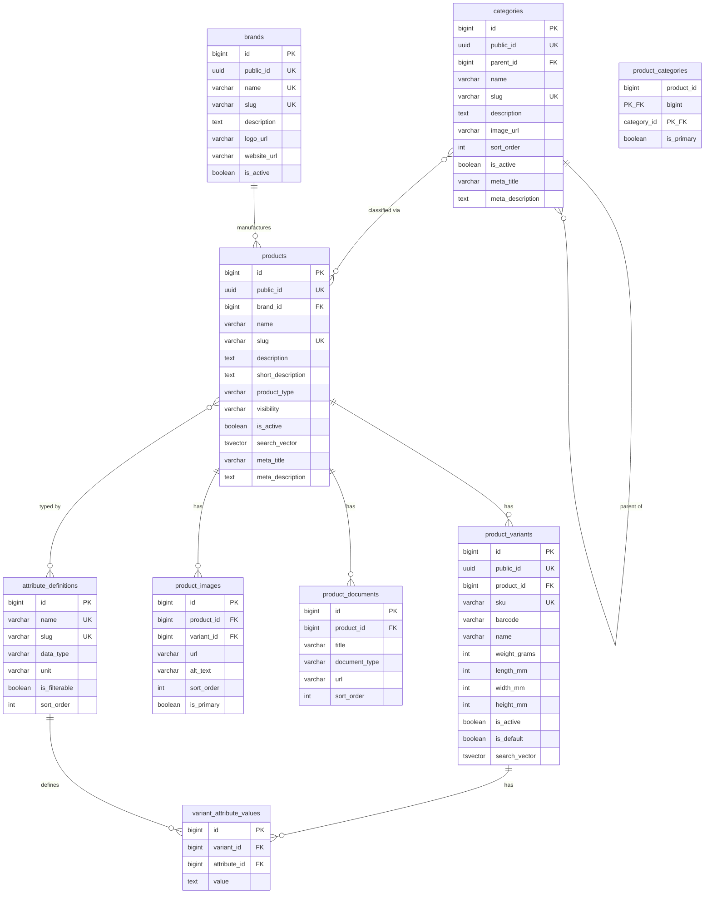
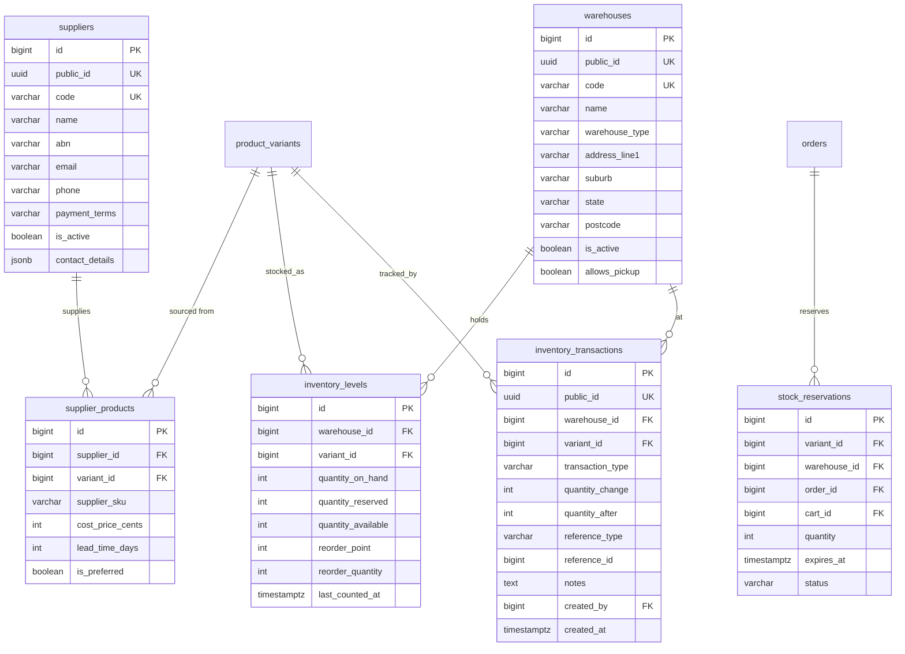
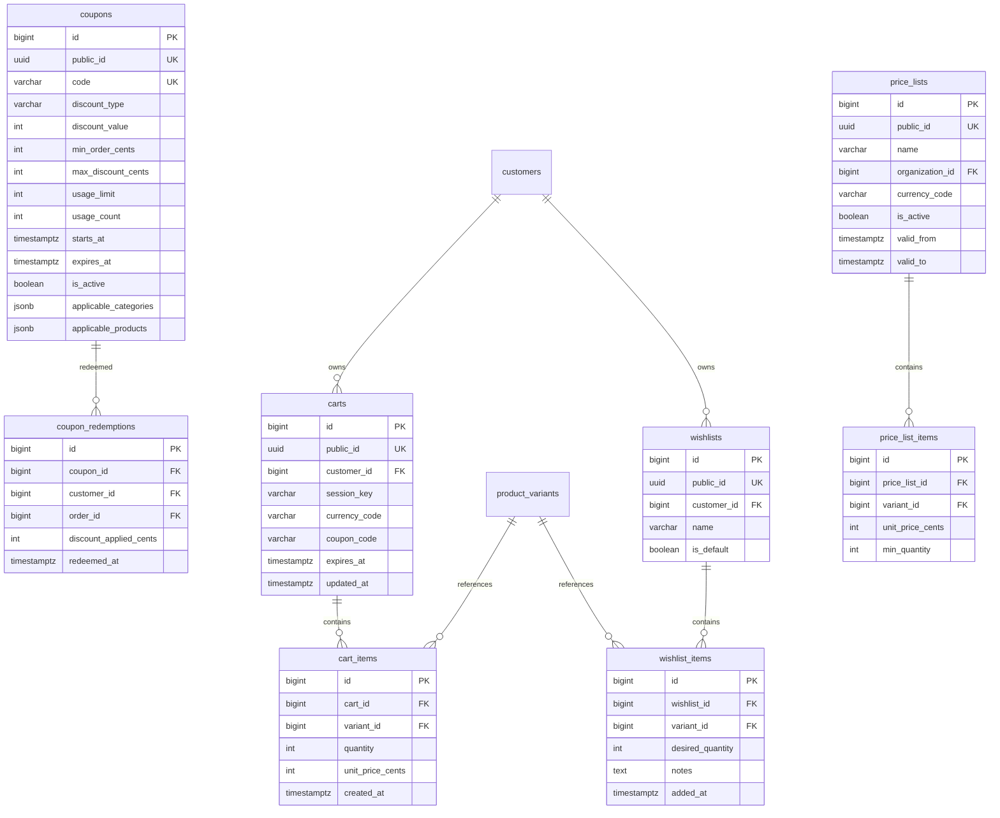

# A2Z Tools — Database Architecture Plan

**PostgreSQL Database Design for Australian Hardware & Networking Ecommerce**

| Attribute | Value |
|-----------|-------|
| **Database** | PostgreSQL 16+ |
| **ORM** | Django 5.x |
| **Currency** | AUD (stored as integer cents) |
| **Tax** | GST 10% |
| **Document Version** | 1.0 |
| **Phase** | Phase 1 (Ecommerce Core) |

---

## Table of Contents

1. [Database Architecture Overview](#1-database-architecture-overview)
2. [Complete ER Diagram](#2-complete-er-diagram)
3. [Table Definitions](#3-table-definitions)
4. [Relationships](#4-relationships)
5. [Indexing Strategy](#5-indexing-strategy)
6. [Future ERP Compatibility](#6-future-erp-compatibility)
7. [Appendix](#7-appendix)

---

## 1. Database Architecture Overview

### 1.1 Design Principles

| Principle | Implementation |
|-----------|----------------|
| **Integer money** | All monetary values stored as `BIGINT` in AUD cents — never `FLOAT`/`DECIMAL` for amounts |
| **GST snapshots** | Tax rates and amounts frozen on order/invoice line items at transaction time |
| **Immutable orders** | Order line items store product name, SKU, and price at purchase — never updated from catalog |
| **Soft delete** | `deleted_at` on user-facing entities; hard delete only for ephemeral data (carts, sessions) |
| **Audit trail** | `created_at`, `updated_at` on all tables; `created_by`/`updated_by` on admin-managed entities |
| **UUID public IDs** | External-facing references use UUID v4; internal joins use `BIGSERIAL` PKs |
| **Normalised catalog** | Products, variants (SKUs), attributes, and inventory are separate tables |
| **Inventory ledger** | Stock changes recorded as transactions, not just quantity overwrites |
| **ERP-ready** | Logical schema groupings map to future ERP modules; extension tables reserved |

### 1.2 Schema Organisation

Phase 1 uses a **single PostgreSQL database** with logical groupings. Django maps one app per domain. Future ERP modules may migrate to dedicated PostgreSQL schemas (`crm`, `hrm`, `erp`) without breaking ecommerce tables.

```
a2z_tools (database)
│
├── AUTH & IDENTITY          users, roles, permissions, sessions
├── CUSTOMERS & ORGS         customers, organizations, addresses
├── CATALOG                  categories, brands, products, variants, images
├── INVENTORY & SUPPLY       warehouses, inventory, suppliers
├── PRICING & PROMOTIONS     coupons, price lists
├── COMMERCE                 carts, wishlists, orders, order items
├── FULFILMENT               shipments, shipping zones, rates
├── FINANCE                  payments, refunds, tax invoices
├── ENGAGEMENT               reviews
└── ANALYTICS                events, sessions
```

### 1.3 High-Level Data Flow

```
┌──────────┐     ┌──────────┐     ┌──────────┐     ┌──────────┐
│  CATALOG │────►│   CART   │────►│  ORDERS  │────►│ FINANCE  │
│ Products │     │ Wishlist │     │  Items   │     │ Payments │
│ Variants │     └──────────┘     └────┬─────┘     │ Invoices │
└────┬─────┘                          │           └──────────┘
     │                                ▼
     ▼                          ┌──────────┐
┌──────────┐                    │FULFILMENT│
│INVENTORY │◄───────────────────│ Shipments│
│ Ledger   │   stock reservation └──────────┘
└──────────┘
```

### 1.4 Django Integration Notes

- Django `auth_user` extended via one-to-one `user_profiles` and `customers`
- Permissions via Django `auth_group` + custom `roles` table for app-level RBAC
- Migrations managed per Django app; cross-app FKs allowed within same database
- Full-text search via PostgreSQL `tsvector` columns on `products` and `product_variants`
- Media file paths stored in DB; binary assets in S3/R2

### 1.5 Australian Compliance Data Model

| Requirement | Storage |
|-------------|---------|
| AUD currency | `currency_code` defaults to `'AUD'`; amounts in cents |
| GST 10% | `gst_rate` (e.g. `0.1000`), `gst_amount_cents`, `amount_ex_gst_cents`, `amount_inc_gst_cents` on line items |
| ABN | `abn` (11 digits) on `organizations`; validated status flag |
| Tax invoices | `tax_invoices` + `tax_invoice_lines` with ATO-required fields |
| AU addresses | `state` (NSW/VIC/…), `postcode` (4 char), `suburb`, `country` default `'AU'` |

---

## 2. Complete ER Diagram

### 2.1 Auth, Customers & Organizations

```mermaid
erDiagram
    users ||--o| user_profiles : has
    users ||--o| customers : "is a"
    users }o--o{ roles : "assigned via"
    roles }o--o{ permissions : contains
    users ||--o{ user_sessions : has
    users ||--o{ password_reset_tokens : has

    customers ||--o{ addresses : owns
    customers }o--o| organizations : "belongs to"
    organizations ||--o{ organization_members : has
    organization_members }o--|| users : links

    users {
        bigint id PK
        uuid public_id UK
        varchar email UK
        varchar password_hash
        boolean is_active
        boolean is_staff
        timestamptz email_verified_at
        timestamptz created_at
        timestamptz updated_at
    }

    user_profiles {
        bigint id PK
        bigint user_id FK UK
        varchar first_name
        varchar last_name
        varchar phone
        varchar avatar_url
        jsonb preferences
    }

    customers {
        bigint id PK
        uuid public_id UK
        bigint user_id FK UK
        bigint organization_id FK
        varchar customer_type
        varchar trade_account_status
        int credit_limit_cents
        int payment_terms_days
    }

    organizations {
        bigint id PK
        uuid public_id UK
        varchar legal_name
        varchar trading_name
        varchar abn UK
        boolean abn_verified
        varchar acn
        varchar email
        varchar phone
        varchar customer_segment
    }

    organization_members {
        bigint id PK
        bigint organization_id FK
        bigint user_id FK
        varchar role
        boolean is_primary_contact
    }

    addresses {
        bigint id PK
        uuid public_id UK
        bigint customer_id FK
        varchar label
        varchar line1
        varchar line2
        varchar suburb
        varchar state
        varchar postcode
        varchar country
        boolean is_default_billing
        boolean is_default_shipping
    }

    roles {
        bigint id PK
        varchar name UK
        varchar slug UK
        text description
    }

    permissions {
        bigint id PK
        varchar codename UK
        varchar module
        text description
    }

    role_permissions {
        bigint role_id PK_FK
        bigint permission_id PK_FK
    }

    user_roles {
        bigint user_id PK_FK
        bigint role_id PK_FK
        bigint organization_id FK
    }
```

### 2.2 Catalog, Brands & Products



### 2.3 Inventory, Suppliers & Warehousing



### 2.4 Pricing, Coupons & Carts



### 2.5 Orders, Payments, Shipping & Invoices

```mermaid
erDiagram
    customers ||--o{ orders : places
    organizations ||--o{ orders : "B2B orders"
    orders ||--o{ order_items : contains
    orders ||--o{ order_status_history : tracks
    orders ||--o| order_addresses : snapshots
    orders ||--o{ payments : paid_by
    orders ||--o{ shipments : fulfilled_by
    orders ||--o| tax_invoices : generates
    payments ||--o{ payment_transactions : logs
    payments ||--o{ refunds : may_have
    tax_invoices ||--o{ tax_invoice_lines : itemises
    shipments ||--o{ shipment_items : contains
    shipping_zones ||--o{ shipping_rates : defines

    orders {
        bigint id PK
        uuid public_id UK
        varchar order_number UK
        bigint customer_id FK
        bigint organization_id FK
        varchar status
        varchar payment_status
        varchar fulfilment_status
        varchar currency_code
        int subtotal_ex_gst_cents
        int gst_total_cents
        int shipping_ex_gst_cents
        int shipping_gst_cents
        int discount_cents
        int total_inc_gst_cents
        varchar po_number
        text customer_notes
        text internal_notes
        bigint coupon_id FK
        timestamptz placed_at
        timestamptz created_at
    }

    order_items {
        bigint id PK
        bigint order_id FK
        bigint variant_id FK
        varchar sku
        varchar product_name
        varchar variant_name
        int quantity
        int unit_price_ex_gst_cents
        int unit_gst_cents
        numeric gst_rate
        int line_total_ex_gst_cents
        int line_gst_cents
        int line_total_inc_gst_cents
        int quantity_fulfilled
        int quantity_returned
    }

    order_addresses {
        bigint id PK
        bigint order_id FK UK
        jsonb billing_address
        jsonb shipping_address
    }

    order_status_history {
        bigint id PK
        bigint order_id FK
        varchar from_status
        varchar to_status
        text comment
        bigint changed_by FK
        timestamptz created_at
    }

    payments {
        bigint id PK
        uuid public_id UK
        bigint order_id FK
        varchar payment_method
        varchar status
        int amount_cents
        varchar currency_code
        varchar gateway
        varchar gateway_payment_id
        jsonb gateway_response
        timestamptz paid_at
    }

    payment_transactions {
        bigint id PK
        bigint payment_id FK
        varchar transaction_type
        varchar status
        int amount_cents
        varchar gateway_transaction_id
        jsonb raw_response
        timestamptz created_at
    }

    refunds {
        bigint id PK
        uuid public_id UK
        bigint payment_id FK
        bigint order_id FK
        int amount_cents
        varchar reason
        varchar status
        varchar gateway_refund_id
        timestamptz processed_at
    }

    tax_invoices {
        bigint id PK
        uuid public_id UK
        varchar invoice_number UK
        bigint order_id FK UK
        bigint customer_id FK
        bigint organization_id FK
        varchar seller_abn
        varchar buyer_abn
        varchar buyer_name
        jsonb buyer_address
        int subtotal_ex_gst_cents
        int gst_total_cents
        int total_inc_gst_cents
        varchar currency_code
        date invoice_date
        date due_date
        varchar status
        varchar pdf_url
        timestamptz issued_at
    }

    tax_invoice_lines {
        bigint id PK
        bigint tax_invoice_id FK
        int line_number
        varchar description
        int quantity
        int unit_price_ex_gst_cents
        numeric gst_rate
        int gst_amount_cents
        int line_total_inc_gst_cents
    }

    shipments {
        bigint id PK
        uuid public_id UK
        bigint order_id FK
        bigint warehouse_id FK
        varchar status
        varchar carrier
        varchar tracking_number
        varchar tracking_url
        int shipping_cost_ex_gst_cents
        int shipping_gst_cents
        jsonb ship_to_address
        timestamptz shipped_at
        timestamptz delivered_at
    }

    shipment_items {
        bigint id PK
        bigint shipment_id FK
        bigint order_item_id FK
        int quantity
    }

    shipping_zones {
        bigint id PK
        varchar name
        varchar zone_type
        jsonb postcodes
        jsonb states
        boolean is_active
    }

    shipping_rates {
        bigint id PK
        bigint zone_id FK
        bigint shipping_method_id FK
        int min_weight_grams
        int max_weight_grams
        int min_order_cents
        int rate_ex_gst_cents
        boolean is_free_shipping
    }

    shipping_methods {
        bigint id PK
        varchar code UK
        varchar name
        varchar carrier
        int estimated_days_min
        int estimated_days_max
        boolean is_active
    }
```

### 2.6 Reviews & Analytics

```mermaid
erDiagram
    customers ||--o{ product_reviews : writes
    products ||--o{ product_reviews : receives
    orders ||--o{ product_reviews : verifies
    product_reviews ||--o{ review_responses : has
    users ||--o{ analytics_events : triggers

    product_reviews {
        bigint id PK
        uuid public_id UK
        bigint product_id FK
        bigint customer_id FK
        bigint order_id FK
        smallint rating
        varchar title
        text body
        varchar status
        boolean is_verified_purchase
        timestamptz published_at
        timestamptz created_at
    }

    review_responses {
        bigint id PK
        bigint review_id FK UK
        bigint responder_id FK
        text body
        timestamptz created_at
    }

    analytics_events {
        bigint id PK
        uuid event_id UK
        varchar event_type
        bigint user_id FK
        varchar session_id
        varchar page_url
        varchar referrer
        jsonb properties
        inet ip_address
        varchar user_agent
        timestamptz occurred_at
    }

    analytics_sessions {
        bigint id PK
        varchar session_id UK
        bigint user_id FK
        bigint customer_id FK
        timestamptz started_at
        timestamptz ended_at
        int page_views
        varchar utm_source
        varchar utm_medium
        varchar utm_campaign
        varchar device_type
    }
```

---

## 3. Table Definitions

Tables are grouped by domain. All tables include `created_at` and `updated_at` (`TIMESTAMPTZ`) unless noted. PK = Primary Key, UK = Unique Key, FK = Foreign Key.

### 3.1 Auth & Identity

#### `users`
Core authentication entity. Integrates with Django `AbstractUser` or custom user model.

| Column | Type | Constraints | Description |
|--------|------|-------------|-------------|
| id | BIGSERIAL | PK | Internal primary key |
| public_id | UUID | UK, NOT NULL | External API reference |
| email | VARCHAR(254) | UK, NOT NULL | Login identifier |
| password_hash | VARCHAR(128) | NOT NULL | bcrypt/argon2 hash |
| is_active | BOOLEAN | DEFAULT true | Account enabled |
| is_staff | BOOLEAN | DEFAULT false | Django admin access |
| is_superuser | BOOLEAN | DEFAULT false | Full admin access |
| email_verified_at | TIMESTAMPTZ | NULL | Email verification timestamp |
| last_login_at | TIMESTAMPTZ | NULL | Last successful login |
| deleted_at | TIMESTAMPTZ | NULL | Soft delete |

#### `user_profiles`
Extended personal information (1:1 with users).

| Column | Type | Constraints | Description |
|--------|------|-------------|-------------|
| id | BIGSERIAL | PK | |
| user_id | BIGINT | FK → users, UK | Owner |
| first_name | VARCHAR(100) | NOT NULL | |
| last_name | VARCHAR(100) | NOT NULL | |
| phone | VARCHAR(20) | NULL | E.164 format preferred |
| avatar_url | VARCHAR(500) | NULL | S3/R2 URL |
| preferences | JSONB | DEFAULT '{}' | Notification prefs, locale |

#### `roles`
Application-level roles beyond Django groups.

| Column | Type | Constraints | Description |
|--------|------|-------------|-------------|
| id | BIGSERIAL | PK | |
| name | VARCHAR(100) | UK, NOT NULL | e.g. "Trade Buyer" |
| slug | VARCHAR(100) | UK, NOT NULL | e.g. `trade_buyer` |
| description | TEXT | NULL | |
| is_system | BOOLEAN | DEFAULT false | Protected system role |

#### `permissions`
Granular permission definitions.

| Column | Type | Constraints | Description |
|--------|------|-------------|-------------|
| id | BIGSERIAL | PK | |
| codename | VARCHAR(100) | UK, NOT NULL | e.g. `orders.view_all` |
| module | VARCHAR(50) | NOT NULL | Domain grouping |
| description | TEXT | NULL | Human-readable |

#### `role_permissions`
Many-to-many join: roles ↔ permissions.

| Column | Type | Constraints |
|--------|------|-------------|
| role_id | BIGINT | PK, FK → roles |
| permission_id | BIGINT | PK, FK → permissions |

#### `user_roles`
Assigns roles to users, optionally scoped to an organization.

| Column | Type | Constraints | Description |
|--------|------|-------------|-------------|
| user_id | BIGINT | PK, FK → users | |
| role_id | BIGINT | PK, FK → roles | |
| organization_id | BIGINT | FK → organizations, NULL | Org-scoped role |

#### `user_sessions`
Active session/token tracking for security audit.

| Column | Type | Constraints | Description |
|--------|------|-------------|-------------|
| id | BIGSERIAL | PK | |
| user_id | BIGINT | FK → users | |
| token_hash | VARCHAR(64) | UK | Hashed refresh token |
| ip_address | INET | NULL | |
| user_agent | TEXT | NULL | |
| expires_at | TIMESTAMPTZ | NOT NULL | |
| revoked_at | TIMESTAMPTZ | NULL | |

#### `password_reset_tokens`
Single-use password reset tokens.

| Column | Type | Constraints | Description |
|--------|------|-------------|-------------|
| id | BIGSERIAL | PK | |
| user_id | BIGINT | FK → users | |
| token_hash | VARCHAR(64) | UK | |
| expires_at | TIMESTAMPTZ | NOT NULL | |
| used_at | TIMESTAMPTZ | NULL | |

---

### 3.2 Customers & Organizations

#### `customers`
Commerce customer profile (1:1 with users for registered customers).

| Column | Type | Constraints | Description |
|--------|------|-------------|-------------|
| id | BIGSERIAL | PK | |
| public_id | UUID | UK, NOT NULL | |
| user_id | BIGINT | FK → users, UK, NULL | NULL for guest-only (legacy) |
| organization_id | BIGINT | FK → organizations, NULL | B2B affiliation |
| customer_type | VARCHAR(20) | NOT NULL | `retail`, `trade`, `contractor`, `business` |
| trade_account_status | VARCHAR(20) | NULL | `pending`, `approved`, `suspended`, `rejected` |
| credit_limit_cents | INTEGER | DEFAULT 0 | Trade credit limit (AUD cents) |
| payment_terms_days | INTEGER | NULL | e.g. 30 for Net 30 |
| stripe_customer_id | VARCHAR(100) | NULL | Payment gateway reference |
| total_orders | INTEGER | DEFAULT 0 | Denormalised counter |
| total_spent_cents | BIGINT | DEFAULT 0 | Denormalised lifetime value |

#### `organizations`
B2B company entities with Australian business identifiers.

| Column | Type | Constraints | Description |
|--------|------|-------------|-------------|
| id | BIGSERIAL | PK | |
| public_id | UUID | UK, NOT NULL | |
| legal_name | VARCHAR(255) | NOT NULL | Registered entity name |
| trading_name | VARCHAR(255) | NULL | Trading as name |
| abn | VARCHAR(11) | UK, NULL | Australian Business Number |
| abn_verified | BOOLEAN | DEFAULT false | ABR lookup result |
| abn_verified_at | TIMESTAMPTZ | NULL | |
| acn | VARCHAR(9) | NULL | Australian Company Number |
| email | VARCHAR(254) | NOT NULL | Primary business email |
| phone | VARCHAR(20) | NULL | |
| customer_segment | VARCHAR(20) | NOT NULL | `trade`, `contractor`, `business` |
| is_active | BOOLEAN | DEFAULT true | |

#### `organization_members`
Links users to organizations with org-level roles.

| Column | Type | Constraints | Description |
|--------|------|-------------|-------------|
| id | BIGSERIAL | PK | |
| organization_id | BIGINT | FK → organizations | |
| user_id | BIGINT | FK → users | |
| role | VARCHAR(30) | NOT NULL | `admin`, `buyer`, `approver`, `viewer` |
| is_primary_contact | BOOLEAN | DEFAULT false | |
| invited_at | TIMESTAMPTZ | NULL | |
| accepted_at | TIMESTAMPTZ | NULL | |

**Unique constraint:** `(organization_id, user_id)`

#### `addresses`
Customer shipping and billing addresses.

| Column | Type | Constraints | Description |
|--------|------|-------------|-------------|
| id | BIGSERIAL | PK | |
| public_id | UUID | UK, NOT NULL | |
| customer_id | BIGINT | FK → customers | |
| label | VARCHAR(50) | NULL | e.g. "Warehouse", "Site Office" |
| line1 | VARCHAR(255) | NOT NULL | Street address |
| line2 | VARCHAR(255) | NULL | Unit, suite, level |
| suburb | VARCHAR(100) | NOT NULL | |
| state | VARCHAR(3) | NOT NULL | NSW, VIC, QLD, SA, WA, TAS, NT, ACT |
| postcode | VARCHAR(4) | NOT NULL | 4-digit AU postcode |
| country | VARCHAR(2) | DEFAULT 'AU' | ISO 3166-1 alpha-2 |
| is_default_billing | BOOLEAN | DEFAULT false | |
| is_default_shipping | BOOLEAN | DEFAULT false | |

---

### 3.3 Catalog

#### `categories`
Hierarchical product taxonomy (adjacency list with optional `path` for breadcrumbs).

| Column | Type | Constraints | Description |
|--------|------|-------------|-------------|
| id | BIGSERIAL | PK | |
| public_id | UUID | UK, NOT NULL | |
| parent_id | BIGINT | FK → categories, NULL | Root if NULL |
| name | VARCHAR(150) | NOT NULL | |
| slug | VARCHAR(150) | UK, NOT NULL | URL segment |
| description | TEXT | NULL | |
| image_url | VARCHAR(500) | NULL | |
| sort_order | INTEGER | DEFAULT 0 | Sibling ordering |
| depth | SMALLINT | DEFAULT 0 | Denormalised tree depth |
| path | VARCHAR(500) | NULL | Materialised path e.g. `/networking/switches` |
| is_active | BOOLEAN | DEFAULT true | |
| meta_title | VARCHAR(70) | NULL | SEO |
| meta_description | VARCHAR(160) | NULL | SEO |

#### `brands`
Product manufacturers and brands.

| Column | Type | Constraints | Description |
|--------|------|-------------|-------------|
| id | BIGSERIAL | PK | |
| public_id | UUID | UK, NOT NULL | |
| name | VARCHAR(150) | UK, NOT NULL | |
| slug | VARCHAR(150) | UK, NOT NULL | |
| description | TEXT | NULL | |
| logo_url | VARCHAR(500) | NULL | |
| website_url | VARCHAR(500) | NULL | |
| is_active | BOOLEAN | DEFAULT true | |
| meta_title | VARCHAR(70) | NULL | |
| meta_description | VARCHAR(160) | NULL | |

#### `products`
Parent product record (conceptual product; purchasable units are variants).

| Column | Type | Constraints | Description |
|--------|------|-------------|-------------|
| id | BIGSERIAL | PK | |
| public_id | UUID | UK, NOT NULL | |
| brand_id | BIGINT | FK → brands, NULL | |
| name | VARCHAR(255) | NOT NULL | |
| slug | VARCHAR(255) | UK, NOT NULL | |
| description | TEXT | NULL | Full HTML description |
| short_description | VARCHAR(500) | NULL | Listing card text |
| product_type | VARCHAR(20) | DEFAULT 'simple' | `simple`, `variable`, `bundle` |
| visibility | VARCHAR(20) | DEFAULT 'public' | `public`, `trade_only`, `hidden` |
| is_active | BOOLEAN | DEFAULT true | |
| search_vector | TSVECTOR | NULL | Full-text search index |
| meta_title | VARCHAR(70) | NULL | |
| meta_description | VARCHAR(160) | NULL | |
| average_rating | NUMERIC(3,2) | DEFAULT 0 | Denormalised |
| review_count | INTEGER | DEFAULT 0 | Denormalised |

#### `product_variants`
Purchasable SKUs with physical attributes.

| Column | Type | Constraints | Description |
|--------|------|-------------|-------------|
| id | BIGSERIAL | PK | |
| public_id | UUID | UK, NOT NULL | |
| product_id | BIGINT | FK → products | |
| sku | VARCHAR(50) | UK, NOT NULL | Internal SKU |
| barcode | VARCHAR(50) | NULL | EAN/UPC |
| name | VARCHAR(255) | NULL | Variant label e.g. "24-Port PoE" |
| weight_grams | INTEGER | NULL | Shipping calculation |
| length_mm | INTEGER | NULL | |
| width_mm | INTEGER | NULL | |
| height_mm | INTEGER | NULL | |
| base_price_cents | INTEGER | NOT NULL | Default retail price (ex GST) |
| compare_at_price_cents | INTEGER | NULL | RRP / was price |
| cost_price_cents | INTEGER | NULL | Internal cost |
| is_active | BOOLEAN | DEFAULT true | |
| is_default | BOOLEAN | DEFAULT false | Default variant for product |
| search_vector | TSVECTOR | NULL | |

#### `product_images`
Product and variant media assets.

| Column | Type | Constraints | Description |
|--------|------|-------------|-------------|
| id | BIGSERIAL | PK | |
| product_id | BIGINT | FK → products | |
| variant_id | BIGINT | FK → product_variants, NULL | Variant-specific image |
| url | VARCHAR(500) | NOT NULL | CDN URL |
| alt_text | VARCHAR(255) | NULL | Accessibility / SEO |
| sort_order | INTEGER | DEFAULT 0 | |
| is_primary | BOOLEAN | DEFAULT false | |

#### `product_documents`
Datasheets, manuals, installation guides.

| Column | Type | Constraints | Description |
|--------|------|-------------|-------------|
| id | BIGSERIAL | PK | |
| product_id | BIGINT | FK → products | |
| title | VARCHAR(255) | NOT NULL | |
| document_type | VARCHAR(30) | NOT NULL | `datasheet`, `manual`, `warranty` |
| url | VARCHAR(500) | NOT NULL | |
| sort_order | INTEGER | DEFAULT 0 | |

#### `attribute_definitions`
Reusable spec attributes (e.g. "Port Count", "PoE Budget").

| Column | Type | Constraints | Description |
|--------|------|-------------|-------------|
| id | BIGSERIAL | PK | |
| name | VARCHAR(100) | UK, NOT NULL | |
| slug | VARCHAR(100) | UK, NOT NULL | |
| data_type | VARCHAR(20) | NOT NULL | `text`, `number`, `boolean`, `enum` |
| unit | VARCHAR(20) | NULL | e.g. "W", "GHz", "m" |
| allowed_values | JSONB | NULL | For enum type |
| is_filterable | BOOLEAN | DEFAULT false | Show in faceted search |
| sort_order | INTEGER | DEFAULT 0 | |

#### `variant_attribute_values`
Attribute values per variant.

| Column | Type | Constraints | Description |
|--------|------|-------------|-------------|
| id | BIGSERIAL | PK | |
| variant_id | BIGINT | FK → product_variants | |
| attribute_id | BIGINT | FK → attribute_definitions | |
| value | TEXT | NOT NULL | Stored as text; cast by data_type |

**Unique constraint:** `(variant_id, attribute_id)`

#### `product_categories`
Many-to-many: products ↔ categories.

| Column | Type | Constraints | Description |
|--------|------|-------------|-------------|
| product_id | BIGINT | PK, FK → products | |
| category_id | BIGINT | PK, FK → categories | |
| is_primary | BOOLEAN | DEFAULT false | Primary breadcrumb category |

---

### 3.4 Inventory & Suppliers

#### `suppliers`
Vendor/supplier master data (feeds future procurement module).

| Column | Type | Constraints | Description |
|--------|------|-------------|-------------|
| id | BIGSERIAL | PK | |
| public_id | UUID | UK, NOT NULL | |
| code | VARCHAR(20) | UK, NOT NULL | Internal supplier code |
| name | VARCHAR(255) | NOT NULL | |
| abn | VARCHAR(11) | NULL | Supplier ABN |
| email | VARCHAR(254) | NULL | |
| phone | VARCHAR(20) | NULL | |
| payment_terms | VARCHAR(50) | NULL | e.g. "Net 30" |
| currency_code | VARCHAR(3) | DEFAULT 'AUD' | |
| is_active | BOOLEAN | DEFAULT true | |
| contact_details | JSONB | DEFAULT '{}' | Address, contacts |
| notes | TEXT | NULL | Internal notes |

#### `supplier_products`
Maps suppliers to SKUs with procurement pricing.

| Column | Type | Constraints | Description |
|--------|------|-------------|-------------|
| id | BIGSERIAL | PK | |
| supplier_id | BIGINT | FK → suppliers | |
| variant_id | BIGINT | FK → product_variants | |
| supplier_sku | VARCHAR(50) | NULL | Supplier's SKU reference |
| cost_price_cents | INTEGER | NOT NULL | Purchase price (AUD cents) |
| lead_time_days | INTEGER | NULL | Expected delivery |
| min_order_quantity | INTEGER | DEFAULT 1 | |
| is_preferred | BOOLEAN | DEFAULT false | Primary supplier for SKU |

**Unique constraint:** `(supplier_id, variant_id)`

#### `warehouses`
Physical stocking locations.

| Column | Type | Constraints | Description |
|--------|------|-------------|-------------|
| id | BIGSERIAL | PK | |
| public_id | UUID | UK, NOT NULL | |
| code | VARCHAR(10) | UK, NOT NULL | e.g. `SYD`, `MEL` |
| name | VARCHAR(100) | NOT NULL | |
| warehouse_type | VARCHAR(20) | NOT NULL | `distribution`, `retail`, `3pl` |
| address_line1 | VARCHAR(255) | NULL | |
| suburb | VARCHAR(100) | NULL | |
| state | VARCHAR(3) | NULL | |
| postcode | VARCHAR(4) | NULL | |
| is_active | BOOLEAN | DEFAULT true | |
| allows_pickup | BOOLEAN | DEFAULT false | Click & collect |

#### `inventory_levels`
Current stock position per variant per warehouse.

| Column | Type | Constraints | Description |
|--------|------|-------------|-------------|
| id | BIGSERIAL | PK | |
| warehouse_id | BIGINT | FK → warehouses | |
| variant_id | BIGINT | FK → product_variants | |
| quantity_on_hand | INTEGER | NOT NULL, DEFAULT 0 | Physical stock |
| quantity_reserved | INTEGER | NOT NULL, DEFAULT 0 | Allocated to orders/carts |
| quantity_available | INTEGER | GENERATED | `on_hand - reserved` (or maintained) |
| reorder_point | INTEGER | DEFAULT 0 | Low stock threshold |
| reorder_quantity | INTEGER | DEFAULT 0 | Suggested reorder qty |
| last_counted_at | TIMESTAMPTZ | NULL | Last stocktake |

**Unique constraint:** `(warehouse_id, variant_id)`

#### `inventory_transactions`
Append-only inventory ledger (ERP-compatible).

| Column | Type | Constraints | Description |
|--------|------|-------------|-------------|
| id | BIGSERIAL | PK | |
| public_id | UUID | UK, NOT NULL | |
| warehouse_id | BIGINT | FK → warehouses | |
| variant_id | BIGINT | FK → product_variants | |
| transaction_type | VARCHAR(30) | NOT NULL | See enum below |
| quantity_change | INTEGER | NOT NULL | Positive or negative |
| quantity_after | INTEGER | NOT NULL | Balance after transaction |
| reference_type | VARCHAR(30) | NULL | `order`, `purchase_order`, `adjustment` |
| reference_id | BIGINT | NULL | Polymorphic FK |
| unit_cost_cents | INTEGER | NULL | Cost at time of transaction |
| notes | TEXT | NULL | |
| created_by | BIGINT | FK → users, NULL | |

**Transaction types:** `receipt`, `sale`, `return`, `adjustment`, `transfer_in`, `transfer_out`, `reservation`, `release`

#### `stock_reservations`
Temporary stock holds during checkout.

| Column | Type | Constraints | Description |
|--------|------|-------------|-------------|
| id | BIGSERIAL | PK | |
| variant_id | BIGINT | FK → product_variants | |
| warehouse_id | BIGINT | FK → warehouses | |
| order_id | BIGINT | FK → orders, NULL | |
| cart_id | BIGINT | FK → carts, NULL | |
| quantity | INTEGER | NOT NULL | |
| expires_at | TIMESTAMPTZ | NOT NULL | Auto-release TTL |
| status | VARCHAR(20) | NOT NULL | `active`, `converted`, `expired`, `released` |

---

### 3.5 Pricing & Promotions

#### `coupons`
Discount codes and promotional rules.

| Column | Type | Constraints | Description |
|--------|------|-------------|-------------|
| id | BIGSERIAL | PK | |
| public_id | UUID | UK, NOT NULL | |
| code | VARCHAR(50) | UK, NOT NULL | Customer-facing code |
| description | VARCHAR(255) | NULL | Internal label |
| discount_type | VARCHAR(20) | NOT NULL | `percentage`, `fixed_amount`, `free_shipping` |
| discount_value | INTEGER | NOT NULL | Percentage (basis points) or cents |
| min_order_cents | INTEGER | DEFAULT 0 | Minimum cart subtotal |
| max_discount_cents | INTEGER | NULL | Cap for percentage discounts |
| usage_limit | INTEGER | NULL | Total redemptions allowed |
| usage_limit_per_customer | INTEGER | NULL | Per-customer cap |
| usage_count | INTEGER | DEFAULT 0 | Current redemption count |
| starts_at | TIMESTAMPTZ | NULL | |
| expires_at | TIMESTAMPTZ | NULL | |
| is_active | BOOLEAN | DEFAULT true | |
| applicable_categories | JSONB | NULL | Category ID allowlist |
| applicable_products | JSONB | NULL | Product/variant ID allowlist |
| customer_segments | JSONB | NULL | Segment restrictions |

#### `coupon_redemptions`
Audit trail of coupon usage.

| Column | Type | Constraints | Description |
|--------|------|-------------|-------------|
| id | BIGSERIAL | PK | |
| coupon_id | BIGINT | FK → coupons | |
| customer_id | BIGINT | FK → customers | |
| order_id | BIGINT | FK → orders, NULL | Set on order completion |
| discount_applied_cents | INTEGER | NOT NULL | Actual discount given |
| redeemed_at | TIMESTAMPTZ | NOT NULL | |

#### `price_lists`
B2B contract pricing per organization (Phase 2 ready).

| Column | Type | Constraints | Description |
|--------|------|-------------|-------------|
| id | BIGSERIAL | PK | |
| public_id | UUID | UK, NOT NULL | |
| name | VARCHAR(100) | NOT NULL | |
| organization_id | BIGINT | FK → organizations, NULL | NULL = tier-based list |
| currency_code | VARCHAR(3) | DEFAULT 'AUD' | |
| is_active | BOOLEAN | DEFAULT true | |
| valid_from | TIMESTAMPTZ | NULL | |
| valid_to | TIMESTAMPTZ | NULL | |

#### `price_list_items`
SKU-specific prices within a price list.

| Column | Type | Constraints | Description |
|--------|------|-------------|-------------|
| id | BIGSERIAL | PK | |
| price_list_id | BIGINT | FK → price_lists | |
| variant_id | BIGINT | FK → product_variants | |
| unit_price_cents | INTEGER | NOT NULL | Ex GST |
| min_quantity | INTEGER | DEFAULT 1 | Tier breakpoint |

**Unique constraint:** `(price_list_id, variant_id, min_quantity)`

---

### 3.6 Cart & Wishlist

#### `carts`
Shopping cart (authenticated or guest session).

| Column | Type | Constraints | Description |
|--------|------|-------------|-------------|
| id | BIGSERIAL | PK | |
| public_id | UUID | UK, NOT NULL | |
| customer_id | BIGINT | FK → customers, NULL | NULL for guest |
| session_key | VARCHAR(64) | NULL | Guest cart identifier |
| currency_code | VARCHAR(3) | DEFAULT 'AUD' | |
| coupon_code | VARCHAR(50) | NULL | Applied coupon (validated at checkout) |
| notes | TEXT | NULL | |
| expires_at | TIMESTAMPTZ | NULL | Guest cart TTL |

**Check constraint:** `customer_id IS NOT NULL OR session_key IS NOT NULL`

#### `cart_items`
Line items within a cart.

| Column | Type | Constraints | Description |
|--------|------|-------------|-------------|
| id | BIGSERIAL | PK | |
| cart_id | BIGINT | FK → carts | |
| variant_id | BIGINT | FK → product_variants | |
| quantity | INTEGER | NOT NULL, CHECK > 0 | |
| unit_price_cents | INTEGER | NULL | Snapshot at add-to-cart |

**Unique constraint:** `(cart_id, variant_id)`

#### `wishlists`
Named saved product lists.

| Column | Type | Constraints | Description |
|--------|------|-------------|-------------|
| id | BIGSERIAL | PK | |
| public_id | UUID | UK, NOT NULL | |
| customer_id | BIGINT | FK → customers | |
| name | VARCHAR(100) | NOT NULL | e.g. "Default", "Job #4521" |
| is_default | BOOLEAN | DEFAULT false | |
| is_shared | BOOLEAN | DEFAULT false | Future: shareable lists |

#### `wishlist_items`

| Column | Type | Constraints | Description |
|--------|------|-------------|-------------|
| id | BIGSERIAL | PK | |
| wishlist_id | BIGINT | FK → wishlists | |
| variant_id | BIGINT | FK → product_variants | |
| desired_quantity | INTEGER | DEFAULT 1 | |
| notes | TEXT | NULL | |
| added_at | TIMESTAMPTZ | NOT NULL | |

**Unique constraint:** `(wishlist_id, variant_id)`

---

### 3.7 Orders

#### `orders`
Master order record with GST totals.

| Column | Type | Constraints | Description |
|--------|------|-------------|-------------|
| id | BIGSERIAL | PK | |
| public_id | UUID | UK, NOT NULL | |
| order_number | VARCHAR(20) | UK, NOT NULL | Human-readable e.g. `A2Z-20250617-0001` |
| customer_id | BIGINT | FK → customers | |
| organization_id | BIGINT | FK → organizations, NULL | B2B order |
| status | VARCHAR(30) | NOT NULL | See status enum |
| payment_status | VARCHAR(20) | NOT NULL | `pending`, `paid`, `partial`, `refunded`, `failed` |
| fulfilment_status | VARCHAR(20) | NOT NULL | `unfulfilled`, `partial`, `fulfilled`, `returned` |
| currency_code | VARCHAR(3) | DEFAULT 'AUD' | |
| subtotal_ex_gst_cents | INTEGER | NOT NULL | Sum of line items ex GST |
| gst_total_cents | INTEGER | NOT NULL | Total GST |
| shipping_ex_gst_cents | INTEGER | DEFAULT 0 | |
| shipping_gst_cents | INTEGER | DEFAULT 0 | |
| discount_cents | INTEGER | DEFAULT 0 | Coupon + promotions |
| total_inc_gst_cents | INTEGER | NOT NULL | Grand total |
| coupon_id | BIGINT | FK → coupons, NULL | |
| po_number | VARCHAR(50) | NULL | Customer purchase order ref |
| customer_notes | TEXT | NULL | Delivery instructions |
| internal_notes | TEXT | NULL | Staff-only notes |
| ip_address | INET | NULL | Fraud detection |
| placed_at | TIMESTAMPTZ | NULL | When order confirmed |
| cancelled_at | TIMESTAMPTZ | NULL | |
| cancellation_reason | TEXT | NULL | |

**Order status values:** `draft`, `pending_payment`, `confirmed`, `processing`, `on_hold`, `completed`, `cancelled`

#### `order_items`
Immutable line items with price/GST snapshots.

| Column | Type | Constraints | Description |
|--------|------|-------------|-------------|
| id | BIGSERIAL | PK | |
| order_id | BIGINT | FK → orders | |
| variant_id | BIGINT | FK → product_variants | Reference only |
| sku | VARCHAR(50) | NOT NULL | Snapshot |
| product_name | VARCHAR(255) | NOT NULL | Snapshot |
| variant_name | VARCHAR(255) | NULL | Snapshot |
| quantity | INTEGER | NOT NULL | Ordered qty |
| unit_price_ex_gst_cents | INTEGER | NOT NULL | Per unit ex GST |
| unit_gst_cents | INTEGER | NOT NULL | Per unit GST |
| gst_rate | NUMERIC(5,4) | NOT NULL | e.g. 0.1000 |
| line_total_ex_gst_cents | INTEGER | NOT NULL | |
| line_gst_cents | INTEGER | NOT NULL | |
| line_total_inc_gst_cents | INTEGER | NOT NULL | |
| quantity_fulfilled | INTEGER | DEFAULT 0 | |
| quantity_returned | INTEGER | DEFAULT 0 | |
| tax_code | VARCHAR(10) | DEFAULT 'GST' | Future: GST-free, input-taxed |

#### `order_addresses`
Frozen address snapshot at order time (JSONB for flexibility).

| Column | Type | Constraints | Description |
|--------|------|-------------|-------------|
| id | BIGSERIAL | PK | |
| order_id | BIGINT | FK → orders, UK | |
| billing_address | JSONB | NOT NULL | Full address object |
| shipping_address | JSONB | NOT NULL | Full address object |

#### `order_status_history`
Audit log of order state transitions.

| Column | Type | Constraints | Description |
|--------|------|-------------|-------------|
| id | BIGSERIAL | PK | |
| order_id | BIGINT | FK → orders | |
| from_status | VARCHAR(30) | NULL | |
| to_status | VARCHAR(30) | NOT NULL | |
| comment | TEXT | NULL | |
| changed_by | BIGINT | FK → users, NULL | NULL = system |
| created_at | TIMESTAMPTZ | NOT NULL | |

---

### 3.8 Payments & Tax Invoices

#### `payments`
Payment attempts and completions per order.

| Column | Type | Constraints | Description |
|--------|------|-------------|-------------|
| id | BIGSERIAL | PK | |
| public_id | UUID | UK, NOT NULL | |
| order_id | BIGINT | FK → orders | |
| payment_method | VARCHAR(30) | NOT NULL | `card`, `paypal`, `bank_transfer`, `trade_credit` |
| status | VARCHAR(20) | NOT NULL | `pending`, `processing`, `succeeded`, `failed`, `cancelled` |
| amount_cents | INTEGER | NOT NULL | |
| currency_code | VARCHAR(3) | DEFAULT 'AUD' | |
| gateway | VARCHAR(30) | NOT NULL | `stripe`, `manual`, `trade_account` |
| gateway_payment_id | VARCHAR(100) | NULL | External reference |
| gateway_response | JSONB | NULL | Raw gateway payload |
| idempotency_key | VARCHAR(64) | UK, NULL | Prevent duplicate charges |
| paid_at | TIMESTAMPTZ | NULL | |

#### `payment_transactions`
Granular payment gateway event log.

| Column | Type | Constraints | Description |
|--------|------|-------------|-------------|
| id | BIGSERIAL | PK | |
| payment_id | BIGINT | FK → payments | |
| transaction_type | VARCHAR(20) | NOT NULL | `authorize`, `capture`, `void`, `refund` |
| status | VARCHAR(20) | NOT NULL | |
| amount_cents | INTEGER | NOT NULL | |
| gateway_transaction_id | VARCHAR(100) | NULL | |
| raw_response | JSONB | NULL | |
| created_at | TIMESTAMPTZ | NOT NULL | |

#### `refunds`
Refund records linked to payments and orders.

| Column | Type | Constraints | Description |
|--------|------|-------------|-------------|
| id | BIGSERIAL | PK | |
| public_id | UUID | UK, NOT NULL | |
| payment_id | BIGINT | FK → payments | |
| order_id | BIGINT | FK → orders | |
| amount_cents | INTEGER | NOT NULL | |
| reason | VARCHAR(255) | NULL | |
| status | VARCHAR(20) | NOT NULL | `pending`, `succeeded`, `failed` |
| gateway_refund_id | VARCHAR(100) | NULL | |
| processed_at | TIMESTAMPTZ | NULL | |
| processed_by | BIGINT | FK → users, NULL | |

#### `tax_invoices`
ATO-compliant tax invoices (GST).

| Column | Type | Constraints | Description |
|--------|------|-------------|-------------|
| id | BIGSERIAL | PK | |
| public_id | UUID | UK, NOT NULL | |
| invoice_number | VARCHAR(30) | UK, NOT NULL | Sequential e.g. `INV-2025-00001` |
| order_id | BIGINT | FK → orders, UK | One invoice per order (Phase 1) |
| customer_id | BIGINT | FK → customers | |
| organization_id | BIGINT | FK → organizations, NULL | |
| seller_abn | VARCHAR(11) | NOT NULL | A2Z Tools ABN |
| seller_name | VARCHAR(255) | NOT NULL | Legal entity name |
| seller_address | JSONB | NOT NULL | Registered business address |
| buyer_abn | VARCHAR(11) | NULL | Customer/org ABN |
| buyer_name | VARCHAR(255) | NOT NULL | |
| buyer_address | JSONB | NOT NULL | |
| subtotal_ex_gst_cents | INTEGER | NOT NULL | |
| gst_total_cents | INTEGER | NOT NULL | |
| total_inc_gst_cents | INTEGER | NOT NULL | |
| currency_code | VARCHAR(3) | DEFAULT 'AUD' | |
| invoice_date | DATE | NOT NULL | Date of issue |
| due_date | DATE | NULL | For trade credit terms |
| status | VARCHAR(20) | NOT NULL | `draft`, `issued`, `paid`, `void`, `credited` |
| pdf_url | VARCHAR(500) | NULL | Generated PDF in object storage |
| issued_at | TIMESTAMPTZ | NULL | |
| notes | TEXT | NULL | |

#### `tax_invoice_lines`
Line-item detail on tax invoices.

| Column | Type | Constraints | Description |
|--------|------|-------------|-------------|
| id | BIGSERIAL | PK | |
| tax_invoice_id | BIGINT | FK → tax_invoices | |
| line_number | SMALLINT | NOT NULL | |
| description | VARCHAR(500) | NOT NULL | Product/service description |
| quantity | INTEGER | NOT NULL | |
| unit_price_ex_gst_cents | INTEGER | NOT NULL | |
| gst_rate | NUMERIC(5,4) | NOT NULL | |
| gst_amount_cents | INTEGER | NOT NULL | |
| line_total_inc_gst_cents | INTEGER | NOT NULL | |
| tax_code | VARCHAR(10) | DEFAULT 'GST' | |

**Unique constraint:** `(tax_invoice_id, line_number)`

---

### 3.9 Shipping & Fulfilment

#### `shipping_methods`
Available delivery options.

| Column | Type | Constraints | Description |
|--------|------|-------------|-------------|
| id | BIGSERIAL | PK | |
| code | VARCHAR(30) | UK, NOT NULL | e.g. `standard`, `express`, `pickup` |
| name | VARCHAR(100) | NOT NULL | Display name |
| carrier | VARCHAR(50) | NULL | `australia_post`, `star_track`, `pickup` |
| description | TEXT | NULL | |
| estimated_days_min | INTEGER | NULL | |
| estimated_days_max | INTEGER | NULL | |
| is_active | BOOLEAN | DEFAULT true | |
| sort_order | INTEGER | DEFAULT 0 | |

#### `shipping_zones`
Geographic zones for rate calculation.

| Column | Type | Constraints | Description |
|--------|------|-------------|-------------|
| id | BIGSERIAL | PK | |
| name | VARCHAR(100) | NOT NULL | e.g. "Metro Sydney" |
| zone_type | VARCHAR(20) | NOT NULL | `state`, `postcode`, `national` |
| states | JSONB | NULL | `["NSW", "ACT"]` |
| postcodes | JSONB | NULL | Range or list |
| is_active | BOOLEAN | DEFAULT true | |

#### `shipping_rates`
Rate rules per zone and method.

| Column | Type | Constraints | Description |
|--------|------|-------------|-------------|
| id | BIGSERIAL | PK | |
| zone_id | BIGINT | FK → shipping_zones | |
| shipping_method_id | BIGINT | FK → shipping_methods | |
| min_weight_grams | INTEGER | DEFAULT 0 | |
| max_weight_grams | INTEGER | NULL | NULL = unlimited |
| min_order_cents | INTEGER | DEFAULT 0 | Free shipping threshold |
| rate_ex_gst_cents | INTEGER | NOT NULL | Shipping cost ex GST |
| is_free_shipping | BOOLEAN | DEFAULT false | |

#### `shipments`
Fulfilment shipments (partial shipments supported).

| Column | Type | Constraints | Description |
|--------|------|-------------|-------------|
| id | BIGSERIAL | PK | |
| public_id | UUID | UK, NOT NULL | |
| order_id | BIGINT | FK → orders | |
| warehouse_id | BIGINT | FK → warehouses | |
| shipping_method_id | BIGINT | FK → shipping_methods, NULL | |
| status | VARCHAR(20) | NOT NULL | `pending`, `picked`, `packed`, `shipped`, `delivered`, `failed` |
| carrier | VARCHAR(50) | NULL | |
| tracking_number | VARCHAR(100) | NULL | |
| tracking_url | VARCHAR(500) | NULL | |
| shipping_cost_ex_gst_cents | INTEGER | DEFAULT 0 | |
| shipping_gst_cents | INTEGER | DEFAULT 0 | |
| ship_to_address | JSONB | NOT NULL | Snapshot |
| weight_grams | INTEGER | NULL | Actual shipped weight |
| shipped_at | TIMESTAMPTZ | NULL | |
| delivered_at | TIMESTAMPTZ | NULL | |

#### `shipment_items`
Items included in each shipment.

| Column | Type | Constraints | Description |
|--------|------|-------------|-------------|
| id | BIGSERIAL | PK | |
| shipment_id | BIGINT | FK → shipments | |
| order_item_id | BIGINT | FK → order_items | |
| quantity | INTEGER | NOT NULL | |

---

### 3.10 Reviews

#### `product_reviews`
Customer product reviews with moderation.

| Column | Type | Constraints | Description |
|--------|------|-------------|-------------|
| id | BIGSERIAL | PK | |
| public_id | UUID | UK, NOT NULL | |
| product_id | BIGINT | FK → products | |
| customer_id | BIGINT | FK → customers | |
| order_id | BIGINT | FK → orders, NULL | Verified purchase link |
| rating | SMALLINT | NOT NULL, CHECK 1-5 | Star rating |
| title | VARCHAR(150) | NULL | |
| body | TEXT | NOT NULL | Review text |
| status | VARCHAR(20) | NOT NULL | `pending`, `approved`, `rejected`, `flagged` |
| is_verified_purchase | BOOLEAN | DEFAULT false | |
| helpful_count | INTEGER | DEFAULT 0 | |
| published_at | TIMESTAMPTZ | NULL | |

**Unique constraint:** `(product_id, customer_id, order_id)` — one review per product per order

#### `review_responses`
Official store responses to reviews.

| Column | Type | Constraints | Description |
|--------|------|-------------|-------------|
| id | BIGSERIAL | PK | |
| review_id | BIGINT | FK → product_reviews, UK | One response per review |
| responder_id | BIGINT | FK → users | Staff member |
| body | TEXT | NOT NULL | |
| created_at | TIMESTAMPTZ | NOT NULL | |

---

### 3.11 Analytics

#### `analytics_events`
Append-only event stream for behaviour tracking.

| Column | Type | Constraints | Description |
|--------|------|-------------|-------------|
| id | BIGSERIAL | PK | |
| event_id | UUID | UK, NOT NULL | Deduplication key |
| event_type | VARCHAR(50) | NOT NULL | See event types below |
| user_id | BIGINT | FK → users, NULL | |
| customer_id | BIGINT | FK → customers, NULL | |
| session_id | VARCHAR(64) | NULL | Browser session |
| page_url | VARCHAR(2000) | NULL | |
| referrer | VARCHAR(2000) | NULL | |
| properties | JSONB | DEFAULT '{}' | Event-specific payload |
| ip_address | INET | NULL | Hashed in production |
| user_agent | TEXT | NULL | |
| occurred_at | TIMESTAMPTZ | NOT NULL | |

**Event types:** `page_view`, `product_view`, `add_to_cart`, `remove_from_cart`, `begin_checkout`, `purchase`, `search`, `signup`, `login`

#### `analytics_sessions`
Aggregated session-level metrics.

| Column | Type | Constraints | Description |
|--------|------|-------------|-------------|
| id | BIGSERIAL | PK | |
| session_id | VARCHAR(64) | UK, NOT NULL | |
| user_id | BIGINT | FK → users, NULL | |
| customer_id | BIGINT | FK → customers, NULL | |
| started_at | TIMESTAMPTZ | NOT NULL | |
| ended_at | TIMESTAMPTZ | NULL | |
| page_views | INTEGER | DEFAULT 0 | |
| utm_source | VARCHAR(100) | NULL | |
| utm_medium | VARCHAR(100) | NULL | |
| utm_campaign | VARCHAR(100) | NULL | |
| device_type | VARCHAR(20) | NULL | `mobile`, `tablet`, `desktop` |
| converted | BOOLEAN | DEFAULT false | Session led to order |

---

## 4. Relationships

### 4.1 Relationship Summary

| Parent Entity | Child Entity | Cardinality | FK Column | On Delete |
|---------------|-------------|-------------|-----------|-----------|
| users | user_profiles | 1:1 | user_profiles.user_id | CASCADE |
| users | customers | 1:0..1 | customers.user_id | CASCADE |
| users | user_sessions | 1:N | user_sessions.user_id | CASCADE |
| users | organization_members | 1:N | organization_members.user_id | CASCADE |
| organizations | customers | 1:N | customers.organization_id | SET NULL |
| organizations | organization_members | 1:N | organization_members.organization_id | CASCADE |
| organizations | orders | 1:N | orders.organization_id | SET NULL |
| customers | addresses | 1:N | addresses.customer_id | CASCADE |
| customers | carts | 1:N | carts.customer_id | CASCADE |
| customers | wishlists | 1:N | wishlists.customer_id | CASCADE |
| customers | orders | 1:N | orders.customer_id | RESTRICT |
| categories | categories | 1:N (self) | categories.parent_id | SET NULL |
| brands | products | 1:N | products.brand_id | SET NULL |
| products | product_variants | 1:N | product_variants.product_id | CASCADE |
| products | product_images | 1:N | product_images.product_id | CASCADE |
| products | product_categories | N:M | via product_categories | CASCADE |
| product_variants | cart_items | 1:N | cart_items.variant_id | RESTRICT |
| product_variants | order_items | 1:N | order_items.variant_id | RESTRICT |
| product_variants | inventory_levels | 1:N | inventory_levels.variant_id | CASCADE |
| suppliers | supplier_products | 1:N | supplier_products.supplier_id | CASCADE |
| warehouses | inventory_levels | 1:N | inventory_levels.warehouse_id | CASCADE |
| carts | cart_items | 1:N | cart_items.cart_id | CASCADE |
| wishlists | wishlist_items | 1:N | wishlist_items.wishlist_id | CASCADE |
| orders | order_items | 1:N | order_items.order_id | CASCADE |
| orders | order_addresses | 1:1 | order_addresses.order_id | CASCADE |
| orders | payments | 1:N | payments.order_id | RESTRICT |
| orders | shipments | 1:N | shipments.order_id | CASCADE |
| orders | tax_invoices | 1:1 | tax_invoices.order_id | RESTRICT |
| orders | product_reviews | 1:N | product_reviews.order_id | SET NULL |
| payments | payment_transactions | 1:N | payment_transactions.payment_id | CASCADE |
| payments | refunds | 1:N | refunds.payment_id | RESTRICT |
| tax_invoices | tax_invoice_lines | 1:N | tax_invoice_lines.tax_invoice_id | CASCADE |
| shipments | shipment_items | 1:N | shipment_items.shipment_id | CASCADE |
| order_items | shipment_items | 1:N | shipment_items.order_item_id | RESTRICT |
| coupons | orders | 1:N | orders.coupon_id | SET NULL |
| coupons | coupon_redemptions | 1:N | coupon_redemptions.coupon_id | RESTRICT |
| products | product_reviews | 1:N | product_reviews.product_id | CASCADE |
| customers | product_reviews | 1:N | product_reviews.customer_id | CASCADE |

### 4.2 Key Relationship Rules

**Catalog integrity**
- A product must have at least one variant before it can be sold
- Deleting a product cascades to variants, images, and category links
- Variant deletion is RESTRICTED if referenced by order_items (historical orders)

**Order immutability**
- `order_items` store snapshots; FK to `product_variants` is for reference only
- Order totals are denormalised on `orders` and must equal the sum of line items + shipping − discount
- `order_addresses` are JSONB snapshots — never updated after creation

**Inventory consistency**
- `inventory_levels.quantity_available` = `quantity_on_hand` − `quantity_reserved`
- Every stock change must create an `inventory_transactions` record
- `stock_reservations` convert to `sale` transactions on order confirmation

**Financial integrity**
- One `tax_invoice` per `order` in Phase 1; credit notes added in ERP phase
- `payments.amount_cents` sum must not exceed `orders.total_inc_gst_cents`
- GST on line items: `line_gst_cents` = `line_total_ex_gst_cents` × `gst_rate` (rounded per ATO rules)

**Customer model**
- Every registered user has exactly one `customers` row
- B2B customers link to `organizations` via `customers.organization_id`
- Guest checkout creates `orders` with customer record or guest email in order metadata (Phase 1: require account or guest email field on order)

### 4.3 Polymorphic References

| Table | reference_type | reference_id | Targets |
|-------|---------------|--------------|---------|
| inventory_transactions | VARCHAR | BIGINT | orders, purchase_orders (future), adjustments |

Django `ContentType` framework recommended for polymorphic FK validation in application layer.

---

## 5. Indexing Strategy

### 5.1 Index Design Principles

| Principle | Rationale |
|-----------|-----------|
| Index foreign keys | Every FK column gets a B-tree index for join performance |
| Composite indexes match query patterns | Multi-column indexes ordered by selectivity |
| Partial indexes for filtered queries | `WHERE is_active = true`, `WHERE status = 'pending'` |
| GIN indexes for JSONB and TSVECTOR | Faceted search, full-text search |
| Avoid over-indexing write-heavy tables | `analytics_events` indexed selectively; partition by time |
| UUID lookups via UK index | API routes resolve `public_id` → internal `id` |

### 5.2 Primary & Unique Indexes

| Table | Index Name | Columns | Type |
|-------|-----------|---------|------|
| users | pk_users | id | PRIMARY KEY |
| users | uk_users_public_id | public_id | UNIQUE |
| users | uk_users_email | email | UNIQUE |
| products | uk_products_slug | slug | UNIQUE |
| product_variants | uk_variants_sku | sku | UNIQUE |
| product_variants | uk_variants_public_id | public_id | UNIQUE |
| orders | uk_orders_order_number | order_number | UNIQUE |
| orders | uk_orders_public_id | public_id | UNIQUE |
| tax_invoices | uk_invoices_number | invoice_number | UNIQUE |
| coupons | uk_coupons_code | code | UNIQUE |
| organizations | uk_orgs_abn | abn | UNIQUE (partial: WHERE abn IS NOT NULL) |

### 5.3 Foreign Key Indexes

| Table | Index | Columns |
|-------|-------|---------|
| customers | idx_customers_user_id | user_id |
| customers | idx_customers_org_id | organization_id |
| addresses | idx_addresses_customer_id | customer_id |
| products | idx_products_brand_id | brand_id |
| product_variants | idx_variants_product_id | product_id |
| product_images | idx_images_product_id | product_id |
| product_categories | idx_pc_category_id | category_id |
| inventory_levels | idx_inv_warehouse_variant | warehouse_id, variant_id |
| inventory_transactions | idx_inv_txn_variant | variant_id |
| inventory_transactions | idx_inv_txn_warehouse | warehouse_id |
| inventory_transactions | idx_inv_txn_reference | reference_type, reference_id |
| cart_items | idx_cart_items_cart_id | cart_id |
| cart_items | idx_cart_items_variant_id | variant_id |
| orders | idx_orders_customer_id | customer_id |
| orders | idx_orders_org_id | organization_id |
| orders | idx_orders_status | status |
| order_items | idx_order_items_order_id | order_id |
| payments | idx_payments_order_id | order_id |
| shipments | idx_shipments_order_id | order_id |
| tax_invoices | idx_invoices_order_id | order_id |
| product_reviews | idx_reviews_product_id | product_id |
| coupon_redemptions | idx_redemptions_coupon_id | coupon_id |

### 5.4 Composite & Query-Pattern Indexes

| Table | Index | Columns | Purpose |
|-------|-------|---------|---------|
| categories | idx_categories_parent_sort | parent_id, sort_order | Tree navigation |
| categories | idx_categories_slug_active | slug, is_active | Category page lookup |
| products | idx_products_active_visibility | is_active, visibility | Catalog listing |
| products | idx_products_brand_active | brand_id, is_active | Brand page products |
| product_variants | idx_variants_product_active | product_id, is_active | Variant listing |
| orders | idx_orders_customer_placed | customer_id, placed_at DESC | Order history |
| orders | idx_orders_status_placed | status, placed_at DESC | Admin order queue |
| orders | idx_orders_payment_status | payment_status, placed_at DESC | Payment reconciliation |
| inventory_levels | idx_inv_low_stock | warehouse_id, quantity_available | Low stock alerts |
| carts | idx_carts_session | session_key | Guest cart lookup |
| carts | idx_carts_customer | customer_id | User cart lookup |
| analytics_events | idx_events_type_time | event_type, occurred_at DESC | Event reporting |
| analytics_events | idx_events_session | session_id, occurred_at | Session replay |
| analytics_sessions | idx_sessions_customer | customer_id, started_at DESC | Customer journey |
| stock_reservations | idx_reservations_expires | status, expires_at | Expiry cleanup job |
| supplier_products | idx_supplier_variant | supplier_id, variant_id | Procurement lookup |
| price_list_items | idx_pli_list_variant | price_list_id, variant_id | B2B pricing |
| shipping_rates | idx_rates_zone_method | zone_id, shipping_method_id | Rate calculation |

### 5.5 Full-Text Search Indexes

| Table | Index | Type | Column(s) |
|-------|-------|------|-----------|
| products | idx_products_fts | GIN | search_vector |
| product_variants | idx_variants_fts | GIN | search_vector |

**Search vector composition (maintained by trigger or application):**
- products: `name` (weight A) + `short_description` (weight B) + `description` (weight C)
- product_variants: `sku` (weight A) + `name` (weight B) + `barcode` (weight A)

### 5.6 JSONB Indexes

| Table | Index | Type | Path | Purpose |
|-------|-------|------|------|---------|
| analytics_events | idx_events_props | GIN | properties | Event property queries |
| shipping_zones | idx_zones_postcodes | GIN | postcodes | Postcode zone matching |
| shipping_zones | idx_zones_states | GIN | states | State zone matching |
| coupons | idx_coupons_categories | GIN | applicable_categories | Coupon eligibility |

### 5.7 Partial Indexes

| Table | Index | Condition | Purpose |
|-------|-------|-----------|---------|
| products | idx_products_active | is_active = true | Public catalog queries |
| product_variants | idx_variants_active | is_active = true | Sellable SKUs only |
| orders | idx_orders_pending | status IN ('pending_payment', 'confirmed', 'processing') | Active order queue |
| stock_reservations | idx_reservations_active | status = 'active' | Active reservations |
| product_reviews | idx_reviews_published | status = 'approved' | Public review display |
| coupons | idx_coupons_active | is_active = true AND expires_at > NOW() | Valid coupons |
| customers | idx_customers_trade_pending | trade_account_status = 'pending' | Trade approval queue |

### 5.8 Partitioning Strategy (Phase 3+)

| Table | Strategy | Partition Key | Retention |
|-------|----------|---------------|-----------|
| analytics_events | RANGE (monthly) | occurred_at | 24 months hot, archive older |
| inventory_transactions | RANGE (quarterly) | created_at | Indefinite (ERP requirement) |
| order_status_history | RANGE (yearly) | created_at | Indefinite |
| payment_transactions | RANGE (yearly) | created_at | 7 years (ATO record-keeping) |

### 5.9 Sequence Management

| Sequence | Table | Format | Example |
|----------|-------|--------|---------|
| seq_order_number | orders.order_number | `A2Z-{YYYYMMDD}-{NNNN}` | A2Z-20250617-0042 |
| seq_invoice_number | tax_invoices.invoice_number | `INV-{YYYY}-{NNNNN}` | INV-2025-00142 |

Implemented via PostgreSQL sequences or application-level generators with advisory locks to prevent gaps under concurrency.

---

## 6. Future ERP Compatibility

### 6.1 Expansion Philosophy

The Phase 1 schema is designed as the **commerce core** of a future unified business platform. ERP modules will extend — not replace — existing tables. Key strategies:

1. **Shared master data** — `suppliers`, `warehouses`, `organizations`, and `product_variants` become system-of-record entities referenced by ERP modules
2. **Ledger pattern** — `inventory_transactions` and `payment_transactions` follow double-entry-compatible append-only design
3. **Polymorphic references** — `reference_type` + `reference_id` pattern extensible to purchase orders, journal entries, transfer orders
4. **UUID external IDs** — All modules expose `public_id` for cross-system integration without sequential ID leakage
5. **PostgreSQL schemas** — Future modules migrate to dedicated schemas while retaining FK references to commerce tables

### 6.2 Future Schema Map

```
a2z_tools (database)
│
├── public (Phase 1 — Ecommerce)          ← Current scope
│   ├── users, customers, organizations
│   ├── products, variants, inventory
│   ├── orders, payments, tax_invoices
│   └── analytics_events
│
├── crm (Phase 5 — CRM)                   ← Future
│   ├── leads
│   ├── lead_activities
│   ├── opportunities
│   ├── opportunity_stages
│   ├── contact_communications
│   └── customer_notes
│
├── hrm (Phase 5 — HRM)                   ← Future
│   ├── employees
│   ├── departments
│   ├── leave_requests
│   ├── attendance_records
│   ├── payroll_runs
│   └── employee_documents
│
├── erp_procurement (Phase 5)             ← Future
│   ├── purchase_orders
│   ├── purchase_order_lines
│   ├── goods_received_notes
│   ├── grn_lines
│   ├── supplier_invoices
│   └── supplier_payments
│
├── erp_accounting (Phase 5)              ← Future
│   ├── chart_of_accounts
│   ├── journal_entries
│   ├── journal_entry_lines
│   ├── bank_accounts
│   ├── bank_transactions
│   ├── gst_bas_reports
│   └── xero_sync_log
│
└── erp_warehousing (Phase 5)             ← Future
    ├── stock_transfers
    ├── stock_transfer_lines
    ├── stocktake_sessions
    ├── stocktake_lines
    ├── bin_locations
    └── pick_lists
```

### 6.3 Phase 1 → ERP Extension Points

| Phase 1 Table | ERP Module | Extension |
|---------------|-----------|-----------|
| `organizations` | CRM | → `crm.leads`, `crm.opportunities` linked via `organization_id` |
| `customers` | CRM | → activity timeline, communication log |
| `suppliers` | Procurement | → `purchase_orders.supplier_id` |
| `supplier_products` | Procurement | → PO line default pricing and lead times |
| `warehouses` | Warehousing | → bin locations, transfer orders, pick lists |
| `inventory_levels` | Warehousing | → multi-bin granularity |
| `inventory_transactions` | Accounting | → journal entry auto-posting on stock valuation change |
| `orders` | Accounting | → revenue recognition, AR entries |
| `tax_invoices` | Accounting | → GST BAS reporting, Xero/MYOB sync |
| `payments` | Accounting | → bank reconciliation, cash receipts |
| `product_variants` | Procurement | → reorder rules trigger auto-PO generation |
| `users` | HRM | → `hrm.employees.user_id` for staff accounts |

### 6.4 Future Table Sketches (Not Phase 1)

#### CRM Extension

| Table | Key Columns | Links To |
|-------|------------|----------|
| `crm.leads` | id, organization_id, source, status, assigned_to, estimated_value_cents | organizations, users |
| `crm.opportunities` | id, lead_id, customer_id, stage, probability, expected_close_date | customers, leads |
| `crm.contact_communications` | id, customer_id, channel, direction, subject, body, occurred_at | customers |

#### Procurement Extension

| Table | Key Columns | Links To |
|-------|------------|----------|
| `erp_procurement.purchase_orders` | id, supplier_id, warehouse_id, status, total_cents, expected_date | suppliers, warehouses |
| `erp_procurement.purchase_order_lines` | id, po_id, variant_id, quantity, unit_cost_cents | product_variants |
| `erp_procurement.goods_received_notes` | id, po_id, warehouse_id, received_at, received_by | purchase_orders |

#### Accounting Extension

| Table | Key Columns | Links To |
|-------|------------|----------|
| `erp_accounting.chart_of_accounts` | id, code, name, account_type, parent_id | Self-referential |
| `erp_accounting.journal_entries` | id, entry_date, description, source_type, source_id | Polymorphic |
| `erp_accounting.journal_entry_lines` | id, journal_id, account_id, debit_cents, credit_cents | chart_of_accounts |
| `erp_accounting.gst_bas_reports` | id, period_start, period_end, gst_collected_cents, gst_paid_cents, status | tax_invoices |

#### HRM Extension

| Table | Key Columns | Links To |
|-------|------------|----------|
| `hrm.employees` | id, user_id, employee_number, department_id, start_date, status | users |
| `hrm.leave_requests` | id, employee_id, leave_type, start_date, end_date, status | employees |

#### Warehousing Extension

| Table | Key Columns | Links To |
|-------|------------|----------|
| `erp_warehousing.bin_locations` | id, warehouse_id, aisle, rack, shelf, bin_code | warehouses |
| `erp_warehousing.stock_transfers` | id, from_warehouse_id, to_warehouse_id, status | warehouses |
| `erp_warehousing.pick_lists` | id, order_id, warehouse_id, status, assigned_to | orders |

### 6.5 Integration Architecture

```
┌─────────────────────────────────────────────────────────────┐
│                    A2Z Tools Platform                        │
├─────────────┬─────────────┬─────────────┬──────────────────┤
│  Ecommerce  │     CRM     │     HRM     │   ERP Modules    │
│  (Phase 1)  │  (Future)   │  (Future)   │ Proc | Acct | WH │
├─────────────┴─────────────┴─────────────┴──────────────────┤
│              Shared PostgreSQL Database                       │
│         organisations · users · products · suppliers          │
├────────────────────────────────────────────────────────────┤
│  External: Xero/MYOB · Stripe · Australia Post · ABR API   │
└────────────────────────────────────────────────────────────┘
```

**Event bus (future):** Celery tasks or PostgreSQL `LISTEN/NOTIFY` propagate domain events:
- `order.confirmed` → accounting journal entry + inventory deduction
- `stock.below_reorder` → procurement PO draft
- `lead.converted` → customer + organization creation
- `invoice.issued` → Xero sync

### 6.6 Data Migration & Versioning

| Concern | Strategy |
|---------|----------|
| Schema versioning | Django migrations per app; ERP apps added as new Django apps |
| Backward compatibility | New columns nullable; no breaking FK changes |
| Cross-schema FKs | PostgreSQL supports FK across schemas within same database |
| Read replicas | Analytics and reporting queries routed to replica (Phase 4) |
| Data warehouse | `analytics_events` + order data ETL to warehouse for BI (Phase 4) |

### 6.7 Reserved Extension Columns

Phase 1 tables include `metadata JSONB DEFAULT '{}'` (recommended addition) on key entities for forward-compatible custom fields without schema migrations:

- `organizations.metadata` — CRM fields, custom payment terms
- `customers.metadata` — Segment tags, account manager ID
- `products.metadata` — ERP product codes, customs tariff codes
- `orders.metadata` — Integration IDs, external references
- `suppliers.metadata` — Banking details, compliance certs

---

## 7. Appendix

### 7.1 Complete Table Inventory (Phase 1)

| # | Table | Domain | Est. Row Growth |
|---|-------|--------|-----------------|
| 1 | users | Auth | Low |
| 2 | user_profiles | Auth | Low |
| 3 | roles | Auth | Static |
| 4 | permissions | Auth | Static |
| 5 | role_permissions | Auth | Static |
| 6 | user_roles | Auth | Low |
| 7 | user_sessions | Auth | Medium |
| 8 | password_reset_tokens | Auth | Low |
| 9 | customers | Customers | Medium |
| 10 | organizations | Customers | Low |
| 11 | organization_members | Customers | Low |
| 12 | addresses | Customers | Medium |
| 13 | categories | Catalog | Static |
| 14 | brands | Catalog | Static |
| 15 | products | Catalog | Medium |
| 16 | product_variants | Catalog | Medium |
| 17 | product_images | Catalog | Medium |
| 18 | product_documents | Catalog | Low |
| 19 | attribute_definitions | Catalog | Static |
| 20 | variant_attribute_values | Catalog | Medium |
| 21 | product_categories | Catalog | Medium |
| 22 | suppliers | Inventory | Low |
| 23 | supplier_products | Inventory | Medium |
| 24 | warehouses | Inventory | Static |
| 25 | inventory_levels | Inventory | Medium |
| 26 | inventory_transactions | Inventory | High |
| 27 | stock_reservations | Inventory | Medium |
| 28 | coupons | Pricing | Low |
| 29 | coupon_redemptions | Pricing | Medium |
| 30 | price_lists | Pricing | Low |
| 31 | price_list_items | Pricing | Medium |
| 32 | carts | Commerce | Medium |
| 33 | cart_items | Commerce | Medium |
| 34 | wishlists | Commerce | Low |
| 35 | wishlist_items | Commerce | Low |
| 36 | orders | Commerce | High |
| 37 | order_items | Commerce | High |
| 38 | order_addresses | Commerce | High |
| 39 | order_status_history | Commerce | High |
| 40 | payments | Finance | High |
| 41 | payment_transactions | Finance | High |
| 42 | refunds | Finance | Medium |
| 43 | tax_invoices | Finance | High |
| 44 | tax_invoice_lines | Finance | High |
| 45 | shipping_methods | Fulfilment | Static |
| 46 | shipping_zones | Fulfilment | Static |
| 47 | shipping_rates | Fulfilment | Static |
| 48 | shipments | Fulfilment | High |
| 49 | shipment_items | Fulfilment | High |
| 50 | product_reviews | Engagement | Medium |
| 51 | review_responses | Engagement | Low |
| 52 | analytics_events | Analytics | Very High |
| 53 | analytics_sessions | Analytics | High |

**Total Phase 1 tables: 53**

### 7.2 GST Calculation Reference

| Field | Formula | Example |
|-------|---------|---------|
| unit_price_ex_gst_cents | Base price | 10000 ($100.00) |
| unit_gst_cents | `ROUND(unit_price_ex_gst × 0.10)` | 1000 ($10.00) |
| unit_price_inc_gst_cents | `unit_price_ex_gst + unit_gst` | 11000 ($110.00) |
| line_total_ex_gst_cents | `unit_price_ex_gst × quantity` | 20000 ($200.00) |
| line_gst_cents | `ROUND(line_total_ex_gst × 0.10)` | 2000 ($20.00) |
| line_total_inc_gst_cents | `line_total_ex_gst + line_gst` | 22000 ($220.00) |

Rounding: Per ATO guidelines, GST is calculated per line item and rounded to the nearest cent.

### 7.3 Australian State Codes

| Code | State/Territory |
|------|----------------|
| NSW | New South Wales |
| VIC | Victoria |
| QLD | Queensland |
| SA | South Australia |
| WA | Western Australia |
| TAS | Tasmania |
| NT | Northern Territory |
| ACT | Australian Capital Territory |

### 7.4 Entity Count Diagram

```
Phase 1 Entity Relationship Count
══════════════════════════════════

Auth & Identity        ████████░░  8 tables
Customers & Orgs       █████░░░░░  5 tables
Catalog                ███████████ 11 tables
Inventory & Supply     ██████░░░░  6 tables
Pricing                ████░░░░░░  4 tables
Cart & Wishlist        ████░░░░░░  4 tables
Orders                 ████░░░░░░  4 tables
Payments & Invoices    █████░░░░░  5 tables
Shipping               █████░░░░░  5 tables
Reviews                ██░░░░░░░░  2 tables
Analytics              ██░░░░░░░░  2 tables
                       ───────────
                       53 tables total
```

### 7.5 Django App Mapping

| Django App | Tables |
|------------|--------|
| `accounts` | users, user_profiles, user_sessions, password_reset_tokens, roles, permissions, role_permissions, user_roles |
| `organizations` | organizations, organization_members |
| `customers` | customers, addresses |
| `catalog` | categories, brands, products, product_variants, product_images, product_documents, attribute_definitions, variant_attribute_values, product_categories |
| `inventory` | suppliers, supplier_products, warehouses, inventory_levels, inventory_transactions, stock_reservations |
| `pricing` | coupons, coupon_redemptions, price_lists, price_list_items |
| `cart` | carts, cart_items, wishlists, wishlist_items |
| `orders` | orders, order_items, order_addresses, order_status_history |
| `payments` | payments, payment_transactions, refunds, tax_invoices, tax_invoice_lines |
| `shipping` | shipping_methods, shipping_zones, shipping_rates, shipments, shipment_items |
| `reviews` | product_reviews, review_responses |
| `analytics` | analytics_events, analytics_sessions |

### 7.6 Document References

| Document | Location |
|----------|----------|
| Project Master Plan | `/PROJECT_MASTER_PLAN.md` |
| API Conventions | `/docs/architecture/api-conventions.md` (planned) |
| Auth Flow | `/docs/architecture/auth-flow.md` (planned) |
| Deployment Guide | `/docs/architecture/deployment.md` (planned) |

---

*Document Version: 1.0*
*Last Updated: June 2025*
*Author: Senior Database Architect*
*Status: Approved for Phase 1 Implementation Planning*

