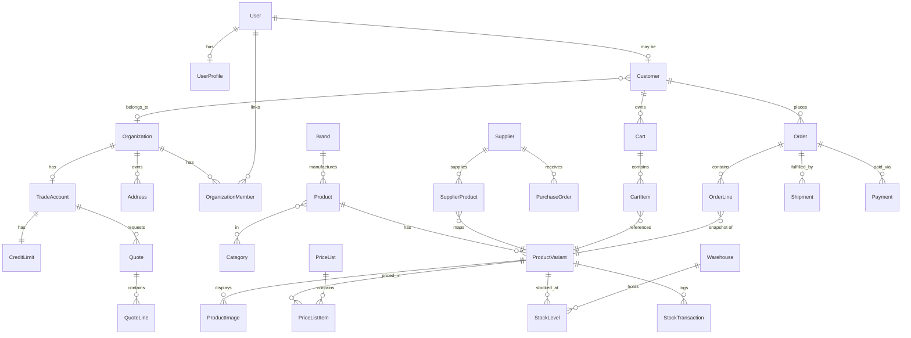
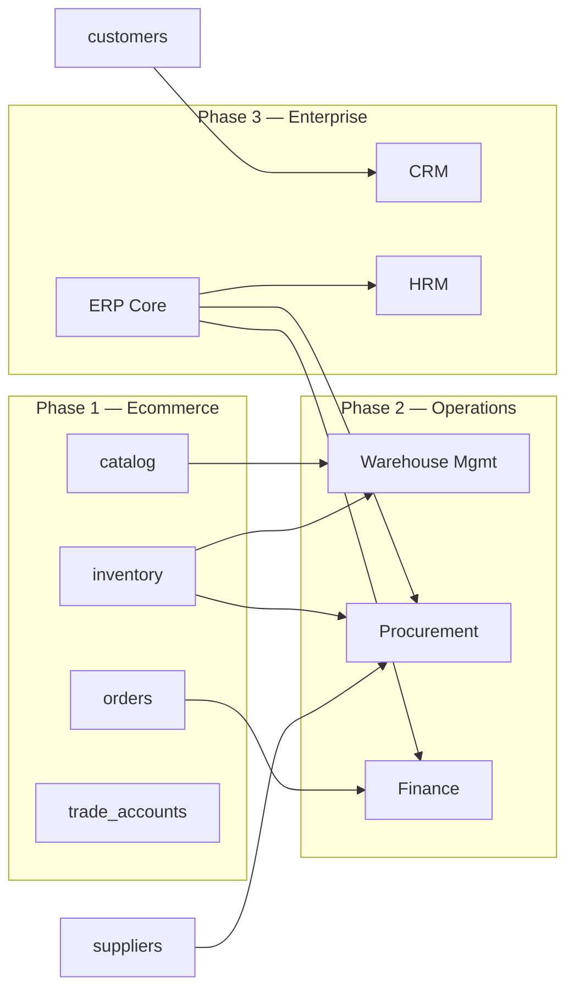

# A2Z Tools — Backend Architecture

**Django · Django REST Framework · PostgreSQL · Docker**

| Attribute | Value |
|-----------|-------|
| **Pattern** | Modular monolith (ERP-ready) |
| **API** | REST `/api/v1` — JSON, cursor pagination |
| **Currency** | AUD (integer cents) |
| **Tax** | GST 10% |
| **Timezone** | `Australia/Sydney` (AEST/AEDT) |
| **Locale** | `en-AU` |
| **Document Version** | 1.0 |

---

## Table of Contents

1. [Executive Summary](#1-executive-summary)
2. [Folder Structure](#2-folder-structure)
3. [Django Apps & Boundaries](#3-django-apps--boundaries)
4. [Database Design](#4-database-design)
5. [Model Relationships](#5-model-relationships)
6. [API Structure](#6-api-structure)
7. [Docker Setup](#7-docker-setup)
8. [Environment Variables](#8-environment-variables)
9. [Authentication Strategy](#9-authentication-strategy)
10. [ERP Scalability Plan](#10-erp-scalability-plan)
11. [Future Module Compatibility](#11-future-module-compatibility)
12. [Australian Compliance](#12-australian-compliance)
13. [Implementation Phases](#13-implementation-phases)

---

## 1. Executive Summary

A2Z Tools backend is a **modular Django monolith** designed as the system of record for Australian B2B/B2C hardware and networking commerce, with a clear path to full ERP (procurement, warehouse, finance, CRM, HRM).

**Core principles:**

| Principle | Rationale |
|-----------|-----------|
| **App-per-domain** | Each Django app owns one bounded context; cross-app imports only via public services |
| **UUID at the edge** | Public APIs expose UUIDs; `BigAutoField` PKs stay internal |
| **Money as cents** | `BigIntegerField` for all AUD amounts — never float |
| **GST snapshots** | Tax frozen on orders, quotes, and invoices at transaction time |
| **Inventory ledger** | Stock changes are append-only transactions, not silent overwrites |
| **Event-ready** | Domain events (order.placed, stock.reserved) feed analytics and future integrations |
| **API-first** | Next.js storefront, admin, mobile, and ERP modules all consume the same REST API |

**Technology stack:**

```
┌─────────────┐     ┌─────────────┐     ┌─────────────┐
│  Next.js    │────►│  Django     │────►│ PostgreSQL  │
│  (frontend) │ JWT │  + DRF      │     │  16+        │
└─────────────┘     └──────┬──────┘     └─────────────┘
                           │
                    ┌──────┴──────┐
                    │ Redis       │
                    │ Celery      │
                    └─────────────┘
```

---

## 2. Folder Structure

### 2.1 Repository Layout

```
a2z-tools/
├── docker-compose.yml              # Dev: db, redis, api, celery, web
├── docker-compose.prod.yml         # Prod: gunicorn, nginx, managed volumes
├── .env.example                    # Root env template
├── Makefile                        # dev, migrate, test shortcuts
│
├── docs/
│   ├── API_SPECIFICATION.md        # Endpoint contracts (v1)
│   ├── DATABASE_PLAN.md            # Detailed table definitions
│   └── architecture/
│       ├── BACKEND_ARCHITECTURE.md # This document
│       ├── auth-flow.md
│       └── deployment.md
│
├── frontend/                       # Next.js 15 (headless storefront)
│
├── backend/
│   ├── manage.py
│   ├── Dockerfile                  # multi-stage: development | production
│   ├── pyproject.toml
│   ├── pytest.ini
│   ├── .env.example
│   │
│   ├── config/                     # Project configuration
│   │   ├── settings/
│   │   │   ├── __init__.py
│   │   │   ├── base.py             # Shared: apps, DRF, JWT, AU defaults
│   │   │   ├── dev.py
│   │   │   ├── prod.py
│   │   │   └── test.py
│   │   ├── urls.py                 # /admin, /api/v1/, /api/schema/
│   │   ├── wsgi.py
│   │   ├── asgi.py
│   │   └── celery.py
│   │
│   ├── api/                        # API layer (thin routing)
│   │   ├── v1/
│   │   │   ├── urls.py             # Aggregates app URL includes
│   │   │   ├── schema.py           # drf-spectacular OpenAPI
│   │   │   └── permissions.py      # Shared DRF permission classes
│   │   └── health/
│   │       └── views.py            # /health, /ready probes
│   │
│   ├── apps/                       # Domain applications
│   │   ├── core/                   # Base models, mixins, exceptions, pagination
│   │   ├── accounts/               # Users, auth, RBAC, sessions
│   │   ├── customers/              # B2C/B2B customer profiles, addresses, orgs
│   │   ├── trade_accounts/         # Trade onboarding, credit, price tiers
│   │   ├── catalog/                # Products, categories, brands, attributes
│   │   ├── inventory/              # Warehouses, stock ledger, reservations
│   │   ├── suppliers/              # Supplier master, PO headers (procurement seed)
│   │   ├── pricing/                # Price lists, rules, coupons, GST helpers
│   │   ├── orders/                 # Carts, wishlists, orders, fulfilment
│   │   ├── analytics/              # Events, aggregates, reporting API
│   │   └── cms/                    # Pages, blog, navigation, SEO blocks
│   │
│   ├── services/                   # Cross-app orchestration (optional layer)
│   │   ├── checkout.py             # Cart → order → payment → inventory
│   │   ├── pricing_engine.py       # Resolve trade/retail/GST price
│   │   └── stock_allocation.py     # Reserve/release stock
│   │
│   ├── requirements/
│   │   ├── base.txt
│   │   ├── dev.txt
│   │   └── prod.txt
│   │
│   ├── templates/                  # Admin email templates
│   ├── static/
│   ├── media/                      # Dev media; prod → S3/R2
│   ├── fixtures/                   # Seed data (categories, GST, AU states)
│   └── scripts/
│       ├── wait_for_db.py
│       └── seed_catalog.py
│
└── infrastructure/
    ├── nginx/
    └── terraform/                  # Future: RDS, ElastiCache, ECS/Render
```

### 2.2 Per-App Internal Structure

Every domain app follows the same layout for consistency and testability:

```
apps/catalog/
├── __init__.py
├── apps.py
├── admin.py
├── models/
│   ├── __init__.py
│   ├── brand.py
│   ├── category.py
│   ├── product.py
│   └── variant.py
├── managers.py                     # Custom QuerySets
├── services.py                     # Business logic (no HTTP)
├── selectors.py                    # Read-optimised queries
├── serializers/
│   ├── __init__.py
│   ├── product.py
│   └── category.py
├── views/
│   ├── __init__.py
│   ├── product.py
│   └── category.py
├── urls.py
├── filters.py
├── signals.py
├── tasks.py                        # Celery tasks
├── migrations/
└── tests/
    ├── test_models.py
    ├── test_services.py
    └── test_api.py
```

### 2.3 Mapping: Current Scaffold → Target ERP Apps

The repository already contains scaffold apps. Migrate toward the canonical ERP layout:

| Current app | Target | Action |
|-------------|--------|--------|
| `apps.accounts` | `accounts` | Keep — extend with custom User + RBAC |
| `apps.organizations` | `customers` + `trade_accounts` | Split: org/address → customers; credit/tiers → trade_accounts |
| `apps.catalog` | `catalog` | Keep |
| `apps.inventory` | `inventory` | Keep — add ledger models |
| — | `suppliers` | **Add** — extract supplier FK from inventory |
| `apps.pricing` | `pricing` | Keep |
| `apps.cart` | `orders` (subpackage) | Merge cart/wishlist under orders |
| `apps.orders` | `orders` | Keep — absorb cart |
| `apps.payments` | `orders` or `finance` (Phase 3) | Keep separate until finance module |
| `apps.shipping` | `orders` | Fulfilment submodule |
| `apps.analytics` | `analytics` | Keep |
| `apps.cms` | `cms` | Keep |
| `apps.quotes` | `trade_accounts` | RFQ/quotes under trade |
| `apps.integrations` | `core` + Celery | Webhooks, Xero/MYOB adapters |

---

## 3. Django Apps & Boundaries

### 3.1 App Responsibility Matrix

| App | Owns | Does NOT own |
|-----|------|--------------|
| **core** | `TimeStampedModel`, `PublicIdMixin`, `SoftDeleteMixin`, pagination, exception handler, AU validators (ABN, postcode) | Domain entities |
| **accounts** | User, Profile, Role, Permission, JWT blacklist, password reset, staff admin access | Customer commercial data |
| **customers** | Customer, Organization, Address, OrganizationMember, customer segments | Pricing, credit limits |
| **trade_accounts** | TradeApplication, TradeAccount, CreditLimit, PaymentTerms, Quote, QuoteLine | Product catalog |
| **catalog** | Brand, Category, Product, ProductVariant, Attribute, ProductImage, SEO | Stock quantities, prices |
| **inventory** | Warehouse, StockLevel, StockTransaction, StockReservation, ReorderPoint | Supplier contracts |
| **suppliers** | Supplier, SupplierContact, SupplierProduct, PurchaseOrder (header) | Goods receipt (WMS Phase 2) |
| **pricing** | PriceList, PriceListItem, PricingRule, Coupon, TaxRate (GST) | Order totals (computed at checkout) |
| **orders** | Cart, CartItem, Wishlist, Order, OrderLine, Shipment, PaymentIntent | User identity |
| **analytics** | Event, Session, DailyAggregate, SearchLog | Source transactional writes |
| **cms** | Page, PageBlock, BlogPost, NavigationMenu, Redirect | Product data |

### 3.2 Dependency Graph (allowed import direction)

```
                    ┌─────────┐
                    │  core   │
                    └────┬────┘
         ┌───────────────┼───────────────┐
         ▼               ▼               ▼
   ┌──────────┐   ┌──────────┐   ┌──────────┐
   │ accounts │   │   cms    │   │analytics │
   └────┬─────┘   └──────────┘   └──────────┘
        ▼
   ┌──────────┐     ┌───────────────┐
   │customers │────►│ trade_accounts│
   └────┬─────┘     └───────┬───────┘
        │                   │
        ▼                   ▼
   ┌──────────┐     ┌──────────┐     ┌──────────┐
   │ catalog  │◄────│ pricing  │     │suppliers │
   └────┬─────┘     └────┬─────┘     └────┬─────┘
        │                │                │
        ▼                ▼                ▼
   ┌──────────┐                    ┌──────────┐
   │inventory │◄───────────────────│  orders  │
   └──────────┘                    └──────────┘
```

**Rule:** Apps may import from `core` and from apps to their left in the flow. Never import `orders` from `catalog`.

---

## 4. Database Design

### 4.1 PostgreSQL Configuration

```sql
-- Database-level settings (applied via migration or init script)
CREATE DATABASE a2z_tools
  ENCODING 'UTF8'
  LC_COLLATE 'en_AU.UTF-8'
  LC_CTYPE 'en_AU.UTF-8';

-- Recommended extensions
CREATE EXTENSION IF NOT EXISTS "uuid-ossp";
CREATE EXTENSION IF NOT EXISTS "pg_trgm";      -- fuzzy search
CREATE EXTENSION IF NOT EXISTS "btree_gin";    -- composite indexes
```

Django `TIME_ZONE = "Australia/Sydney"` — all `DateTimeField` values stored UTC, displayed in AEST/AEDT.

### 4.2 Schema Groups (Logical)

```
a2z_tools
├── auth.*              → accounts (custom user)
├── customers.*         → customers
├── trade.*             → trade_accounts
├── catalog.*           → catalog
├── inventory.*         → inventory
├── suppliers.*         → suppliers
├── pricing.*           → pricing
├── commerce.*          → orders (cart, order, shipment)
├── analytics.*         → analytics
└── cms.*               → cms
```

Phase 1: single database, single schema (`public`). Phase 3+: optional PostgreSQL schemas per future ERP module without breaking ecommerce tables.

### 4.3 Core Tables by App

#### accounts

| Table | Purpose | Key fields |
|-------|---------|------------|
| `users` | Auth identity | `public_id` UUID, `email` UK, `password`, `is_staff`, `is_active` |
| `user_profiles` | Display profile | `user_id` FK, `first_name`, `last_name`, `phone`, `preferences` JSONB |
| `roles` | RBAC roles | `slug` UK, `name`, `is_system` |
| `permissions` | Fine-grained perms | `codename` UK, `module` |
| `role_permissions` | M2M | `role_id`, `permission_id` |
| `user_roles` | User ↔ Role | `user_id`, `role_id`, `organization_id` nullable |
| `refresh_token_blacklist` | JWT rotation | `jti`, `expires_at` |

#### customers

| Table | Purpose | Key fields |
|-------|---------|------------|
| `customers` | Commercial entity | `public_id`, `user_id` FK nullable, `customer_type` (retail/trade/guest) |
| `organizations` | B2B company | `legal_name`, `trading_name`, `abn` UK, `abn_verified`, `acn` |
| `organization_members` | Users in org | `organization_id`, `user_id`, `role` (owner/buyer/accounts) |
| `addresses` | AU addresses | `line1`, `suburb`, `state`, `postcode`, `country` default AU |

#### trade_accounts

| Table | Purpose | Key fields |
|-------|---------|------------|
| `trade_applications` | Onboarding workflow | `organization_id`, `status`, `submitted_at`, `reviewed_by` |
| `trade_accounts` | Approved trade | `organization_id` UK, `account_number`, `tier` (bronze/silver/gold) |
| `credit_limits` | Credit control | `trade_account_id`, `limit_cents`, `used_cents`, `currency` AUD |
| `payment_terms` | Net days | `trade_account_id`, `terms_days` (7/14/30/60) |
| `quotes` | B2B RFQ | `quote_number`, `status`, `valid_until`, GST snapshot fields |
| `quote_lines` | Quote items | `variant_id`, `qty`, `unit_price_ex_gst_cents`, frozen SKU/name |

#### catalog

| Table | Purpose | Key fields |
|-------|---------|------------|
| `brands` | Manufacturer | `slug` UK, `name`, `logo_url`, `is_authorized_reseller` |
| `categories` | Nested set / MPTT | `parent_id`, `slug` UK, `name`, `path` |
| `products` | Product master | `public_id`, `brand_id`, `name`, `slug` UK, `description`, `search_vector` tsvector |
| `product_variants` | Sellable SKU | `product_id`, `sku` UK, `barcode`, `weight_grams` |
| `product_images` | Media refs | `product_id`, `url`, `alt`, `sort_order` |
| `product_attributes` | Specs | `variant_id`, `key`, `value` |
| `category_products` | M2M | `category_id`, `product_id` |

#### inventory

| Table | Purpose | Key fields |
|-------|---------|------------|
| `warehouses` | Stock locations | `code` UK, `name`, `state`, `is_default`, `is_pickable` |
| `stock_levels` | Current qty per WH | `warehouse_id`, `variant_id` UK composite, `qty_on_hand`, `qty_reserved` |
| `stock_transactions` | Ledger (append-only) | `variant_id`, `warehouse_id`, `qty_delta`, `reason`, `reference_type/id` |
| `stock_reservations` | Checkout holds | `variant_id`, `order_id`/`cart_id`, `qty`, `expires_at` |
| `reorder_rules` | Replenishment | `variant_id`, `min_qty`, `supplier_id` |

#### suppliers

| Table | Purpose | Key fields |
|-------|---------|------------|
| `suppliers` | Vendor master | `code` UK, `name`, `abn`, `payment_terms_days`, `currency` AUD |
| `supplier_contacts` | AP contacts | `supplier_id`, `name`, `email`, `phone` |
| `supplier_products` | Vendor SKU map | `supplier_id`, `variant_id`, `supplier_sku`, `cost_ex_gst_cents` |
| `purchase_orders` | PO header (seed) | `po_number`, `supplier_id`, `status`, `warehouse_id` |
| `purchase_order_lines` | PO lines | `po_id`, `variant_id`, `qty_ordered`, `unit_cost_cents` |

#### pricing

| Table | Purpose | Key fields |
|-------|---------|------------|
| `tax_rates` | GST config | `code` (GST), `rate` 0.1000, `country` AU, `valid_from` |
| `price_lists` | Named lists | `slug` (retail/trade-tier-1), `currency` AUD |
| `price_list_items` | SKU prices | `price_list_id`, `variant_id`, `amount_ex_gst_cents` |
| `pricing_rules` | % off, bulk breaks | `trade_tier`, `min_qty`, `discount_bps` |
| `coupons` | Promotions | `code` UK, `discount_type`, `valid_from/to` |

#### orders

| Table | Purpose | Key fields |
|-------|---------|------------|
| `carts` | Session/user cart | `user_id` nullable, `session_key`, `currency` AUD |
| `cart_items` | Line items | `cart_id`, `variant_id`, `qty` |
| `wishlists` | Saved products | `customer_id`, `variant_id` |
| `orders` | Confirmed sale | `order_number` UK, `customer_id`, `status`, GST totals |
| `order_lines` | Frozen line snapshot | `sku`, `name`, `qty`, `unit_*_cents`, `gst_rate` |
| `shipments` | Fulfilment | `order_id`, `carrier`, `tracking_number`, `status` |
| `payments` | Payment records | `order_id`, `provider`, `amount_cents`, `status` |

#### analytics

| Table | Purpose | Key fields |
|-------|---------|------------|
| `events` | Raw events | `event_type`, `user_id`, `session_id`, `payload` JSONB, `occurred_at` |
| `search_logs` | Predictive search | `query`, `results_count`, `clicked_type/id` |
| `daily_aggregates` | Rollups | `date`, `metric`, `dimension`, `value` |

#### cms

| Table | Purpose | Key fields |
|-------|---------|------------|
| `pages` | Static content | `slug` UK, `title`, `status`, `published_at` |
| `page_blocks` | Flexible content | `page_id`, `block_type`, `content` JSONB, `sort_order` |
| `blog_posts` | Blog | `slug`, `author_id`, `body`, `seo_meta` JSONB |
| `navigation_menus` | Header/footer | `location`, `items` JSONB |
| `redirects` | SEO redirects | `from_path`, `to_path`, `status_code` |

### 4.4 Indexing Strategy

| Pattern | Index | Reason |
|---------|-------|--------|
| Public API lookups | `UNIQUE (public_id)` on all exposed entities | UUID path params |
| Catalog browse | `(category_id, is_published, sort_order)` | Category PLP |
| Search | GIN on `search_vector` | Full-text product search |
| SKU lookup | `UNIQUE (sku)` on `product_variants` | Cart/checkout |
| Stock | `(warehouse_id, variant_id)` composite UK | Inventory joins |
| Orders | `(customer_id, created_at DESC)` | Account order history |
| Analytics | `(event_type, occurred_at)` BRIN or btree | Time-series queries |
| ABN | `UNIQUE (abn)` on organizations | B2B dedup |

### 4.5 Money & GST Column Pattern

Every monetary line item (cart preview, order line, quote line, invoice line) stores:

```
unit_price_ex_gst_cents   BIGINT NOT NULL
gst_rate                  NUMERIC(5,4) NOT NULL DEFAULT 0.1000
gst_cents                 BIGINT NOT NULL
unit_price_inc_gst_cents  BIGINT NOT NULL
currency_code             CHAR(3) NOT NULL DEFAULT 'AUD'
```

Order header stores rolled-up totals with the same pattern. **Never recalculate GST from catalog after order placement.**

---

## 5. Model Relationships

### 5.1 ER Diagram — Commerce Core



### 5.2 Key Relationship Rules

| Relationship | Cardinality | On delete | Notes |
|--------------|-------------|-----------|-------|
| User → Customer | 1:0..1 | CASCADE | Guest checkout uses session-only customer |
| Organization → TradeAccount | 1:0..1 | PROTECT | Must close account before org delete |
| Product → ProductVariant | 1:N | CASCADE | Variant is the sellable unit |
| Variant → StockLevel | 1:N | CASCADE | One row per warehouse |
| Order → OrderLine | 1:N | RESTRICT | Lines immutable after payment |
| OrderLine → Variant | N:1 | SET_NULL | Variant ref kept but snapshot is source of truth |
| CartItem → Variant | N:1 | CASCADE | Live price resolved at read time |
| Quote → QuoteLine | 1:N | CASCADE | Converts to order via service |

### 5.3 Django Model Base Classes (`apps/core/models.py`)

```python
class TimeStampedModel(models.Model):
    created_at = models.DateTimeField(auto_now_add=True, db_index=True)
    updated_at = models.DateTimeField(auto_now=True)

    class Meta:
        abstract = True

class PublicIdModel(TimeStampedModel):
    public_id = models.UUIDField(default=uuid.uuid4, unique=True, editable=False)

    class Meta:
        abstract = True

class SoftDeleteModel(TimeStampedModel):
    deleted_at = models.DateTimeField(null=True, blank=True, db_index=True)

    class Meta:
        abstract = True
```

### 5.4 Custom User (`apps/accounts/models.py`)

```python
class User(AbstractBaseUser, PermissionsMixin, PublicIdModel):
    email = models.EmailField(unique=True)
    is_staff = models.BooleanField(default=False)
    is_active = models.BooleanField(default=True)
    email_verified_at = models.DateTimeField(null=True, blank=True)

    USERNAME_FIELD = "email"
    REQUIRED_FIELDS = []
```

---

## 6. API Structure

Base URL: `https://api.a2ztools.com.au/api/v1`

Full endpoint contracts live in [`API_SPECIFICATION.md`](../API_SPECIFICATION.md). Summary by app:

### 6.1 URL Routing (`api/v1/urls.py`)

```python
urlpatterns = [
    path("health/", ...),
    path("ready/", ...),

    # accounts
    path("auth/", include("apps.accounts.urls")),           # register, login, refresh, logout, me

    # customers
    path("customers/", include("apps.customers.urls")),     # profile, addresses
    path("organizations/", include("apps.customers.urls_orgs")),

    # trade_accounts
    path("trade/", include("apps.trade_accounts.urls")),    # apply, status, quotes
    path("quotes/", include("apps.trade_accounts.urls_quotes")),

    # catalog
    path("products/", include("apps.catalog.urls_products")),
    path("categories/", include("apps.catalog.urls_categories")),
    path("brands/", include("apps.catalog.urls_brands")),
    path("search/", include("apps.catalog.urls_search")),   # predictive search

    # inventory (staff + trade)
    path("inventory/", include("apps.inventory.urls")),

    # suppliers (staff)
    path("suppliers/", include("apps.suppliers.urls")),

    # pricing
    path("pricing/", include("apps.pricing.urls")),           # coupons validate, price preview

    # orders
    path("cart/", include("apps.orders.urls_cart")),
    path("wishlists/", include("apps.orders.urls_wishlist")),
    path("orders/", include("apps.orders.urls")),
    path("checkout/", include("apps.orders.urls_checkout")),
    path("shipping/", include("apps.orders.urls_shipping")),

    # analytics (internal + beacon)
    path("analytics/", include("apps.analytics.urls")),

    # cms (public read)
    path("cms/", include("apps.cms.urls")),
]
```

### 6.2 Endpoint Summary

| Module | Method | Path | Auth | Description |
|--------|--------|------|------|-------------|
| **Auth** | POST | `/auth/register/` | Public | Create user + customer |
| | POST | `/auth/login/` | Public | JWT access + refresh |
| | POST | `/auth/refresh/` | Refresh | Rotate tokens |
| | POST | `/auth/logout/` | JWT | Blacklist refresh |
| | GET | `/auth/me/` | JWT | User + profile + trade status |
| **Products** | GET | `/products/` | Public | List/filter/search (cursor) |
| | GET | `/products/{id}/` | Public | Detail + variants + pricing |
| **Categories** | GET | `/categories/` | Public | Tree |
| | GET | `/categories/{slug}/products/` | Public | Category PLP |
| **Brands** | GET | `/brands/` | Public | Brand directory |
| **Search** | GET | `/search/predictive/?q=` | Public | Products/categories/brands |
| **Cart** | GET/PATCH | `/cart/` | Session/JWT | Current cart |
| | POST | `/cart/items/` | Session/JWT | Add line |
| **Wishlist** | GET | `/wishlists/` | JWT | List |
| | POST | `/wishlists/items/` | JWT | Add |
| **Checkout** | POST | `/checkout/preview/` | Session/JWT | Totals + GST + shipping |
| | POST | `/checkout/place/` | Session/JWT | Create order |
| **Orders** | GET | `/orders/` | JWT | Customer order history |
| | GET | `/orders/{id}/` | JWT | Detail + shipments |
| **Trade** | POST | `/trade/apply/` | JWT | Submit application |
| | GET | `/trade/account/` | JWT | Trade account + credit |
| **Quotes** | GET/POST | `/quotes/` | JWT Trade | RFQ list/create |
| **Inventory** | GET | `/inventory/variants/{id}/` | Staff/Trade | Stock by warehouse |
| **Suppliers** | GET | `/suppliers/` | Staff | Supplier list |
| **CMS** | GET | `/cms/pages/{slug}/` | Public | Page content |
| | GET | `/cms/blog/` | Public | Blog index |
| **Analytics** | POST | `/analytics/events/` | Public | Beacon (rate-limited) |

### 6.3 Serializer & Response Conventions

- **Public IDs only** in JSON — never integer PKs
- **Cents** for all money — `amount_inc_gst_cents: 34900` = $349.00 AUD
- **Cursor pagination** envelope: `{ data, pagination: { next_cursor, has_more, limit } }`
- **Errors**: `{ error: { code, message, details } }`
- **OpenAPI**: `/api/schema/` + `/api/docs/` via drf-spectacular

### 6.4 Versioning Strategy

| Version | Path | Status |
|---------|------|--------|
| v1 | `/api/v1/` | Current — storefront + admin |
| v2 | `/api/v2/` | Future — ERP/mobile breaking changes |

Additive changes only in v1 (new optional fields). Breaking changes require v2.

---

## 7. Docker Setup

### 7.1 Development Stack (`docker-compose.yml`)

```yaml
services:
  db:        postgres:16-alpine   # port 5432, volume postgres_data
  redis:     redis:7-alpine       # port 6379, Celery broker + cache
  api:       backend Dockerfile   # port 8000, runserver + hot reload
  celery:    backend Dockerfile   # async tasks
  celery-beat:                   # scheduled jobs (reorder reports, aggregates)
  web:       frontend Dockerfile  # port 3000, Next.js dev
```

**Startup:**

```bash
cp .env.example .env
docker compose up -d
docker compose exec api python manage.py migrate
docker compose exec api python manage.py createsuperuser
```

### 7.2 Production Stack (`docker-compose.prod.yml`)

| Service | Image | Notes |
|---------|-------|-------|
| `db` | postgres:16-alpine | Managed volume, no public port |
| `redis` | redis:7-alpine | Persistence AOF |
| `api` | backend:production | Gunicorn 4 workers |
| `celery` | backend:production | Horizontal scale |
| `nginx` | nginx:alpine | TLS termination, static/media proxy |

### 7.3 Backend Dockerfile (multi-stage)

```
base        → python:3.12-slim
development → + libpq-dev, dev requirements, runserver
production  → + gunicorn, non-root user, collectstatic
```

### 7.4 Health Checks

| Endpoint | Purpose |
|----------|---------|
| `GET /api/v1/health/` | Liveness — process up |
| `GET /api/v1/ready/` | Readiness — DB + Redis connected |

### 7.5 Celery Task Categories

| Queue | Tasks |
|-------|-------|
| `default` | Email, webhooks |
| `inventory` | Stock sync, reservation expiry |
| `analytics` | Event batch insert, daily rollups |
| `integrations` | Xero/MYOB sync (future) |

---

## 8. Environment Variables

### 8.1 Root `.env.example`

```bash
# ─── Django ─────────────────────────────────────────
DJANGO_SETTINGS_MODULE=config.settings.dev
DJANGO_SECRET_KEY=change-me-to-a-secure-random-string-min-50-chars
DJANGO_DEBUG=True
DJANGO_ALLOWED_HOSTS=localhost,127.0.0.1,api

# ─── Database (PostgreSQL) ──────────────────────────
POSTGRES_DB=a2z_tools
POSTGRES_USER=a2z
POSTGRES_PASSWORD=changeme
POSTGRES_HOST=localhost
POSTGRES_PORT=5432
POSTGRES_HOST_PORT=5432          # docker host mapping

# ─── Redis / Celery ─────────────────────────────────
REDIS_URL=redis://localhost:6379/0
REDIS_HOST_PORT=6379
CELERY_BROKER_URL=redis://localhost:6379/0

# ─── CORS / Frontend ────────────────────────────────
DJANGO_CORS_ALLOWED_ORIGINS=http://localhost:3000
NEXT_PUBLIC_API_URL=http://localhost:8000/api/v1
NEXT_PUBLIC_SITE_URL=http://localhost:3000

# ─── JWT ────────────────────────────────────────────
JWT_ACCESS_TOKEN_LIFETIME_MINUTES=15
JWT_REFRESH_TOKEN_LIFETIME_DAYS=7

# ─── Australian Defaults ────────────────────────────
A2Z_CURRENCY_CODE=AUD
A2Z_GST_RATE=0.1000
A2Z_DEFAULT_COUNTRY=AU
A2Z_TIMEZONE=Australia/Sydney

# ─── Email (dev: console) ───────────────────────────
EMAIL_BACKEND=django.core.mail.backends.console.EmailBackend
DEFAULT_FROM_EMAIL=noreply@a2ztools.com.au

# ─── Storage (prod) ─────────────────────────────────
# AWS_S3_BUCKET=a2z-tools-media
# AWS_S3_REGION=ap-southeast-2
# AWS_ACCESS_KEY_ID=
# AWS_SECRET_ACCESS_KEY=

# ─── Payments (Phase 2) ─────────────────────────────
# STRIPE_SECRET_KEY=
# STRIPE_WEBHOOK_SECRET=

# ─── Integrations (Phase 3) ─────────────────────────
# XERO_CLIENT_ID=
# XERO_CLIENT_SECRET=
# ABN_LOOKUP_GUID=                  # ABR web services
```

### 8.2 Settings Module Split

| Module | Use |
|--------|-----|
| `config.settings.dev` | DEBUG=True, console email, django-extensions |
| `config.settings.test` | SQLite or PG test DB, fast password hasher |
| `config.settings.prod` | DEBUG=False, S3 storage, Sentry, secure cookies |

### 8.3 Django Settings — Australian Constants (`base.py`)

```python
LANGUAGE_CODE = "en-au"
TIME_ZONE = "Australia/Sydney"
USE_TZ = True

A2Z_CURRENCY_CODE = os.environ.get("A2Z_CURRENCY_CODE", "AUD")
A2Z_GST_RATE = Decimal(os.environ.get("A2Z_GST_RATE", "0.1000"))
A2Z_DEFAULT_COUNTRY = "AU"

AU_STATES = ("NSW", "VIC", "QLD", "SA", "WA", "TAS", "NT", "ACT")
```

---

## 9. Authentication Strategy

### 9.1 Overview

```
┌──────────────┐    POST /auth/login     ┌──────────────┐
│   Next.js    │ ──────────────────────► │   Django     │
│   Storefront │ ◄────────────────────── │   + JWT      │
└──────────────┘   access + refresh     └──────────────┘
        │                                        │
        │  Authorization: Bearer <access>        │
        └────────────────────────────────────────┘
```

| Concern | Implementation |
|---------|----------------|
| **Protocol** | JWT (access + refresh) via `djangorestframework-simplejwt` |
| **Access token** | 15 min — in memory (frontend) |
| **Refresh token** | 7 days — httpOnly cookie or secure storage |
| **Rotation** | `ROTATE_REFRESH_TOKENS=True`, blacklist on logout |
| **Guest cart** | `X-Session-Key` UUID header — merged on login |
| **Staff admin** | Django admin session + `is_staff` + role permissions |
| **Trade endpoints** | JWT + `TradeAccount` approved + org membership |

### 9.2 Role-Based Access Control

| Role | Scope | Permissions |
|------|-------|-------------|
| `customer` | Own data | cart, orders, wishlist, addresses |
| `trade_buyer` | Organization | + trade prices, quotes, credit checkout |
| `trade_admin` | Organization | + manage org members, addresses |
| `staff_support` | Global read | orders, customers (read) |
| `staff_catalog` | Catalog | products, inventory (write) |
| `staff_procurement` | Suppliers | POs, suppliers |
| `superadmin` | All | Django admin |

Permissions stored in `permissions` table; roles assigned per-user globally or per-organization via `user_roles.organization_id`.

### 9.3 Auth Endpoints

```
POST /api/v1/auth/register/     { email, password, first_name, last_name }
POST /api/v1/auth/login/        { email, password } → { access, refresh, user }
POST /api/v1/auth/refresh/      { refresh } → { access }
POST /api/v1/auth/logout/       { refresh } → blacklist
POST /api/v1/auth/password/reset/
POST /api/v1/auth/password/reset/confirm/
GET  /api/v1/auth/me/           → user, profile, customer, trade_account
```

### 9.4 Security Checklist

- [ ] HTTPS only in production (`SECURE_SSL_REDIRECT`)
- [ ] `CORS_ALLOWED_ORIGINS` explicit — no wildcard with credentials
- [ ] Rate limit login: 5/min per IP (django-ratelimit or Redis)
- [ ] Password validators: min 10 chars, common password check
- [ ] Email verification before trade application
- [ ] ABN validation via ABR API on trade onboarding
- [ ] Audit log on staff actions (future `core.AuditLog`)

---

## 10. ERP Scalability Plan

### 10.1 Modular Monolith → Extractable Services

Stay monolith until a domain hits independent scaling needs. Each app is a future service boundary:

```
Phase 1 (Now)          Phase 2 (12–18 mo)       Phase 3 (24+ mo)
─────────────          ──────────────────       ─────────────────
Django monolith   →    + Read replicas          + Inventory service
                       + Redis cache layer      + Finance service
                       + S3 media                 + CRM (HubSpot sync)
                       + Event outbox             + WMS integration
```

### 10.2 Horizontal Scaling

| Layer | Strategy |
|-------|----------|
| **API** | Stateless Gunicorn/Uvicorn workers behind load balancer |
| **PostgreSQL** | Primary + read replica for catalog/search/analytics |
| **Redis** | Session, cache, Celery broker, rate limits |
| **Celery** | Separate worker pools per queue |
| **Media** | S3/R2 — never local disk in prod |

### 10.3 Performance Targets

| Endpoint | Target p95 |
|----------|------------|
| Product list | < 200ms |
| Product detail | < 150ms |
| Predictive search | < 100ms |
| Checkout preview | < 300ms |
| Place order | < 500ms |

**Tactics:** `select_related`/`prefetch_related`, Redis cache for category trees, denormalised `search_vector`, connection pooling (pgBouncer).

### 10.4 Event Outbox (ERP Integration)

```python
class OutboxEvent(models.Model):
    event_type = models.CharField(max_length=100)  # order.placed
    aggregate_id = models.UUIDField()
    payload = models.JSONField()
    created_at = models.DateTimeField(auto_now_add=True)
    published_at = models.DateTimeField(null=True)
```

Celery publishes to message bus (SQS/Kafka) for CRM, ERP, WMS consumers without dual-write bugs.

### 10.5 Data Partitioning (Future)

| Table | Strategy | When |
|-------|----------|------|
| `events` | Monthly partitions | > 50M rows |
| `stock_transactions` | Yearly partitions | > 10M rows |
| `orders` | Archive cold orders to read replica | > 5 years |

---

## 11. Future Module Compatibility

### 11.1 Module Roadmap



### 11.2 CRM (Customer Relationship Management)

| A2Z Tables | CRM Use |
|------------|---------|
| `customers`, `organizations` | Account sync |
| `orders`, `quotes` | Opportunity / deal value |
| `analytics.events` | Activity timeline |
| `trade_applications` | Lead qualification |

**Integration:** Webhook `customer.updated`, `order.placed` → HubSpot/Salesforce. Keep Django as source of truth for commerce data.

### 11.3 ERP Core

| Domain | Extension |
|--------|-----------|
| **Finance** | `invoices`, `credit_notes`, `gl_journal_entries` — link to `orders` |
| **Procurement** | Expand `purchase_orders` → GRN, three-way match |
| **Inventory** | Multi-warehouse transfers, cycle counts, serial numbers |
| **Fixed assets** | Tool tracking for hire/rental (future) |

**Schema strategy:** New Django apps (`finance`, `procurement`) in same DB; optional `erp` PostgreSQL schema.

### 11.4 HRM (Human Resource Management)

| Separation | Rationale |
|------------|-----------|
| Staff `User` in accounts | Login identity only |
| `employees` table in `hrm` app (future) | Payroll, leave — not in ecommerce DB initially |
| Link via `user_id` FK nullable | SSO when HRM module added |

### 11.5 Procurement

Built on `suppliers` app:

```
Requisition → PurchaseOrder → GoodsReceipt → SupplierInvoice → Payment
```

`PurchaseOrder` already seeded in suppliers app. `stock_transactions` with `reason=goods_receipt` posts inventory.

### 11.6 Warehouse Management (WMS)

Built on `inventory` app:

| WMS Feature | Model extension |
|-------------|-----------------|
| Bin locations | `warehouse_locations` (aisle/bin) |
| Pick/pack/ship | `pick_lists`, `pick_list_lines` |
| Wave picking | Celery-orchestrated tasks |
| Serial tracking | `serial_numbers` on variants |

**API:** `/api/v1/wms/` namespace when extracted; internal apps call `services.stock_allocation` until then.

### 11.7 Integration Adapter Pattern

```
apps/integrations/
├── abn_lookup.py      # Australian Business Register
├── stripe.py          # Payments
├── xero.py            # Accounting
├── myob.py            # Accounting
├── auspost.py         # Shipping labels
└── webhooks/
    ├── inbound.py     # Stripe, Xero
    └── outbound.py    # Customer ERP webhooks
```

All adapters implement `IntegrationPort` protocol; swap providers without touching domain services.

---

## 12. Australian Compliance

### 12.1 Currency & Tax

| Requirement | Implementation |
|-------------|----------------|
| AUD only (Phase 1) | `currency_code='AUD'` enforced at model + API validation |
| GST 10% | `A2Z_GST_RATE=0.1000`; `TaxRate` model with effective dates |
| Tax invoices | `TaxInvoice` model: ABN, invoice date, GST amount, line items |
| Display | Frontend shows inc-GST for B2C; trade may show ex-GST with GST subtotal |
| Rounding | Per-line GST round half-up; sum of lines = invoice total |

```python
def calculate_gst(amount_ex_gst_cents: int, rate: Decimal = Decimal("0.1")) -> int:
    return int((Decimal(amount_ex_gst_cents) * rate).quantize(Decimal("1"), rounding=ROUND_HALF_UP))
```

### 12.2 Addresses & Geography

```python
AU_STATE_CHOICES = [
    ("NSW", "New South Wales"),
    ("VIC", "Victoria"),
    ("QLD", "Queensland"),
    ("SA", "South Australia"),
    ("WA", "Western Australia"),
    ("TAS", "Tasmania"),
    ("NT", "Northern Territory"),
    ("ACT", "Australian Capital Territory"),
]
# postcode: RegexValidator(r"^\d{4}$")
# country default: "AU"
```

### 12.3 Business Identifiers

| Field | Validation |
|-------|------------|
| **ABN** | 11 digits, checksum algorithm + optional ABR API |
| **ACN** | 9 digits for incorporated entities |
| **BSB** | 6 digits — for bank transfer checkout (future) |

### 12.4 Timezone

- Store: UTC in PostgreSQL (`timestamptz`)
- Display: `Australia/Sydney` (handles AEST/AEDT automatically)
- Celery beat: crontab in `Australia/Sydney`
- Order numbers: `A2Z-YYYYMMDD-XXXX` using Sydney business date

### 12.5 Privacy (APP)

- PII in `customers`, `addresses` — soft delete, export on request
- Analytics events — no PII in `payload` without consent
- Data residency: `ap-southeast-2` (Sydney) for AWS/Render

---

## 13. Implementation Phases

### Phase 1 — Ecommerce Core (Weeks 1–8)

| Week | Deliverable |
|------|-------------|
| 1–2 | `core`, `accounts`, JWT auth, Docker stable |
| 3–4 | `catalog` CRUD + search API — wire Next.js PLP/PDP |
| 5 | `pricing` + `inventory` stock status |
| 6 | `orders` cart, checkout, GST calculation |
| 7 | `customers` addresses, `trade_accounts` apply flow |
| 8 | `cms` pages, `analytics` events |

### Phase 2 — Trade & Operations (Weeks 9–14)

- Quotes → order conversion
- Credit limit enforcement
- `suppliers` + basic PO
- Stripe payments + tax invoices
- Celery: reservation expiry, low-stock alerts

### Phase 3 — ERP Foundations (Weeks 15+)

- Finance module (Xero sync)
- WMS bin locations + pick lists
- CRM webhook integration
- Read replica + cache layer
- Admin dashboard (Django admin → custom ops UI)

---

## Appendix A — `INSTALLED_APPS` (Target)

```python
LOCAL_APPS = [
    "apps.core",
    "apps.accounts",
    "apps.customers",
    "apps.trade_accounts",
    "apps.catalog",
    "apps.inventory",
    "apps.suppliers",
    "apps.pricing",
    "apps.orders",
    "apps.analytics",
    "apps.cms",
]
```

## Appendix B — Related Documents

| Document | Description |
|----------|-------------|
| [API_SPECIFICATION.md](../API_SPECIFICATION.md) | Full endpoint schemas |
| [DATABASE_PLAN.md](../DATABASE_PLAN.md) | Column-level table definitions |
| [PROJECT_STRUCTURE.md](../PROJECT_STRUCTURE.md) | Repo folder layout |
| [PROJECT_MASTER_PLAN.md](../PROJECT_MASTER_PLAN.md) | Product roadmap |

---

*A2Z Tools Backend Architecture v1.0 — Django ERP-ready modular monolith for Australian B2B/B2C commerce.*
