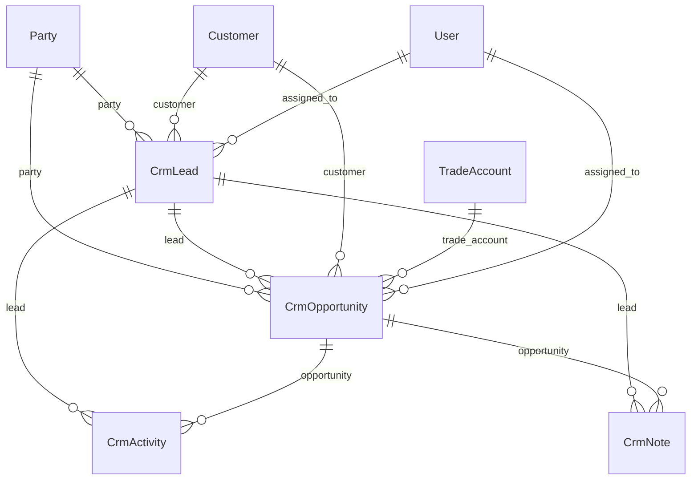

# CRM Module — Architecture

CRM for A2Z Tools sits on the **ERP Foundation Layer**. Customer and trade master data are **not duplicated** — every lead and opportunity links to `erp.Party`, with optional FKs to `customers.Customer` and `trade_accounts.TradeAccount`.

## Module layout

```
backend/apps/crm/
├── constants.py      # Lead/opportunity/activity enums
├── models.py         # CrmLead, CrmOpportunity, CrmActivity, CrmNote
├── services.py       # Business logic + ERP integrations
├── serializers.py    # API shape (camelCase)
├── views.py          # Admin REST endpoints
└── urls.py           # /api/v1/crm/admin/*
```

## Data model (Party-centric)



| Entity | Purpose |
|--------|---------|
| `CrmLead` | Pre-customer prospect; auto-creates `Party` on insert |
| `CrmOpportunity` | Revenue pipeline; requires `Party`; optional lead/customer/trade links |
| `CrmActivity` | Call, meeting, email, follow-up |
| `CrmNote` | Free-form notes |
| Timeline | Aggregated feed of activities + notes + status changes |

### Lead statuses

`new` → `contacted` → `qualified` → `proposal_sent` → `won` / `lost`

### Opportunity fields

- `expected_revenue_cents`, `probability`, `expected_close_date`
- Weighted forecast: `expected_revenue_cents × probability / 100`

## ERP integrations

| Foundation service | CRM usage |
|--------------------|-----------|
| `PartyService` | Create party for new leads; `ensure_for_customer()` on opportunity link |
| `WorkflowEngine` | `crm_opportunity` pipeline (qualified → proposal_sent → won/lost) |
| `NotificationService` | Lead assignment, scheduled activities, opportunity won |
| `AuditService` | All create/update with `AuditModule.CRM` |
| `DomainEventPublisher` | `crm.opportunity.won` / `crm.opportunity.lost` |

Seed workflows: `python manage.py seed_erp_foundation`

## API (`/api/v1/crm/admin/`)

| Method | Path | Permission |
|--------|------|------------|
| GET | `dashboard/` | `crm.view` |
| GET/POST | `leads/` | view / manage |
| GET/PATCH | `leads/{id}/` | view / manage |
| POST | `leads/{id}/convert/` | `crm.manage` |
| GET/POST | `opportunities/` | view / manage |
| GET/PATCH | `opportunities/{id}/` | view / manage |
| GET/POST | `activities/` | view / manage |
| GET/POST | `notes/` | view / manage |
| GET | `timeline/` | `crm.view` |
| GET | `meta/` | `crm.view` |

## RBAC

| Role | `crm.view` | `crm.manage` |
|------|------------|--------------|
| Admin / Super Admin | ✓ | ✓ |
| Manager | ✓ | ✓ |
| Sales Representative | ✓ | ✓ |
| Warehouse Manager | ✗ | ✗ |

Permissions: `crm.view`, `crm.manage` in `apps/accounts/rbac.py` (synced to frontend `lib/rbac/permissions.ts`).

## Admin UI

| Route | Screen |
|-------|--------|
| `/admin-dashboard/crm` | KPI dashboard (leads, opportunities, conversion, forecast) |
| `/admin-dashboard/crm/leads` | Lead list + create |
| `/admin-dashboard/crm/opportunities` | Pipeline table |
| `/admin-dashboard/crm/leads/[id]` | Lead detail — info, timeline, notes, activities, opportunities |
| `/admin-dashboard/crm/opportunities/[id]` | Opportunity detail — revenue, links, quote draft |
| `/admin-dashboard/crm/pipeline` | Kanban board with drag-and-drop stages |

## Quotation draft on win

When an opportunity is marked **Won**, the domain event `crm.opportunity.won` triggers `CrmQuotationService.create_draft_from_opportunity()`:

- Uses `DocumentSequenceService.next_number(DocumentType.QUOTE)` → `QT-{year}-{seq}`
- Creates `trade_accounts.Quote` in **draft** status (no sales order)
- Links `Party`, `Customer`, `TradeAccount` (optional), and `CrmOpportunity`
- Idempotent — one draft per won opportunity

## Pipeline API

| Method | Path | Description |
|--------|------|-------------|
| GET | `/admin/pipeline/` | Kanban columns keyed by lead status |
| PATCH | `/admin/pipeline/` | `{ leadId, status }` — move lead stage |

## Deployment

```bash
python manage.py migrate
python manage.py seed_erp_foundation
```

## Extension points

- Link won opportunities to `orders.Order` via domain events
- SMS notifications via `NotificationChannel.SMS`
- HRM leave workflow remains in foundation (`leave_approval`) — not part of CRM
