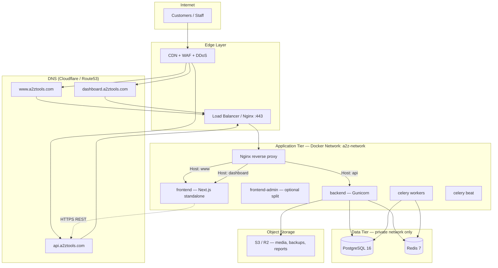
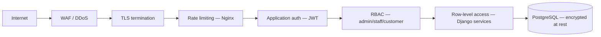
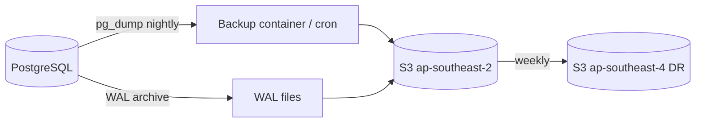
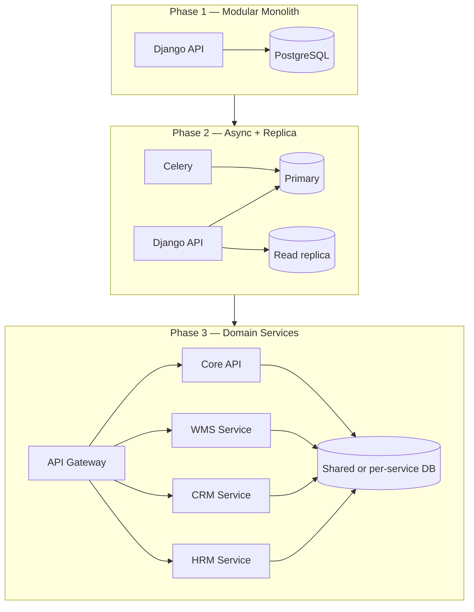
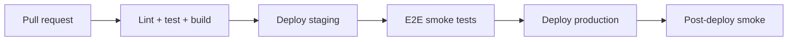

# A2Z Tools — Production Deployment Architecture

**Australian Hardware & Networking Ecommerce Platform**

| Attribute | Value |
|-----------|-------|
| **Version** | 1.0 |
| **Region** | `ap-southeast-2` (Sydney) primary |
| **Stack** | Next.js 15 · Django REST · PostgreSQL 16 · Redis 7 · Docker |
| **Status** | Architecture design — aligns with `docker-compose.yml` + `docker-compose.prod.yml` |

---

## Table of Contents

1. [Production Deployment Architecture](#1-production-deployment-architecture)
2. [Docker Container Strategy](#2-docker-container-strategy)
3. [Domain Structure](#3-domain-structure)
4. [Security Architecture](#4-security-architecture)
5. [Scaling Strategy](#5-scaling-strategy)
6. [Backup Strategy](#6-backup-strategy)
7. [Disaster Recovery Plan](#7-disaster-recovery-plan)
8. [Future ERP Module Compatibility](#8-future-erp-module-compatibility)
9. [CI/CD Pipeline](#9-cicd-pipeline)
10. [Environment Matrix](#10-environment-matrix)

---

## 1. Production Deployment Architecture

### 1.1 High-Level Topology

Production runs as a **Docker Compose stack** on one or more Linux hosts in Sydney, fronted by **Nginx** for TLS termination and host-based routing. Phase 1 is a single-region, multi-container deployment. Phase 2 adds read replicas, horizontal API scaling, and optional Kubernetes when ERP modules justify it.



### 1.2 Request Flow

| Step | Path | Handler |
|------|------|---------|
| 1 | Browser → `www.a2ztools.com` | CDN caches static assets; dynamic HTML from Next.js |
| 2 | Browser → `api.a2ztools.com/api/v1/*` | Nginx → Gunicorn → Django REST |
| 3 | Browser → `dashboard.a2ztools.com` | Nginx → Next.js (`/admin-dashboard/*` routes) |
| 4 | JWT auth | Issued by API; stored in httpOnly cookie or secure storage on dashboard/www |
| 5 | Media/uploads | API writes to S3; served via CDN or signed URLs |

### 1.3 Deployment Phases

| Phase | Scope | Infrastructure |
|-------|-------|----------------|
| **Phase 1 — Launch** | Storefront + admin + API + orders/inventory | 1× VPS (8 vCPU / 16 GB) or managed VM; Compose + Nginx |
| **Phase 2 — Growth** | Celery workers, read replica, CDN | 2× app nodes; managed PostgreSQL (RDS/Neon/Supabase) |
| **Phase 3 — ERP** | CRM, HRM, WMS modules | K8s or ECS; service mesh optional; event bus |

### 1.4 Recommended Cloud Layout (Phase 1)

```
┌─────────────────────────────────────────────────────────────────┐
│  VPC / Private Network (ap-southeast-2)                            │
│                                                                  │
│  ┌──────────────────┐     ┌──────────────────────────────────┐ │
│  │ Public subnet    │     │ Private subnet                    │ │
│  │                  │     │                                   │ │
│  │  Nginx :443      │────▶│  frontend :3000                   │ │
│  │  (TLS terminate) │     │  backend  :8000                   │ │
│  │                  │     │  celery   (workers profile)       │ │
│  │                  │     │  postgres :5432  (no public port)  │ │
│  │                  │     │  redis    :6379  (no public port)  │ │
│  └──────────────────┘     └──────────────────────────────────┘ │
│                                                                  │
│  S3 bucket: a2z-tools-prod-media (ap-southeast-2)               │
│  S3 bucket: a2z-tools-prod-backups (ap-southeast-2, versioning) │
└─────────────────────────────────────────────────────────────────┘
```

**Compose command (production):**

```bash
docker compose -f docker-compose.yml -f docker-compose.prod.yml \
  --profile proxy --profile workers up -d --build
```

---

## 2. Docker Container Strategy

### 2.1 Container Inventory

| Container | Image / Build | Role | Public port | Replicas (Phase 1) |
|-----------|---------------|------|-------------|-------------------|
| `nginx` | `nginx:1.27-alpine` | TLS, routing, rate limits | 80, 443 | 1 |
| `frontend` | `frontend/Dockerfile` → `production` | Next.js standalone (www + dashboard) | internal 3000 | 1–2 |
| `backend` | `backend/Dockerfile` → `production` | Gunicorn + Django REST | internal 8000 | 2+ (Phase 2) |
| `celery` | same as backend | Async jobs (email, inventory, reports) | none | 2+ |
| `celery-beat` | same as backend | Scheduled tasks (GST reports, low-stock) | none | 1 |
| `postgres` | `postgres:16-alpine` | Primary OLTP database | **none** | 1 |
| `redis` | `redis:7-alpine` | Cache, Celery broker, sessions | **none** | 1 |
| `pgadmin` | `dpage/pgadmin4` | Ops only (`--profile ops`) | VPN/bastion only | 0–1 |

### 2.2 Image Build Strategy

| Image | Stages | Production optimisations |
|-------|--------|--------------------------|
| **backend** | `base` → `development` \| `production` | Non-root user, `gunicorn`, minimal `libpq5`, healthcheck on `/api/v1/health/` |
| **frontend** | `base` → `deps` → `production` | Next.js `standalone` output, build-time `NEXT_PUBLIC_*` args, non-root |

**Tagging convention:**

```
registry.a2ztools.com/a2z-backend:1.2.3
registry.a2ztools.com/a2z-backend:sha-abc1234
registry.a2ztools.com/a2z-frontend:1.2.3
```

### 2.3 Network Isolation

```yaml
networks:
  a2z-network:
    driver: bridge
    internal: false   # nginx needs outbound for ACME / webhooks

# postgres + redis: no ports published in docker-compose.prod.yml
```

- **East-west traffic** stays on `a2z-network`.
- **Only Nginx** exposes 443 to the internet.
- Admin tools (`pgadmin`) require VPN or SSH tunnel — never public.

### 2.4 Volumes & State

| Volume | Purpose | Backup |
|--------|---------|--------|
| `postgres_data` | Primary DB files | pg_dump + WAL → S3 |
| `redis_data` | AOF persistence | Optional snapshot; rebuildable |
| `backend_media` | Local media (dev/small prod) | Migrate to S3 in prod |
| `backend_static` | Collected Django static | Regenerated on deploy |

**Production rule:** User-uploaded media and report exports go to **S3-compatible object storage** (`ap-southeast-2`), not container ephemeral disk.

### 2.5 Health & Lifecycle

| Service | Liveness | Readiness | Startup |
|---------|----------|-----------|---------|
| backend | `GET /api/v1/health/` | `GET /api/v1/ready/` | `entrypoint.sh` waits for Postgres, runs migrations |
| frontend | `GET /` | same | ~60s start_period |
| postgres | `pg_isready` | same | 20s start_period |
| nginx | `GET /health` | upstream healthy | depends_on backend + frontend |

**Deploy order:** `postgres` → `redis` → `backend` (migrate) → `celery` → `frontend` → `nginx`.

### 2.6 Future: Split Admin Frontend

When dashboard traffic or release cadence diverges from storefront:

```
frontend-storefront   → www.a2ztools.com
frontend-admin        → dashboard.a2ztools.com   (separate image, shared design system)
```

Both consume `api.a2ztools.com`. No API duplication.

---

## 3. Domain Structure

### 3.1 DNS Records

| Host | Type | Target | Purpose |
|------|------|--------|---------|
| `a2ztools.com` | A / ALIAS | CDN or LB IP | Apex redirect → www |
| `www.a2ztools.com` | CNAME | CDN / LB | Customer storefront |
| `dashboard.a2ztools.com` | CNAME | CDN / LB | Admin ERP dashboard |
| `api.a2ztools.com` | CNAME | LB (bypass CDN for API) | REST API |
| `staging.a2ztools.com` | CNAME | Staging LB | Pre-production |
| `api.staging.a2ztools.com` | CNAME | Staging LB | Staging API |

### 3.2 Nginx Virtual Host Routing

| `server_name` | Upstream | Notes |
|---------------|----------|-------|
| `www.a2ztools.com` | `frontend:3000` | Cache static `/_next/static/*` at CDN |
| `dashboard.a2ztools.com` | `frontend:3000` | Same container; Next.js serves `/admin-dashboard` |
| `api.a2ztools.com` | `backend:8000` | `/api/v1/`, `/admin/` (Django admin), `/static/`, `/media/` |

See `infrastructure/nginx/production.conf.example` for the full vhost configuration.

### 3.3 CORS & Cookie Policy

```bash
# backend production env
DJANGO_ALLOWED_HOSTS=api.a2ztools.com
DJANGO_CORS_ALLOWED_ORIGINS=https://www.a2ztools.com,https://dashboard.a2ztools.com
CSRF_TRUSTED_ORIGINS=https://www.a2ztools.com,https://dashboard.a2ztools.com,https://api.a2ztools.com

# frontend build args
NEXT_PUBLIC_API_URL=https://api.a2ztools.com/api/v1
NEXT_PUBLIC_SITE_URL=https://www.a2ztools.com
NEXT_PUBLIC_ADMIN_URL=https://dashboard.a2ztools.com
```

| Cookie | Domain | Scope |
|--------|--------|-------|
| JWT refresh (httpOnly) | `.a2ztools.com` | Shared auth across www + dashboard |
| Session / cart | `www.a2ztools.com` | Storefront only |
| Admin preference | `dashboard.a2ztools.com` | Dashboard only |

### 3.4 TLS

- **Certificates:** Let's Encrypt via Certbot (on-host) or Cloudflare Full (Strict).
- **Minimum:** TLS 1.2; prefer TLS 1.3.
- **HSTS:** `max-age=31536000; includeSubDomains; preload` after validation.

---

## 4. Security Architecture

### 4.1 Defence in Depth



### 4.2 Layer Controls

| Layer | Control |
|-------|---------|
| **Edge** | Cloudflare WAF rules; geo block if needed; bot management on checkout |
| **Network** | Postgres/Redis no public ports; security groups allow 443 only to Nginx |
| **Transport** | HTTPS everywhere; `SECURE_SSL_REDIRECT=True`; HSTS |
| **API** | JWT short-lived access (15 min) + refresh rotation; rate limits on auth endpoints |
| **Admin** | Staff role required; optional IP allowlist for `dashboard.a2ztools.com` |
| **Secrets** | `.env` never in git; use Docker secrets / AWS SSM / Vault in prod |
| **Data** | AU data residency (`ap-southeast-2`); PCI via Stripe (no card data on servers) |
| **Audit** | Django admin + future `audit_logs` table; Nginx access logs → centralized logging |

### 4.3 Authentication Boundaries

| Surface | Auth mechanism | Authorization |
|---------|----------------|---------------|
| `www.a2ztools.com` | JWT (customer) | `customer`, `trade-customer` roles |
| `dashboard.a2ztools.com` | JWT (staff) | `admin`, `staff` roles; MFA recommended Phase 2 |
| `api.a2ztools.com` | Bearer JWT | Per-endpoint permissions + custom Django services |
| Django `/admin/` | Session + staff flag | Superuser only; restrict by IP |

### 4.4 Container Hardening

- Run all app containers as **non-root** (already in production Dockerfiles).
- Read-only root filesystem where possible; writable mounts only for `/tmp`, media.
- Pin image digests in production Compose overrides.
- Scan images in CI (Trivy / Grype) before deploy.

### 4.5 Secrets Inventory

| Secret | Storage | Rotation |
|--------|---------|----------|
| `DJANGO_SECRET_KEY` | Secret manager | Annual or on breach |
| `POSTGRES_PASSWORD` | Secret manager | Quarterly |
| `JWT signing key` | Same as Django secret or dedicated | With secret key |
| Stripe keys | Secret manager | On personnel change |
| S3 credentials | IAM role (preferred) or keys | 90 days |
| TLS private key | Certbot volume or ACM | Auto via ACME |

---

## 5. Scaling Strategy

### 5.1 Scaling Dimensions

| Component | Vertical (Phase 1) | Horizontal (Phase 2+) |
|-----------|-------------------|----------------------|
| **frontend** | 2 vCPU / 2 GB | Multiple replicas behind Nginx; CDN for static |
| **backend** | 4 Gunicorn workers | 2+ containers; `workers = 2*CPU+1` per node |
| **celery** | 2 workers | Queue-specific workers: `inventory`, `analytics`, `integrations` |
| **postgres** | 4 vCPU / 16 GB RAM | Read replica for reporting; connection pooling (PgBouncer) |
| **redis** | 1 GB memory | Redis Cluster or ElastiCache for HA |

### 5.2 Traffic Estimates (Planning)

| Metric | Launch | Year 1 | ERP Phase |
|--------|--------|--------|-----------|
| Daily orders | 50–200 | 500–2,000 | 5,000+ |
| API RPS (peak) | 20 | 100 | 500+ |
| Concurrent admin users | 5 | 20 | 100+ |
| DB size | < 10 GB | 50 GB | 500 GB+ |

### 5.3 Caching Strategy

| Cache | Technology | TTL | Invalidation |
|-------|------------|-----|--------------|
| Product catalog | Redis + CDN | 60s–5m | Signal on product update |
| API list responses | Redis | Per-endpoint | Version keys |
| Next.js pages | ISR / `revalidate` | 60s storefront | On-demand revalidation webhook |
| Session / cart | Redis | 7 days | Explicit logout |

### 5.4 Database Scaling Path

1. **Phase 1:** Single PostgreSQL instance; indexed queries; pagination on all lists.
2. **Phase 2:** PgBouncer connection pooling; read replica for reports/analytics.
3. **Phase 3:** Partition large tables (`analytics_events`, `inventory_transactions`) by month.
4. **Phase 4:** Optional TimescaleDB extension for time-series warehouse metrics.

### 5.5 Auto-Scaling Triggers (Phase 2+)

| Signal | Action |
|--------|--------|
| CPU > 70% for 5 min | +1 backend replica |
| Celery queue depth > 1000 | +1 celery worker |
| Postgres connections > 80% | Scale PgBouncer; add read replica |
| p95 API latency > 500ms | Profile slow queries; add cache |

---

## 6. Backup Strategy

### 6.1 Backup Scope

| Asset | Method | Frequency | Retention |
|-------|--------|-----------|-----------|
| PostgreSQL (full) | `pg_dump -Fc` | Daily 02:00 AEST | 30 days |
| PostgreSQL (WAL) | Continuous archiving | Real-time | 7 days PITR window |
| Redis | RDB snapshot | Daily | 7 days (non-critical) |
| Media (S3) | Versioning + cross-region replication | Continuous | 90 days |
| Config / Compose | Git | Every commit | Indefinite |
| Secrets | Secret manager versioning | On change | 90 days |

### 6.2 Backup Architecture



### 6.3 Backup Script (reference)

```bash
#!/bin/bash
# infrastructure/scripts/backup-postgres.sh
set -euo pipefail
TIMESTAMP=$(date +%Y%m%d_%H%M%S)
FILE="a2z_tools_${TIMESTAMP}.dump"

docker exec a2z-postgres pg_dump -U "$POSTGRES_USER" -Fc "$POSTGRES_DB" > "/tmp/${FILE}"
aws s3 cp "/tmp/${FILE}" "s3://a2z-tools-prod-backups/postgres/daily/${FILE}"
rm "/tmp/${FILE}"
```

### 6.4 Verification

| Test | Frequency | Success criteria |
|------|-----------|------------------|
| Restore to staging | Weekly | App boots; migration count matches |
| Point-in-time recovery | Monthly | Restore to T-1 hour; order data intact |
| S3 object spot-check | Weekly | Random media file downloadable |
| Backup alert | Daily | Cron success notification to ops |

### 6.5 Compliance Notes (Australia)

- GST report data: retain **5 years** (ATO requirement).
- Customer PII: backup encryption at rest (S3 SSE-KMS).
- Backup access: ops role only; audit S3 access logs.

---

## 7. Disaster Recovery Plan

### 7.1 Objectives

| Tier | Systems | RTO | RPO |
|------|---------|-----|-----|
| **Tier 1** | API, storefront, checkout | 1 hour | 15 minutes |
| **Tier 2** | Admin dashboard, inventory sync | 4 hours | 1 hour |
| **Tier 3** | Analytics, reports | 24 hours | 24 hours |

*RTO = Recovery Time Objective · RPO = Recovery Point Objective*

### 7.2 Failure Scenarios

| Scenario | Detection | Response |
|----------|-----------|----------|
| Single container crash | Healthcheck fail | Docker `restart: always`; auto-restart |
| App node loss | LB health fail | Failover to standby node; restore from image |
| Postgres corruption | Readiness fail / alerts | Restore latest `pg_dump`; apply WAL to RPO |
| Region outage (Sydney) | Multi-AZ / external monitor | Activate DR runbook; promote replica in Melbourne |
| DDoS | CDN spike / WAF | Enable "Under Attack" mode; rate limit API |
| Credential leak | Audit / alert | Rotate secrets; invalidate JWT refresh tokens |

### 7.3 DR Runbook (Summary)

**Phase A — Assess (0–15 min)**

1. Confirm scope via status page, health endpoints, error rate dashboards.
2. Classify severity (SEV1 checkout down vs SEV3 reports delayed).
3. Notify stakeholders per incident matrix.

**Phase B — Contain (15–30 min)**

1. If security incident: rotate keys, block malicious IPs, preserve logs.
2. If data incident: stop writes (`MAINTENANCE_MODE=true`); snapshot current state.

**Phase C — Recover (30 min – RTO)**

1. Provision clean host or failover region.
2. Pull latest known-good images from registry.
3. Restore Postgres: `pg_restore -d a2z_tools latest.dump`
4. Restore env secrets from secret manager.
5. `docker compose -f docker-compose.yml -f docker-compose.prod.yml --profile proxy --profile workers up -d`
6. Run smoke tests: health, login, place test order, admin dashboard load.

**Phase D — Post-incident**

1. Root cause analysis within 5 business days.
2. Update runbook and monitoring gaps.
3. Customer communication if checkout or PII affected.

### 7.4 DR Infrastructure (Phase 2)

| Component | Primary | DR |
|-----------|---------|-----|
| Compute | Sydney VPS / EC2 | Melbourne standby (cold) |
| PostgreSQL | Primary + WAL | Cross-region read replica or logical replication |
| S3 media | `ap-southeast-2` | `ap-southeast-4` replication |
| DNS | Low TTL (60s) | Failover record to DR LB |
| Secrets | Sydney SSM | Replicated secret store |

### 7.5 Maintenance Mode

```bash
# nginx returns 503 with static page; API rejects mutations
MAINTENANCE_MODE=true docker compose up -d
```

Storefront shows branded maintenance page; admin receives banner. Read-only API queries optional for status checks.

---

## 8. Future ERP Module Compatibility

The deployment model is designed so **CRM, ERP, HRM, and Warehouse Management** extend the platform without re-architecting from scratch.

### 8.1 Module Map

| Module | Django apps (current/planned) | Dashboard route | Scale notes |
|--------|------------------------------|-----------------|-------------|
| **Ecommerce** | `catalog`, `orders`, `pricing` | www | CDN-heavy |
| **Inventory / WMS** | `inventory`, `suppliers` | dashboard → Inventory | Celery `inventory` queue |
| **CRM** | `customers`, `trade_accounts` (+ future `crm`) | dashboard → Customers | Read replica for analytics |
| **ERP Core** | `orders`, `pricing`, finance hooks | dashboard → Reports | Event sourcing for ledger |
| **HRM** | future `hrm` app | dashboard → HR (new) | Isolated DB schema; SSO |

### 8.2 Architectural Principles for Expansion

1. **Monolith-first, extract later** — New modules ship as Django apps behind `api.a2ztools.com/api/v1/`. Extract to microservices only when team size or load demands it.
2. **API versioning** — Breaking ERP changes go to `/api/v2/`; v1 remains for storefront mobile clients.
3. **Dashboard modularity** — Admin routes under `/admin-dashboard/{module}`; later splittable to `frontend-admin` image.
4. **Event bus (Phase 3)** — Redis Streams or RabbitMQ for `order.placed`, `stock.adjusted`, `employee.onboarded` — enables CRM/HRM decoupling.
5. **Warehouse edge (Phase 3)** — WMS handheld apps hit `api.a2ztools.com/wms/v1/` with device-scoped tokens; same Postgres, `inventory` schema.

### 8.3 Service Evolution Path



### 8.4 Database Schema Strategy

- Use **PostgreSQL schemas** (`public`, `inventory`, `crm`, `hrm`) before separate databases.
- Foreign keys across schemas reference `public.customers`, `public.organizations`.
- Migrations remain Django-per-app; deploy requires single migration window.

### 8.5 Dashboard Domain Additions (planned)

| Subdomain path | Future module |
|----------------|---------------|
| `/admin-dashboard/crm/*` | Pipelines, contacts, activities |
| `/admin-dashboard/hrm/*` | Employees, leave, payroll export |
| `/admin-dashboard/wms/*` | Pick/pack/ship, bin locations, scanners |
| `/admin-dashboard/erp/*` | GL, AP/AR, GST reconciliation |

---

## 9. CI/CD Pipeline

### 9.1 Pipeline Stages



| Stage | Actions |
|-------|---------|
| **CI** | `pytest`, `npm run typecheck`, `npm run build`, Docker build, Trivy scan |
| **Staging** | Auto-deploy `main` to `staging.a2ztools.com` |
| **Production** | Manual approval or tagged release (`v*`) |
| **Migrate** | `RUN_MIGRATIONS=true` on backend startup; blue/green for risky migrations |

### 9.2 GitHub Actions (target state)

Replace `.github/workflows/deploy.yml` placeholder with:

1. Build & push images to container registry.
2. SSH or API deploy to production host (`docker compose pull && up -d`).
3. Slack/email notification on success/failure.

---

## 10. Environment Matrix

| Variable | Development | Staging | Production |
|----------|-------------|---------|------------|
| `www` | `localhost:3000` | `staging.a2ztools.com` | `www.a2ztools.com` |
| `dashboard` | `localhost:3000/admin-dashboard` | `dashboard.staging.a2ztools.com` | `dashboard.a2ztools.com` |
| `api` | `localhost:8000` | `api.staging.a2ztools.com` | `api.a2ztools.com` |
| `DJANGO_DEBUG` | `True` | `False` | `False` |
| `postgres` | Docker volume | Managed / Docker | Managed + replicas |
| `media` | Local volume | S3 staging bucket | S3 prod bucket |
| `TLS` | None | Let's Encrypt | Cloudflare / LE |
| `workers` | Optional profile | Enabled | Enabled |

---

## Related Documents

| Document | Purpose |
|----------|---------|
| [BACKEND_ARCHITECTURE.md](BACKEND_ARCHITECTURE.md) | Django apps, API, Docker details |
| [POSTGRESQL_DATABASE_ARCHITECTURE.md](POSTGRESQL_DATABASE_ARCHITECTURE.md) | Schema, indexes, replication |
| [deployment.md](deployment.md) | Operational runbook (commands, checklists) |
| `docker-compose.yml` / `docker-compose.prod.yml` | Compose definitions |
| `infrastructure/nginx/production.conf.example` | Multi-domain Nginx config |

---

*Last updated: June 2026*
