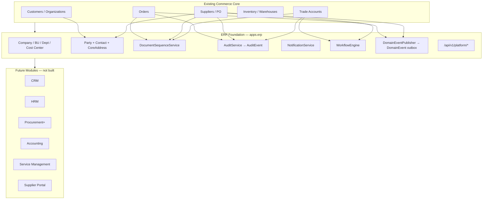
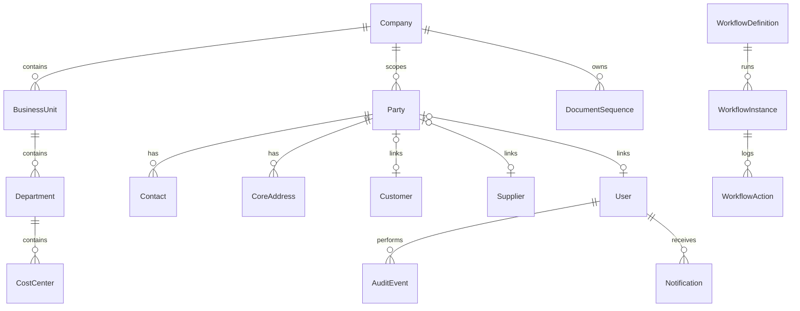

# ERP Foundation Layer — A2Z Tools

**Status:** Implemented (June 2026)  
**Scope:** Shared platform primitives only — no CRM, HRM, Accounting, or other module business logic.

---

## Executive Summary

The ERP Foundation Layer (`apps.erp`) provides the shared infrastructure future modules plug into: company hierarchy, unified parties, contacts, addresses, document numbering, global audit, notifications, workflows, and domain events.

Commerce (orders, catalog, inventory, suppliers, trade) remains the system of record. Foundation **extends** existing flows without replacing tables.

---

## Architecture Diagram



---

## Database Design

### Company hierarchy

| Table | Model | Purpose |
|-------|-------|---------|
| `core_companies` | `Company` | Legal entity (ABN, GST, currency) |
| `core_business_units` | `BusinessUnit` | Operational division |
| `core_departments` | `Department` | Team within BU |
| `core_cost_centers` | `CostCenter` | Financial allocation unit |

Hierarchy: **Company → Business Unit → Department → Cost Center**

### Party model

| Table | Model | Purpose |
|-------|-------|---------|
| `core_parties` | `Party` | Unified person/organization master |
| `core_contacts` | `Contact` | Named individuals at a party |
| `core_addresses` | `CoreAddress` | Reusable AU addresses |

**Party links (nullable OneToOne):**

- `Customer` → `party.customer`
- `Supplier` → `party.supplier`
- `User` → `party.user` (future HRM employee)

**Address owner kinds:** `party`, `warehouse`, `customer` (migration bridge)

Legacy `customers.Address` remains unchanged; use `PartyService.ensure_for_customer()` + `POST /platform/parties/sync/` to backfill.

### Platform services

| Table | Model | Purpose |
|-------|-------|---------|
| `core_document_sequences` | `DocumentSequence` | Atomic SO/PO/INV numbering |
| `core_audit_events` | `AuditEvent` | Global append-only audit |
| `core_notification_templates` | `NotificationTemplate` | Email/in-app templates |
| `core_notifications` | `Notification` | Delivery queue + in-app inbox |
| `core_workflow_definitions` | `WorkflowDefinition` | State machine definitions |
| `core_workflow_instances` | `WorkflowInstance` | Running approvals |
| `core_workflow_actions` | `WorkflowAction` | Transition history |
| `core_domain_events` | `DomainEvent` | Outbox for async consumers |
| `core_settings` | `PlatformSetting` | Key-value platform config |

---

## Document Numbering

**Service:** `DocumentSequenceService` (`apps/erp/services/document_sequence.py`)

| Code | Example output | Used by |
|------|----------------|---------|
| `SO` | `SO-2026-000001` | Sales orders |
| `PO` | `PO-2026-000001` | Purchase orders |
| `INV` | `INV-2026-000001` | Future accounting |
| `TA` | `TA-00000001` | Trade accounts |

Configurable per company: prefix, pattern tokens (`{prefix}`, `{year}`, `{month}`, `{seq}`), reset period, padding.

Legacy fallbacks remain if sequences are not seeded.

---

## Audit Framework

**Service:** `AuditService.log()` writes to `core_audit_events`.

Mirrors to existing `OperationalAuditLog` for catalog/inventory/orders/trade/suppliers/reports modules.

Tracked fields: user, module, action, resource_type, resource_id, summary, changes, metadata, timestamp.

**API:** `GET /api/v1/platform/audit/?module=&resource_type=`

---

## Notification Engine

**Service:** `NotificationService`

| Channel | Status |
|---------|--------|
| Email | Active (django send_mail) |
| In-app | Active (stored, staff inbox API) |
| SMS | Reserved (queued, not sent) |

Templates use `{token}` substitution. Seed templates: `trade_approved`, `po_submitted`.

**API:** `GET /api/v1/platform/notifications/`, `POST .../read/`

---

## Workflow Engine

**Service:** `WorkflowEngine`

| Code | Document | States |
|------|----------|--------|
| `trade_approval` | Trade application | pending → approved/rejected |
| `po_approval` | Purchase order | draft → submitted → approved → confirmed |
| `leave_approval` | Leave request (future HRM) | draft → submitted → approved/rejected |

Wired into:

- `TradeAdminService.approve_application` / `reject_application`
- `PurchaseOrderService.create` (start), `submit` (transition)

**API:** `GET /platform/workflows/definitions/`, `GET/POST .../instances/{id}/transition/`

---

## Domain Events

**Service:** `DomainEventPublisher` — Postgres outbox pattern.

| Event | Emitted from |
|-------|--------------|
| `order.created` | `OrderService.create_from_cart` |
| `order.paid` | `OrderService.mark_paid` |
| `trade.approved` / `trade.rejected` | Trade admin service |
| `po.created` / `po.submitted` / `po.received` | PO service |
| `inventory.received` | PO receive |
| `workflow.completed` | Workflow terminal transition |

Handlers register via `@_register_handler`. Default handler writes audit events. Celery dispatch hook ready for future consumers.

**API:** `GET /api/v1/platform/events/?status=pending`

---

## Platform API

Base path: **`/api/v1/platform/`** (staff-only)

| Endpoint | Methods | Description |
|----------|---------|-------------|
| `/company/` | GET, PATCH | Default company profile |
| `/settings/` | GET | Non-sensitive platform settings |
| `/audit/` | GET | Paginated audit log |
| `/sequences/` | GET | Document sequence status |
| `/parties/` | GET | Party search |
| `/parties/sync/` | POST | Backfill parties from customers/suppliers |
| `/parties/{id}/contacts/` | GET, POST | Contact CRUD |
| `/parties/{id}/addresses/` | GET, POST | Address CRUD |
| `/notifications/` | GET | User notification inbox |
| `/workflows/definitions/` | GET | Workflow definitions |
| `/workflows/instances/{id}/` | GET | Instance detail |
| `/workflows/instances/{id}/transition/` | POST | Execute transition |
| `/events/` | GET | Domain event outbox |

---

## Relationships



---

## Future Extension Strategy

### Phase 1 — Foundation (complete)

- [x] Company hierarchy models
- [x] Party / Contact / CoreAddress
- [x] DocumentSequenceService wired to orders, POs, trade accounts
- [x] Global AuditEvent + AuditService
- [x] Notification engine (email + in-app)
- [x] WorkflowEngine with trade + PO pilots
- [x] DomainEvent outbox with handlers
- [x] Platform API + seed command

### Phase 2 — Module prep (next)

- [ ] Add `metadata JSONB` to orders, POs, customers, suppliers
- [ ] Migrate customer addresses → `CoreAddress` (dual-read)
- [ ] Warehouse addresses → `CoreAddress` with `owner_kind=warehouse`
- [ ] Celery worker for `DomainEvent.replay_pending()`
- [ ] Reserved RBAC permission prefixes (`crm.*`, `hrm.*`, etc.)

### Phase 3 — Module launch pattern

Each future module:

1. New Django app under `apps/{module}/`
2. FK to `Party`, `Company`, `DocumentSequence` — never duplicate master data
3. Subscribe to domain events (accounting listens to `order.paid`)
4. Register workflow definitions for module approvals
5. API under `/api/v1/{module}/` per [ERP_FOUNDATION_ROADMAP.md](./ERP_FOUNDATION_ROADMAP.md)

| Module | Foundation dependencies |
|--------|-------------------------|
| **CRM** | Party, Contact, AuditEvent, DomainEvent |
| **HRM** | Company hierarchy, Party (employee), WorkflowEngine |
| **Procurement** | DocumentSequence (GRN), WorkflowEngine, Party (supplier) |
| **Accounting** | Company, DocumentSequence (INV/JE), DomainEvent consumers |
| **Supplier Portal** | Party, Notification, WorkflowEngine |
| **Service Management** | Party, CoreAddress, WorkflowEngine |
| **Warehouse Expansion** | Company, CoreAddress, DomainEvent |

---

## Operations

### Seed foundation (required after deploy)

```bash
cd backend
python manage.py migrate
python manage.py seed_erp_foundation
```

### Backfill parties

```bash
curl -X POST /api/v1/platform/parties/sync/ -H "Authorization: Bearer ..."
```

### Run tests

```powershell
$env:USE_SQLITE_FOR_TESTS='1'
python -m pytest apps/erp/tests -q
```

---

## Key Files

| Area | Path |
|------|------|
| Models | `backend/apps/erp/models.py` |
| Services | `backend/apps/erp/services/` |
| Platform API | `backend/apps/erp/views.py`, `urls.py` |
| Seed command | `backend/apps/erp/management/commands/seed_erp_foundation.py` |
| Integration hooks | `orders/services.py`, `suppliers/services.py`, `trade_accounts/services.py` |
| Tests | `backend/apps/erp/tests/test_foundation.py` |
| Roadmap | [ERP_FOUNDATION_ROADMAP.md](./ERP_FOUNDATION_ROADMAP.md) |

---

*Foundation only — module business logic intentionally excluded.*
