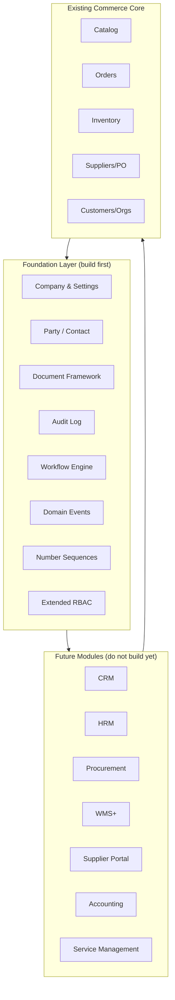
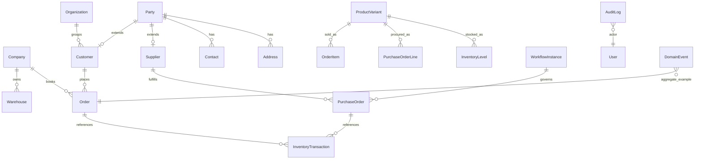

# ERP Foundation Roadmap — A2Z Tools

**Role:** Solution architecture — foundation only. No CRM, HRM, Procurement, WMS, Supplier Portal, Accounting, or Service Management modules are built in this phase.

**Audience:** Engineering, product, and ops planning the transition from **commerce + WMS + light procurement** to a unified Australian hardware ERP platform.

| Document | Relationship |
|----------|--------------|
| [DATABASE_PLAN.md](../DATABASE_PLAN.md) | Phase 1 schema + future schema sketches (§6) |
| [BACKEND_ARCHITECTURE.md](./BACKEND_ARCHITECTURE.md) | Current Django/DRF layout |
| [RBAC.md](./RBAC.md) | Permission model |
| [INVENTORY_MANAGEMENT.md](./INVENTORY_MANAGEMENT.md) | WMS ledger pattern |

---

## Executive summary

A2Z Tools today is a **strong commerce core** with operational depth in **inventory/WMS**, **sales orders**, and **purchase orders**. It is not yet an ERP platform: there is no unified party model, audit trail, workflow engine, chart of accounts, or module isolation strategy enforced in code.

**Foundation goal:** Introduce shared platform primitives so seven future modules can plug in without rewriting commerce tables or breaking the storefront.



---

## Current architecture assessment

### What exists (reuse as system-of-record)

| Domain | Django app | Maturity | Future module anchor |
|--------|------------|----------|----------------------|
| Identity & RBAC | `accounts` | Production-ready | HRM (staff), Supplier Portal (external users) |
| B2B customers | `customers` | Good | CRM (accounts), Accounting (AR party) |
| Trade / quotes | `trade_accounts` | Partial API | CRM (opportunities), Procurement (quote→PO) |
| Catalog / PIM | `catalog` | Strong | All modules reference `ProductVariant` |
| Inventory / WMS | `inventory` | Strongest ops module | WMS+, Accounting (stock valuation) |
| Suppliers / PO | `suppliers` | Moderate | Procurement, Supplier Portal, Accounting (AP) |
| Sales orders | `orders` | Strong | CRM (order history), Accounting (revenue/AR) |
| Pricing / tax | `pricing` | Commerce-focused | Accounting (GST), Procurement (cost) |
| Analytics | `analytics` | Dashboard aggregates | All modules (reporting hooks) |

### Structural gaps (block ERP expansion)

| Gap | Impact on future modules |
|-----|--------------------------|
| No **Company** entity (tenant settings are env-only) | Accounting, HRM, GST reporting need a legal entity profile |
| **Customer** and **Supplier** are separate silos | CRM, AP, Supplier Portal need unified **Party** |
| Order/PO addresses are **JSON snapshots** | CRM activities, service jobs need normalized locations |
| No **audit_log** table | Compliance, SOX-style traceability, dispute resolution |
| No **document numbering service** | PO/order/quote numbers are ad hoc in services |
| **Workflow** = status enums only | Procurement approvals, leave requests, service SLAs |
| No **domain event** bus | Accounting auto-posting, notifications, integrations |
| **`metadata JSONB`** planned but not on models | Custom fields per module without migrations |
| **`apps.organizations` stub** vs `customers.Organization` | Naming confusion; not SaaS multi-tenant |
| Stub apps (`notifications`, `integrations`) | Scattered cross-cutting concerns |
| Admin API partially wired | Dashboard cannot host new modules consistently |

### Architecture note: single Next.js, multi-hostname

Storefront (`www`) and admin (`dashboard`) share one Next.js app routed by Nginx. Future Supplier Portal may need a **third hostname** (`suppliers.domain.com`) or route namespace — plan API-first so portal can be a separate frontend later.

---

## Future module readiness matrix

| Module | Current coverage | Foundation dependencies | Module tables (future) |
|--------|------------------|-------------------------|------------------------|
| **CRM** | Customers, orgs, trade apps, analytics events | Party, Activity base, audit, workflow | leads, opportunities, activities, campaigns |
| **HRM** | Users + RBAC only | Company, Party (employee), workflow, audit | employees, departments, leave, payroll |
| **Procurement** | Supplier, PO, receive→inventory | Document framework, workflow, GRN ref type | requisitions, RFQ, GRN, supplier invoices |
| **WMS** | Warehouses, levels, ledger, alerts | Bin location extension, pick/putaway refs | bins, pick lists, stocktake sessions |
| **Supplier Portal** | Supplier master data | External user type, portal RBAC, document API | PO acknowledgment, ASN, invoice upload |
| **Accounting** | Payments, GST on orders, stock valuation | Chart of accounts, journal framework, fiscal periods | COA, journals, AR/AP invoices, BAS |
| **Service Management** | Shipments/tracking only | Party, workflow, SLA timers, asset link to variant | tickets, cases, work orders, assets |

---

## Shared entities (canonical system-of-record)

These tables **already exist** or will be **introduced in foundation** and referenced by all modules. Do not duplicate master data inside module apps.

### Tier 1 — Existing (keep as SoR)

| Entity | Table | Used by |
|--------|-------|---------|
| User | `users` | Auth, HRM, CRM (owner), Service (assignee), Portal |
| Product | `products` | Catalog, WMS, Procurement, Service (parts) |
| ProductVariant | `product_variants` | Inventory, Orders, PO lines, Quotes |
| Warehouse | `warehouses` | WMS, Orders (ship from), PO (receive to) |
| Organization | `organizations` | B2B customers, CRM accounts, Trade, AR (future) |
| Customer | `customers` | Commerce, CRM, Accounting AR |
| Supplier | `suppliers` | Procurement, Portal, Accounting AP |
| Order | `orders` | Commerce, Accounting revenue, Service (RMA) |
| PurchaseOrder | `purchase_orders` | Procurement, WMS receive, Accounting AP |
| InventoryTransaction | `inventory_transactions` | WMS ledger, Accounting COGS (future) |

### Tier 2 — Foundation (introduce, do not module-scope)

| Entity | Proposed table | Purpose |
|--------|----------------|---------|
| **Company** | `core_companies` | Legal entity: ABN, GST registration, fiscal year, base currency |
| **Party** | `core_parties` | Unified person/org record: `party_type`, links to Customer and/or Supplier |
| **Contact** | `core_contacts` | Named individuals at a party (sales rep, AP clerk, site manager) |
| **Address** | `core_addresses` | Normalized AU addresses; FK from party; orders/POs reference or snapshot |
| **DocumentSequence** | `core_document_sequences` | Atomic numbering: `ORDER`, `PO`, `INV`, `JE`, `TICKET` |
| **AuditLog** | `core_audit_logs` | Append-only change history |
| **DomainEvent** | `core_domain_events` | Outbox for async module reactions |
| **WorkflowDefinition** | `core_workflow_definitions` | Status graphs per document type |
| **WorkflowInstance** | `core_workflow_instances` | Running approval/state machine |
| **ExternalReference** | `core_external_references` | Xero/MYOB/Stripe IDs mapped to internal entities |
| **Setting** | `core_settings` | Key-value config (feature flags, integration toggles) |

### Tier 3 — Module-owned (future, FK to Tier 1/2)

Examples: `crm.opportunities`, `hrm.employees`, `accounting.journal_entries`, `service.work_orders`. Never copy SKU, ABN, or address strings when an FK exists.

---

## ERP-ready abstractions (foundation patterns)

Implement these as **`apps.core`** (or `apps.platform`) services and abstract models — not inside commerce apps.

### 1. Document pattern

Unify how Order, PO, Quote, and future Invoice/Ticket behave:

```
DocumentHeader (abstract)
  - public_id, document_type, document_number, status
  - party_id (optional), company_id
  - currency_code, total_ex_gst_cents, total_inc_gst_cents
  - workflow_instance_id, created_by_id
  - metadata JSONB

DocumentLine (abstract)
  - variant_id (optional), description, quantity
  - unit_price_ex_gst_cents, line_total_*, gst_rate (snapshot)
```

**Migration strategy:** Existing `Order` / `PurchaseOrder` keep their tables; add shared mixin fields (`metadata`, `company_id`) and a `DocumentRegistry` service that maps `document_type` → model. Do **not** merge tables in foundation phase.

### 2. Polymorphic reference registry

`InventoryTransaction.reference_type` + `reference_id` already exists. Formalize:

| `reference_type` | Source model | Today | Future |
|------------------|--------------|-------|--------|
| `sales_order` | Order | Yes | — |
| `purchase_order` | PurchaseOrder | Partial | GRN link |
| `adjustment` | Manual | Yes | — |
| `transfer` | Transfer group UUID | Yes | WMS transfer doc |
| `goods_receipt` | GRN | No | Procurement |
| `journal_entry` | JournalEntry | No | Accounting |
| `work_order` | WorkOrder | No | Service |

Centralize in `core.references.ReferenceType` enum + validation helper.

### 3. Money & tax (AU)

Keep **integer cents** everywhere. Foundation adds:

- `Company.gst_registration_number`, `default_tax_rate_id`
- `TaxContext` helper: given date + company → applicable `TaxRate`
- Never float; GST snapshots on lines remain immutable (already on orders)

### 4. Soft delete & queryset managers

Extend `SoftDeleteModel` with:

- `SoftDeleteManager` auto-filtering `deleted_at__isnull=True`
- Apply to Product, User; extend to Supplier, Customer in foundation

### 5. Metadata extension (`metadata JSONB`)

Add nullable `metadata JSONB DEFAULT '{}'` to foundation targets:

`organizations`, `customers`, `suppliers`, `products`, `orders`, `purchase_orders`, `warehouses`

Modules store module-specific keys without schema churn (e.g. `metadata.crm.account_manager_id`).

### 6. Domain events (outbox)

```
DomainEvent: event_type, aggregate_type, aggregate_id, payload JSONB,
             occurred_at, published_at, idempotency_key
```

Publishers: order placed, PO received, stock below reorder. Consumers (future): accounting, notifications, procurement. Use Celery + Postgres outbox pattern.

### 7. Workflow engine (minimal)

- **Definition:** document_type, states[], transitions[], required_roles[]
- **Instance:** current_state, assigned_to, history JSONB
- Wire first to `TradeApplication` and `PurchaseOrder` (approval) as pilots — without building full Procurement module.

### 8. RBAC module namespaces

Extend `PermissionCodename` with reserved prefixes (seed only, no views yet):

| Prefix | Future module |
|--------|---------------|
| `crm.*` | CRM |
| `hrm.*` | HRM |
| `procurement.*` | Procurement |
| `accounting.*` | Accounting |
| `service.*` | Service Management |
| `portal.supplier.*` | Supplier Portal |

Add `Permission.module` grouping in admin nav (`config/admin/nav.ts` sections already mirror this).

### 9. API module registry

Standardize each ERP module as:

```
/api/v1/{module}/          # REST resources
/api/v1/{module}/admin/    # staff-only aggregates (optional)
```

Foundation adds `api/v1/router.py` documentation contract and OpenAPI tags per module. Existing paths remain; new modules follow convention.

### 10. PostgreSQL schema namespacing (optional, Phase F3)

Align with [DATABASE_PLAN.md §6.2](../DATABASE_PLAN.md):

- `public` — commerce core (current)
- `crm`, `hrm`, `erp_procurement`, `erp_accounting`, `erp_warehousing`, `erp_service` — future

Use `django.contrib.postgres` schema routing or table prefixes (`crm_`) in Django apps. **Decision gate:** choose before first module migration.

---

## 1. Required database changes (foundation only)

### Phase F1 — Platform tables (no module business logic)

| Change | Priority | Notes |
|--------|----------|-------|
| Create `core_companies` | P0 | Single row for Phase 1; multi-company later |
| Create `core_document_sequences` | P0 | Backfill sequences from max existing numbers |
| Create `core_audit_logs` | P0 | Append-only; no updates/deletes |
| Add `metadata JSONB` to 7 key tables | P0 | See § abstractions |
| Add `company_id` FK (nullable) to orders, POs, warehouses | P1 | Default to sole company |
| Create `core_parties` + link columns on customers/suppliers | P1 | Nullable FK `party_id`; backfill script |
| Create `core_contacts`, `core_addresses` | P1 | Migrate `Address` model gradually |
| Create `core_domain_events` | P1 | Outbox table |
| Create `core_workflow_definitions`, `core_workflow_instances` | P2 | Generic workflow |
| Create `core_external_references` | P2 | Integration IDs |
| Create `core_settings` | P2 | Replace hardcoded company config |
| Add `SoftDeleteManager` + extend soft delete to Supplier, Customer | P2 | |
| Index pass: `(status, placed_at)` on orders, `(is_active, deleted_at, visibility)` on products | P1 | Performance for ERP dashboards |

### Phase F2 — Extend existing tables (non-breaking)

| Table | Column / change | Purpose |
|-------|-----------------|---------|
| `users` | `user_type` enum: `staff`, `customer`, `supplier` | Portal + HRM |
| `user_roles` | Already has `organization_id` | Scope portal users to supplier org |
| `purchase_orders` | `workflow_instance_id`, `metadata` | Approval chain |
| `orders` | `metadata`, optional `company_id` | Integration refs |
| `inventory_transactions` | Validate `reference_type` against registry | Data integrity |
| `suppliers` | `portal_enabled`, `party_id` | Supplier Portal prep |
| `trade_accounts_tradeapplication` | `workflow_instance_id` | Approval pilot |

### Explicitly NOT in foundation

- Chart of accounts, journal entries, leads, employees, tickets, bin locations, GRN tables
- Dropping or merging `customers` / `suppliers` into parties (link-only in F1)

---

## 2. Required API changes (foundation only)

### Phase F1 — Platform endpoints

| Endpoint | Method | Purpose |
|----------|--------|---------|
| `/api/v1/platform/company/` | GET, PATCH | Company profile (staff) |
| `/api/v1/platform/settings/` | GET, PATCH | System settings (super-admin) |
| `/api/v1/platform/audit/` | GET | Paginated audit log (staff) |
| `/api/v1/platform/sequences/` | GET | Document sequence status (ops) |

### Phase F2 — Shared master data

| Endpoint | Purpose |
|----------|---------|
| `/api/v1/parties/` | Unified party search (staff) |
| `/api/v1/parties/{id}/contacts/` | Contact CRUD |
| `/api/v1/parties/{id}/addresses/` | Address CRUD |
| `/api/v1/events/` (internal) | Webhook subscription registry (future) |

### Phase F3 — API platform mechanics

| Change | Purpose |
|--------|---------|
| OpenAPI tags per module | `catalog`, `orders`, `inventory`, `platform`, … |
| Standard list envelope `{ data, pagination, facets? }` | Already on products; extend to all admin lists |
| `X-Company-Id` header (optional) | Multi-company future |
| Idempotency-Key on all POST mutations | Already on payments; generalize via middleware |
| Webhook outbox consumer API | `POST /integrations/webhooks/` (signed) |
| Admin module route prefix | `/api/v1/analytics/admin/` pattern → `{module}/admin/` |

### Wire existing APIs (pre-module)

Complete admin integration **before** new modules — reduces duplicate work:

| Existing API | Admin hook status | Action |
|--------------|-------------------|--------|
| `suppliers/purchase-orders/` | Stub in frontend | Wire PO list/detail/mutations |
| `inventory/*` | Live on inventory page | Extract shared ops SDK |
| Categories, brands, warehouses | Backend exists | Wire admin hooks |
| Trade application status update | Unavailable | Add PATCH + workflow |

### Future module API namespaces (reserve, do not implement)

```
/api/v1/crm/
/api/v1/hrm/
/api/v1/procurement/     # extends suppliers/PO
/api/v1/accounting/
/api/v1/service/
/api/v1/portal/supplier/
```

---

## 3. Shared entities — relationship diagram



---

## 4. ERP-ready abstractions — implementation map

| Abstraction | Location (proposed) | Consumers |
|-------------|---------------------|-----------|
| `PublicIdModel`, `SoftDeleteModel` | `apps.core.models` | All apps (exists) |
| `DocumentSequenceService` | `apps.core.documents` | Orders, PO, quotes, future invoices |
| `AuditService.log()` | `apps.core.audit` | All mutations via signal or explicit call |
| `ReferenceType` registry | `apps.core.references` | Inventory, accounting, service |
| `DomainEventPublisher` | `apps.core.events` | Celery tasks |
| `WorkflowEngine` | `apps.core.workflow` | Trade approval, PO approval |
| `PartyService` | `apps.core.parties` | CRM, portal, accounting |
| `TaxContext` | `apps.pricing.tax` | Accounting BAS, orders |
| `Money` value object | `apps.core.money` | Serializers (cents in/out) |
| Custom DRF permissions | `apps.accounts.permissions` | Extend per module prefix |

---

## Foundation roadmap (phased)

### Phase F0 — Governance (Week 1–2)

- [ ] Approve this roadmap and [DATABASE_PLAN §6](../DATABASE_PLAN.md) alignment
- [ ] Decide: PostgreSQL schemas vs prefixed table names for new apps
- [ ] Define `ReferenceType` and `DocumentType` enums in `apps.core`
- [ ] Document API module naming convention in [API_SPECIFICATION.md](../API_SPECIFICATION.md)
- [ ] Remove or repurpose empty stub apps (`organizations`, `integrations`, `notifications`) — merge into `core` or plan ownership
- [ ] Branch protection + ERP migration review checklist (no destructive migrations on commerce tables)

### Phase F1 — Data platform (Week 3–6)

- [ ] Migration: `core_companies`, `core_document_sequences`, `core_audit_logs`
- [ ] Migration: `metadata JSONB` on seven entities
- [ ] `DocumentSequenceService` + backfill order/PO/quote numbers
- [ ] `AuditService` + Django signals on Order, PO, InventoryTransaction, Customer
- [ ] `GET/PATCH /api/v1/platform/company/` and `/settings/`
- [ ] `GET /api/v1/platform/audit/` (staff, paginated)
- [ ] SoftDeleteManager on Product/User; extend to Customer/Supplier
- [ ] Performance indexes for ERP-scale list queries

### Phase F2 — Party & events (Week 7–10)

- [ ] Migration: `core_parties`, `core_contacts`, `core_addresses`
- [ ] Nullable `party_id` on customers/suppliers + backfill command
- [ ] Migration: `core_domain_events` + Celery outbox publisher
- [ ] Emit events: `order.placed`, `order.paid`, `po.received`, `stock.below_reorder`
- [ ] Party API (staff-only)
- [ ] Wire admin PO hooks and trade application PATCH

### Phase F3 — Workflow & RBAC extension (Week 11–14)

- [ ] Migration: workflow definition + instance tables
- [ ] WorkflowEngine with PO submit→approve→confirm pilot
- [ ] Trade application approval via workflow (replace ad hoc status)
- [ ] Seed reserved RBAC permissions for seven modules (no views)
- [ ] Admin nav: dynamic sections from permission modules
- [ ] `core_external_references` for Stripe/Xero prep

### Phase F4 — Integration shell (Week 15–16)

- [ ] Webhook subscription model + HMAC signing
- [ ] OpenAPI module tags + admin API consistency audit
- [ ] Read replica routing plan for reporting (document only)
- [ ] Supplier Portal **API contract** document (no UI)
- [ ] Accounting **posting interface** (abstract `LedgerPostingProvider` — no COA yet)

**Foundation complete gate:** Company profile live, audit log queryable, parties linked, events publishing, PO approval on workflow, admin PO wired, document sequences centralized.

---

## Future module phases (after foundation — do not start until F4 gate)

| Phase | Module | Depends on | Key deliverable |
|-------|--------|------------|-----------------|
| M1 | **WMS+** | F1, inventory | Bin locations, pick lists, stocktake |
| M2 | **Procurement** | F2, F3, suppliers | Requisitions, GRN, 3-way match prep |
| M3 | **Supplier Portal** | F2, F3, M2 | External auth, PO ack, ASN |
| M4 | **CRM** | F2, parties | Leads, opportunities, activities |
| M5 | **Accounting** | F1, F4, events | COA, journals, AR/AP, BAS |
| M6 | **Service Management** | F2, F3, parties | Tickets, work orders, SLAs |
| M7 | **HRM** | F1, F3, users | Employees, leave, payroll export |

Recommended sequence: **WMS+ → Procurement → Portal → CRM → Accounting → Service → HRM** (operations and cash flow before HR).

---

## Risk register

| Risk | Mitigation |
|------|------------|
| Party model migration breaks customer/supplier APIs | Nullable FK + dual-read period; no table merge |
| Workflow over-engineering | Pilot on PO + trade only; state machine ≤ 10 states |
| Event bus reliability | Postgres outbox + Celery retry; no fire-and-forget |
| Admin frontend bottleneck | API-first; module UIs can lag if REST is stable |
| DATABASE_PLAN shows PO in `erp_procurement` but PO exists in `suppliers` | **Keep** `suppliers.PurchaseOrder`; extend with GRN/AP in procurement app |
| `Organization` naming vs company tenant | Rename in docs: Organization = **customer account**; Company = **legal entity** |

---

## Decision log (fill during F0)

| # | Decision | Options | Chosen |
|---|----------|---------|--------|
| D1 | New module schema strategy | PG schemas / table prefixes / separate DB | TBD |
| D2 | Party backfill | Big-bang / lazy on read | TBD |
| D3 | Audit capture | Signals / explicit service calls / both | TBD |
| D4 | Supplier Portal frontend | Same Next.js / separate app | TBD |
| D5 | Accounting ledger | In-house / Xero primary / hybrid | TBD |

---

## Quick reference — files to extend (foundation work)

| Area | Path |
|------|------|
| Base models | `backend/apps/core/models.py` |
| API router | `backend/api/v1/urls.py` |
| RBAC catalog | `backend/apps/accounts/rbac.py` |
| Pagination envelope | `backend/apps/core/pagination.py` |
| Admin nav modules | `frontend/src/config/admin/nav.ts` |
| Admin API layer | `frontend/src/lib/api/admin/` |
| DB plan (ERP §6) | `docs/DATABASE_PLAN.md` |

---

*Foundation only — no ERP module business logic. Last updated: aligns with current Django apps and Docker deployment architecture.*
