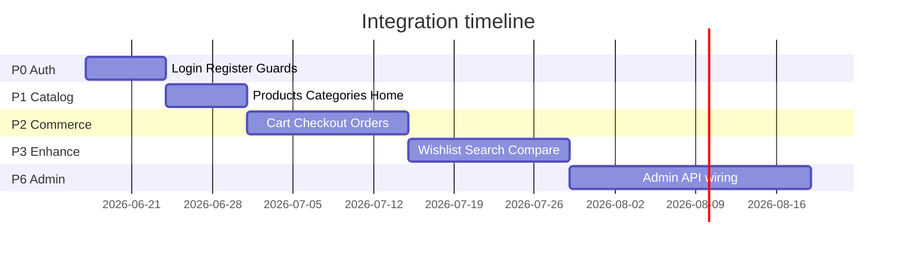
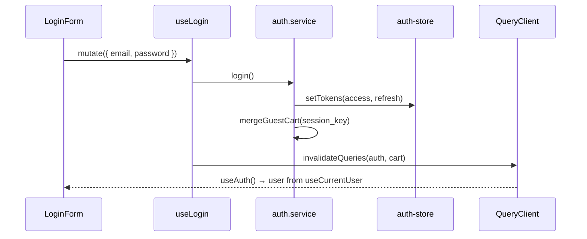

# A2Z Tools — Frontend ↔ API Integration Plan

**Full-stack integration roadmap: mock data → Django REST API**

| Attribute | Value |
|-----------|-------|
| **Version** | 1.0 |
| **Frontend** | Next.js 15 (storefront + `/admin-dashboard`) |
| **API client** | Axios + TanStack Query v5 (already scaffolded) |
| **Auth** | JWT access + refresh (SimpleJWT, rotation + blacklist) |
| **Status** | API layer built; **storefront UI 0% wired**; admin UI uses mock layer |

---

## Table of Contents

1. [Executive Summary](#1-executive-summary)
2. [Audit: Mock Data Inventory](#2-audit-mock-data-inventory)
3. [Integration Roadmap](#3-integration-roadmap)
4. [API Client Layer](#4-api-client-layer)
5. [State Management Strategy](#5-state-management-strategy)
6. [Data Fetching Strategy](#6-data-fetching-strategy)
7. [Backend Gap Register](#7-backend-gap-register)
8. [Type & Contract Alignment](#8-type--contract-alignment)
9. [Testing & Rollout](#9-testing--rollout)

---

## 1. Executive Summary

### Current state

| Layer | Status |
|-------|--------|
| **Django REST API** | Auth, catalog, cart (basic), orders (basic), customers/addresses, inventory (staff), trade accounts (partial) |
| **`src/lib/api/`** | Axios client, JWT refresh, services + React Query hooks for auth, products, categories, brands, cart, orders, trade |
| **Storefront UI** | **100% mock/config data** — hooks exist but **no page or component imports them** |
| **Admin dashboard** | Wired to `lib/api/admin/mock-service.ts` (simulated delay) |
| **Cross-cutting** | `QueryState` component exists; `AppProviders` mounts QueryClient + auth hydration |

### Critical finding

The integration **infrastructure is ahead of the UI**. Work is primarily **wiring + adapter layers + backend endpoint completion**, not greenfield client code.

### Target domains (user request)

| Domain | Storefront | Admin | Backend today |
|--------|------------|-------|---------------|
| Authentication | Wire forms + session | Staff auth (Phase 2) | ✅ Ready |
| Products | Replace config catalog | Mock → admin API (Phase 6) | ✅ Ready |
| Categories | Replace registry | Mock → admin API | ✅ List; ⚠️ no `/categories/{slug}/products/` |
| Brands | Replace homepage config | Mock → admin API | ✅ List |
| Inventory | Via `product.stock` block | Mock → staff API | ✅ Staff-only `/inventory/` |
| Cart | Replace `mockCartItems` | N/A | ⚠️ GET + POST items only |
| Wishlist | Replace local mock | N/A | ❌ Models only, no REST |
| Orders | Replace account mocks | Mock → admin API | ⚠️ List, create, detail, track |
| Customer profile | Replace `mockUser` | N/A | ✅ Profile/me + addresses |

---

## 2. Audit: Mock Data Inventory

### 2.1 Storefront pages — mock usage matrix

| Route | Page / component | Mock source | API hooks available | Priority |
|-------|------------------|-------------|---------------------|----------|
| `/` | `FeaturedProductsSection`, `CategoriesSection`, `FeaturedBrandsSection`, `TestimonialsSection` | `config/homepage.ts` | `useProducts`, `useCategories`, `useBrands` | P1 |
| `/products` | `ProductListingPageView` | `config/catalog-page.ts` → `catalogProducts` | `useProducts` / `useInfiniteProducts` | P1 |
| `/products/[slug]` | Server `getProductBySlug` + `ProductDetailView` | `config/product-detail.ts` | `useProductDetails` (+ server `fetch`) | P1 |
| `/[slug]` (categories) | `CategoryPageView` | `config/category-registry.ts` | `useCategoryProducts` (needs backend route) | P1 |
| `/cart` | `CartPageView` | `config/cart-page.ts` → `mockCartItems` | `useCart`, mutations | P1 |
| `/checkout` | `CheckoutPageView` | `mockCartItems`, `config/checkout-page.ts` | `useCart`, `useCreateOrder`, `useAddresses` | P2 |
| `/wishlist` | `WishlistPageView` + `wishlist-provider` | `config/wishlist.ts` + localStorage | ❌ none | P2 |
| `/compare` | `compare-provider` | `config/compare.ts` | ❌ none (spec has `/products/compare/`) | P3 |
| `/login` | `LoginForm` | Demo `setTimeout` | `useLogin` | **P0** |
| `/register` | `RegisterForm` | Demo `setTimeout` | `useRegister` | **P0** |
| `/forgot-password` | Forgot form | Demo | `useForgotPassword` | P2 |
| `/account` | Dashboard | `mockUser`, `mockDashboardStats`, `mockOrders`, `mockQuotes` | `useAuth`, `useOrders`, `useTradeAccount` | P1 |
| `/account/orders` | Orders table | `mockOrders` | `useOrders` | P1 |
| `/account/addresses` | Address list | `mockAddresses` | `useAddresses` | P1 |
| `/account/settings` | Settings form | `mockUser` | `useAuth`, `useUpdateProfile` | P1 |
| `/account/trade` | Trade panel | `mockUser`, `mockQuotes` | `useTradeAccount`, `useQuotes` | P2 |
| `/account/wishlist` | Wishlist section | `wishlist-provider` mock seed | ❌ none | P2 |
| `/trade` | Marketing | `config/homepage.ts` (static CTA) | `useTradeAccount` apply | P3 |
| Search overlay | `use-predictive-search` | `config/search-data.ts` | `useProductSearch` | P2 |
| Header cart badge | `site-layout.tsx` | `getMockCartItemCount()` | `useCart` | P1 |

### 2.2 Config files (static / mock data)

| File | Role | Replace with |
|------|------|--------------|
| `config/homepage.ts` | Featured products, brands, categories, testimonials | API queries + CMS later |
| `config/catalog-page.ts` | Full product catalog for `/products` | `GET /products/` |
| `config/product-detail.ts` | PDP data + `generateStaticParams` slugs | `GET /products/{slug}/` |
| `config/category-page.ts` | Category metadata, filters | `GET /categories/` + products |
| `config/category-registry.ts` | Category routes + products | API-driven slugs |
| `config/cart-page.ts` | `mockCartItems`, badge count | `GET /cart/` |
| `config/checkout-page.ts` | Shipping methods, payment UI labels | API + settings |
| `config/wishlist.ts` | `mockWishlistItems` | `GET /wishlist/` (to build) |
| `config/compare.ts` | `mockCompareProducts` | `POST /products/compare/` |
| `config/search-data.ts` | Local search index | `GET /products/?search=` |
| `config/account.ts` | **All account mock entities** | Auth + orders + addresses APIs |
| `config/auth.ts` | Form defaults only (OK to keep) | — |
| `config/admin/mock-data.ts` | Entire admin dashboard | Admin REST (Phase 6) |

### 2.3 Admin dashboard (`/admin-dashboard/*`)

All 13 admin routes use `lib/api/admin/mock-service.ts` → `config/admin/mock-data.ts`.  
**Intentionally mock** until staff/admin REST endpoints exist. Separate track from storefront (Phase 6).

### 2.4 Already integrated (non-mock)

| Item | Notes |
|------|-------|
| `AppProviders` | QueryClient + auth store hydration |
| `lib/api/client.ts` | JWT interceptors, refresh queue, `X-Session-Key` |
| `components/api/query-state.tsx` | Loading / error / empty UI |
| Admin hooks | Mock service with React Query pattern (template for storefront) |

---

## 3. Integration Roadmap

### Phase 0 — Foundation (Week 1) **P0**

**Goal:** Auth works end-to-end; fix contract mismatches; establish patterns.

| Task | Files | Done when |
|------|-------|-----------|
| Wire login | `login-form.tsx` → `useLogin` | Real JWT; redirect to `/account` |
| Wire register | `register-form.tsx` → `useRegister` | Account created; tokens stored |
| Auth guard | `account/layout.tsx` | Redirect unauthenticated → `/login` |
| Fix address endpoint | `lib/api/config.ts` | `addresses` → `/customers/addresses/` (or add backend alias) |
| Profile fetch | `account-sidebar.tsx`, `account/page.tsx` | `useAuth()` replaces `mockUser` |
| Auth layout header | `site-header.tsx` | Show user menu when `isAuthenticated` |
| Logout | Header / account | `useLogout` |
| Merge guest cart | Already in `auth.service.ts` | Verify after login E2E |

**Pattern to copy:** Admin dashboard pages (`useAdminX` + `QueryState` + loading skeleton).

### Phase 1 — Catalog (Week 2) **P1**

| Task | Replace | API |
|------|---------|-----|
| Product listing `/products` | `catalogProducts` | `useInfiniteProducts({ sort, search, brand, category })` |
| Product PDP `/products/[slug]` | `getProductBySlug` | Server: `fetchProductDetails(slug)`; client mutations for cart |
| Category pages `/[slug]` | `category-registry` | `useCategories` + `useProducts({ category })` |
| Homepage featured | `featuredProducts` | `useProducts({ limit: 8, sort: 'newest' })` |
| Homepage categories/brands | `homepage` config | `useCategories`, `useBrands` |
| Add to cart (PDP, cards) | Toast-only | `useAddToCart` |
| Header cart count | `getMockCartItemCount` | `useCart().data?.item_count` |

**Adapter:** `lib/api/adapters/product.adapter.ts` — map API `ProductSummary` → `ProductCard` props.

### Phase 2 — Cart & checkout (Week 3) **P1–P2**

| Task | API |
|------|-----|
| Cart page | `useCart`, `useUpdateCartItem`, `useRemoveCartItem` |
| Checkout summary | `useCart` totals |
| Place order | `useCreateOrder` |
| Saved addresses at checkout | `useAddresses` |

**Backend prerequisites:** Extend cart serializer (totals, price blocks, PATCH/DELETE items). See §7.

### Phase 3 — Account & orders (Week 4) **P1**

| Task | Replace | API |
|------|---------|-----|
| Account dashboard stats | `mockDashboardStats` | Derive from `useOrders` + `useAuth` |
| Orders list | `mockOrders` | `useOrders` |
| Order detail (new page) | — | `useOrder(orderId)` |
| Addresses CRUD | `mockAddresses` | `useAddresses`, `useCreateAddress`, + update/delete hooks |
| Settings form | `mockUser` | `useUpdateProfile` |
| Trade panel | `mockUser` / quotes | `useTradeAccount`, `useQuotes` |

### Phase 4 — Wishlist & search (Week 5) **P2**

| Task | Notes |
|------|-------|
| Build wishlist REST API | Backend: `GET/POST/DELETE /wishlist/` |
| `wishlist-provider` | Sync with API when authed; localStorage fallback for guests |
| Predictive search | `useProductSearch` debounced in `use-predictive-search.ts` |

### Phase 5 — Polish & inventory visibility (Week 6) **P2–P3**

| Task | Notes |
|------|-------|
| Compare products | Backend compare endpoint or client-side from product IDs |
| Stock display | Use `stock` block from product/cart API (not staff inventory API) |
| Forgot / reset password | Wire forms to existing hooks |
| Optimistic cart updates | Mutation `onMutate` / rollback |
| Error toasts | `isApiError` + field errors on forms |

### Phase 6 — Admin dashboard API (Week 7+) **Separate track**

Replace `mock-service.ts` with `admin.service.ts` calling staff-only endpoints (`/inventory/`, future `/admin/` namespace). Requires staff JWT + RBAC middleware on frontend.



---

## 4. API Client Layer

### 4.1 Current architecture (keep)

```
src/lib/api/
├── config.ts              # API_BASE_URL, API_ENDPOINTS, STORAGE_KEYS
├── client.ts              # Axios singleton, interceptors, apiGet/Post/Patch/Delete
├── errors.ts              # ApiError, parseApiError, getFieldErrors
├── session.ts             # X-Session-Key for guest cart
├── query-client.ts        # TanStack Query defaults
├── auth/
│   ├── token-storage.ts   # localStorage JWT
│   └── auth-store.ts      # Zustand user + tokens
├── services/*.service.ts  # Thin async functions (no React)
├── hooks/*.ts             # useQuery / useMutation wrappers
├── hooks/query-keys.ts    # Cache key factory
└── types/*.ts             # Request/response TypeScript types
```

### 4.2 Add: adapter layer (recommended)

Map API shapes → UI component props. Keeps components stable during API evolution.

```
src/lib/api/adapters/
├── product.adapter.ts     # ProductSummary → ProductCard / CategoryProduct
├── cart.adapter.ts        # Cart → CartPage line items (when backend adds totals)
├── order.adapter.ts       # OrderDetail → AccountOrdersTable row
├── auth.adapter.ts        # AuthMeResponse → AccountSidebar display user
└── index.ts
```

**Example:**

```typescript
// adapters/product.adapter.ts
import type { ProductSummary } from "../types/product";
import type { CategoryProduct } from "@/types/product"; // UI type

export function toCategoryProduct(p: ProductSummary): CategoryProduct {
  return {
    id: p.id,
    slug: p.slug,
    name: p.name,
    brand: p.brand.name,
    priceIncGst: p.price.amount_inc_gst_cents,
    imageUrl: p.primary_image?.url ?? null,
    inStock: p.stock.status !== "out_of_stock",
    // ...
  };
}
```

### 4.3 Add: missing services

| Service | Endpoints | Priority |
|---------|-----------|----------|
| `wishlist.service.ts` | `GET/POST/DELETE /wishlist/` | P2 (after backend) |
| `addresses.service.ts` | Extend: PATCH/DELETE `/customers/addresses/{id}/` | P1 |
| `customers.service.ts` | Profile stats aggregation | P3 |

### 4.4 Endpoint corrections

| Frontend `API_ENDPOINTS` | Actual backend today | Action |
|------------------------|----------------------|--------|
| `auth.addresses` → `/auth/addresses/` | `/customers/addresses/` | **Fix config** or add Django URL alias |
| `auth.me` | `MeView` = `ProfileView` | ✅ OK |
| `cart.items/{id}` PATCH/DELETE | **Not implemented** | Backend Phase 2 |
| `cart.clear`, `cart.coupon`, `cart.merge` | **Not implemented** | Backend Phase 2 |
| `orders.cancel`, `orders.reorder` | **Not implemented** | Backend Phase 3 |
| `products/search` | Use `GET /products/?search=` | Fix service to use list endpoint |
| `categories/{slug}/products` | **Not implemented** | Use `GET /products/?category=` interim |

### 4.5 Axios client behaviour (already correct)

| Concern | Implementation |
|---------|----------------|
| JWT attach | Request interceptor reads `getAccessToken()` |
| Refresh on 401 | Single-flight `enqueueRefresh()`; retry original request |
| Guest cart | `X-Session-Key` header on all non-auth requests |
| Errors | `parseApiError` → `ApiError` with `message`, `status`, `code`, `fieldErrors` |
| Locale | `Accept-Language: en-AU` |

### 4.6 Environment variables

```bash
# Storefront (www.a2ztools.com)
NEXT_PUBLIC_API_URL=https://api.a2ztools.com/api/v1
NEXT_PUBLIC_SITE_URL=https://www.a2ztools.com

# Admin (dashboard.a2ztools.com) — same API, different SITE_URL
NEXT_PUBLIC_ADMIN_URL=https://dashboard.a2ztools.com
```

---

## 5. State Management Strategy

### 5.1 Principle: server state in React Query, minimal client state

| State type | Tool | Examples |
|------------|------|----------|
| **Server data** | TanStack Query | Products, cart, orders, profile |
| **Auth session** | Zustand (`auth-store`) + localStorage tokens | User, `isAuthenticated`, hydrate on load |
| **Ephemeral UI** | React `useState` | Filters, modals, form fields |
| **Cross-page UI** | React Context | `LayoutProvider`, `CompareProvider` (until API) |
| **Optimistic / offline** | React Query cache | Cart mutations |

**Do not** duplicate server data in Zustand. Auth store holds user **cache** synced from `useCurrentUser`.

### 5.2 Auth flow



| Event | Action |
|-------|--------|
| App mount | `auth-store.hydrate()` in `AppProviders` |
| Login / register | `setTokens` → invalidate `auth.*`, `cart.*` |
| Logout | `queryClient.clear()` + `clearTokens` |
| 401 unrecoverable | Auto logout via interceptor |
| Token refresh | Transparent in Axios interceptor |

### 5.3 Cart state

| User | Source of truth |
|------|-----------------|
| Guest | Backend cart keyed by `X-Session-Key` |
| Authenticated | Backend cart keyed by `customer_id` |
| After login | `mergeGuestCart` in `login()` |

**UI:** `useCart()` everywhere; remove `mockCartItems` and local `useState` in `CartPageView`.

### 5.4 Wishlist state (target)

| User | Strategy |
|------|----------|
| Guest | `localStorage` queue; prompt login to persist |
| Authenticated | `useWishlist` query; mutations sync server |

Replace `wishlist-provider` seed from `mockWishlistItems` with `useQuery` + `enabled: isAuthenticated`.

### 5.5 What stays local (no API)

- Compare list (session) until compare API exists
- UI preferences (grid/list view, theme)
- Admin theme toggle (`localStorage`)

---

## 6. Data Fetching Strategy

### 6.1 Query defaults (`query-client.ts`)

| Setting | Value | Rationale |
|---------|-------|-----------|
| `staleTime` | 60s catalog, 0 cart | Cart must be fresh |
| `gcTime` | 5 min | Memory vs freshness |
| `retry` | 2 (not on 401/404) | Resilience without hammering |
| `refetchOnWindowFocus` | catalog only | Cart refetch on focus |

### 6.2 Fetching pattern per surface

| Surface | Pattern | Hook |
|---------|---------|------|
| Product list | Infinite query + URL search params | `useInfiniteProducts` |
| Product PDP | Server Component fetch + client hydration optional | `fetchProductDetails` in RSC |
| Category page | Parallel queries | `useCategories` + `useProducts` |
| Cart | Single query, mutation-driven updates | `useCart` |
| Account orders | Paginated query | `useOrders({ cursor })` |
| Profile | Query enabled when tokens exist | `useCurrentUser` |
| Search | Debounced query (`enabled: q.length >= 2`) | `useProductSearch` |

### 6.3 Server Components vs client

| Page | Recommendation |
|------|----------------|
| `/products/[slug]` | **Server:** `fetchProductDetails` for SEO/metadata; pass to client view |
| `/products` | **Client:** filters/sort need `useSearchParams` |
| `/account/*` | **Client:** auth-gated queries |
| `/` homepage | **Server:** prefetch featured products; or client with skeleton |

```typescript
// app/(shop)/products/[slug]/page.tsx (target)
import { fetchProductDetails } from "@/lib/api/services/products.service";
import { ProductDetailView } from "@/components/product-detail";

export default async function ProductDetailPage({ params }) {
  const { slug } = await params;
  try {
    const product = await fetchProductDetails(slug);
    return <ProductDetailView product={product} />;
  } catch {
    notFound();
  }
}
```

Use server fetch **without** browser tokens for public PDP; API must allow anonymous `GET /products/{slug}/`.

### 6.4 Loading & error UI

Wrap all API-driven sections with `QueryState`:

```tsx
const { data, isLoading, isError, error, refetch } = useProducts(params);

return (
  <QueryState
    isLoading={isLoading}
    isError={isError}
    error={error}
    isEmpty={!data?.data.length}
    onRetry={() => refetch()}
  >
    <ProductListingGrid products={data.data.map(toCategoryProduct)} />
  </QueryState>
);
```

**Skeletons:** Use `components/ui/skeleton.tsx` inside grids during `isLoading` for better UX than spinner-only.

### 6.5 Mutations & optimistic updates

| Mutation | Optimistic | Invalidate |
|----------|------------|------------|
| `useAddToCart` | Optional: bump `item_count` | `queryKeys.cart.current()` |
| `useUpdateCartItem` | Update line qty in cache | cart |
| `useLogin` | No | `auth.*`, `cart.*` |
| `useCreateOrder` | No | `orders.*`, `cart.*` |
| `useUpdateProfile` | `setQueryData` on success | `auth.me` |

### 6.6 Cache invalidation map

```
login/logout     → auth.*, cart.*
add/update cart  → cart.current
create order     → orders.*, cart.current
update profile   → auth.me
trade apply      → tradeAccounts.me
```

---

## 7. Backend Gap Register

Work required on Django **before** full frontend integration.

### P0 — Contract fixes

| Gap | Fix |
|-----|-----|
| Addresses path | Add `/api/v1/auth/addresses/` alias **or** update frontend to `/customers/addresses/` |
| `GET /auth/me` response shape | Ensure matches `AuthMeResponse` (roles, customer, organization) |

### P1 — Cart API (blocks checkout)

| Endpoint | Status |
|----------|--------|
| `GET /cart/` | ✅ Basic |
| `POST /cart/items/` | ✅ Add only |
| `PATCH /cart/items/{id}/` | ❌ Build |
| `DELETE /cart/items/{id}/` | ❌ Build |
| `POST /cart/clear/` | ❌ Build |
| Cart response: `totals`, `price`, `stock` per item | ❌ Align with `types/cart.ts` |

### P1 — Catalog

| Endpoint | Status |
|----------|--------|
| `GET /products/` with filters | ✅ |
| `GET /products/{slug}/` | ✅ |
| `GET /categories/{slug}/products/` | ❌ Optional; use `?category=` |
| `GET /products/?search=` | ✅ via filters |

### P2 — Wishlist

| Endpoint | Status |
|----------|--------|
| `GET /wishlist/` | ❌ Models exist in `orders` app |
| `POST /wishlist/items/` | ❌ |
| `DELETE /wishlist/items/{id}/` | ❌ |

### P2 — Orders

| Endpoint | Status |
|----------|--------|
| `GET /orders/` | ✅ |
| `POST /orders/` | ✅ |
| `GET /orders/{id}/` | ✅ |
| `POST /orders/track/` | ✅ Guest |
| `POST /orders/{id}/cancel/` | ❌ |
| `POST /orders/{id}/reorder/` | ❌ |

### P3 — Inventory (storefront)

**Do not** call staff `/inventory/` from storefront. Stock comes from catalog `stock` block on products/cart. Admin dashboard uses staff API in Phase 6.

---

## 8. Type & Contract Alignment

### 8.1 Pagination

Backend `A2ZCursorPagination` returns:

```json
{ "data": [...], "pagination": { "next_cursor", "has_more", "limit" } }
```

Frontend `PaginatedResponse<T>` — **aligned**. Ensure all list hooks use `data.data` not `results`.

### 8.2 Cart shape mismatch (high risk)

| Field | Frontend expects | Backend returns today |
|-------|------------------|----------------------|
| `id` | string | `public_id` ✅ map in adapter |
| `items[].price` | `PriceBlock` | ❌ missing |
| `totals` | `CartTotals` | ❌ missing |
| `items[].id` | string | `public_id` |

**Action:** Extend `CartSerializer` in Django to match API spec §7.1 before cart page integration.

### 8.3 Order shape

Backend order serializers now expose `id`, `totals`, `items` with GST — mostly aligned with `types/order.ts`. Verify `AccountOrdersTable` adapter maps `status` enum.

### 8.4 Auth profile

`ProfileSerializer` vs `AuthMeResponse` — audit fields: `roles`, `customer.trade_account_status`, `organization`. Add adapter if names differ (`snake_case` API → UI types).

---

## 9. Testing & Rollout

### 9.1 Integration test matrix

| Flow | Tool |
|------|------|
| Auth login/logout/refresh | Playwright + real API in Docker |
| Add to cart → checkout → order | E2E against `docker compose` |
| Guest cart → login merge | E2E |
| Account orders list | E2E with seeded DB |

### 9.2 Progressive rollout flags

```typescript
// lib/feature-flags.ts
export const flags = {
  useApiProducts: process.env.NEXT_PUBLIC_FF_API_PRODUCTS === "true",
  useApiCart: process.env.NEXT_PUBLIC_FF_API_CART === "true",
  // ...
};
```

Use flags per phase to fall back to mock if API fails in preview deploys.

### 9.3 Definition of done (per domain)

- [ ] No imports from mock config for that domain (except static marketing copy)
- [ ] `QueryState` on all async sections
- [ ] Loading skeletons on list/grid pages
- [ ] Error messages from `ApiError.message`
- [ ] Field validation errors on forms (`getFieldErrors`)
- [ ] Works guest + authenticated where applicable
- [ ] Typecheck passes; E2E smoke green

---

## Quick reference: first PR checklist (Phase 0)

1. `login-form.tsx` — `useLogin` + error handling  
2. `register-form.tsx` — `useRegister`  
3. `account/layout.tsx` — auth guard with `useAuth`  
4. `config.ts` — fix addresses path  
5. `account-sidebar.tsx` + `account/page.tsx` — `useAuth` not `mockUser`  
6. Remove `mockUser` from `account-settings-form.tsx` — use profile query  
7. Manual test: register → login → profile → logout  

---

## Related documents

| Document | Purpose |
|----------|---------|
| [API_SPECIFICATION.md](../API_SPECIFICATION.md) | Canonical request/response contracts |
| [BACKEND_ARCHITECTURE.md](BACKEND_ARCHITECTURE.md) | Django apps and endpoints |
| [DEPLOYMENT_ARCHITECTURE.md](DEPLOYMENT_ARCHITECTURE.md) | Production domains and env vars |
| `frontend/src/lib/api/` | Existing client implementation |

---

*Last updated: June 2026*
