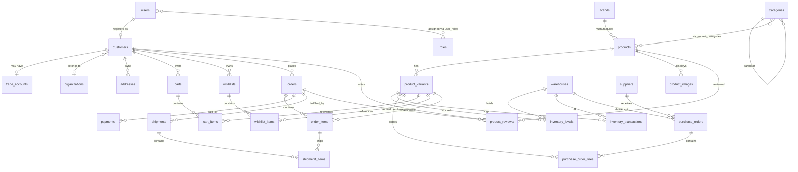
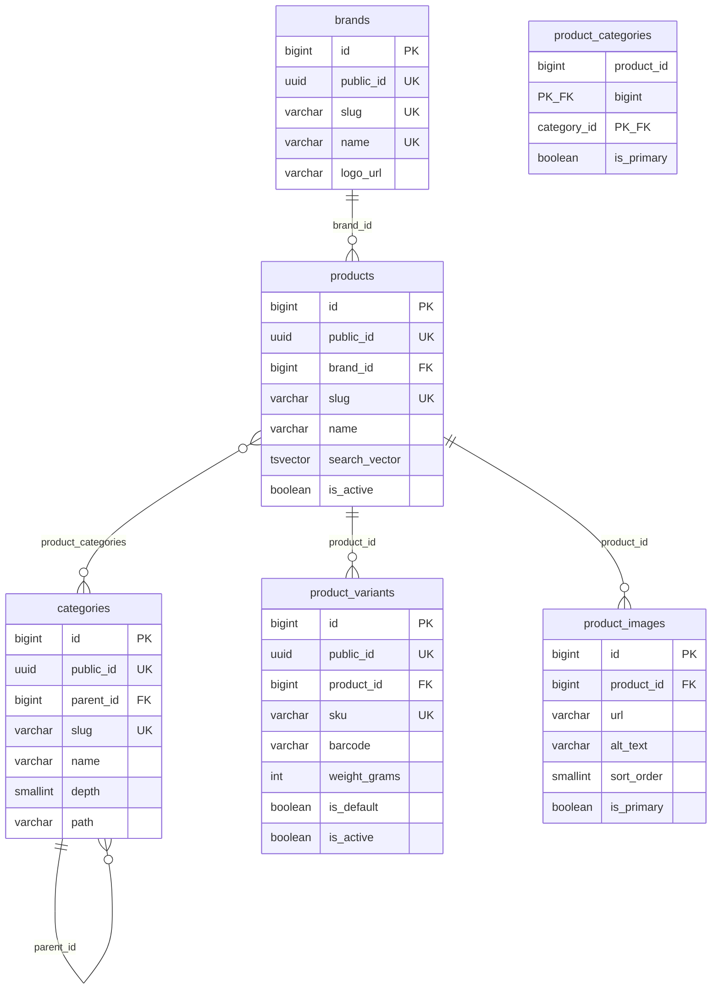
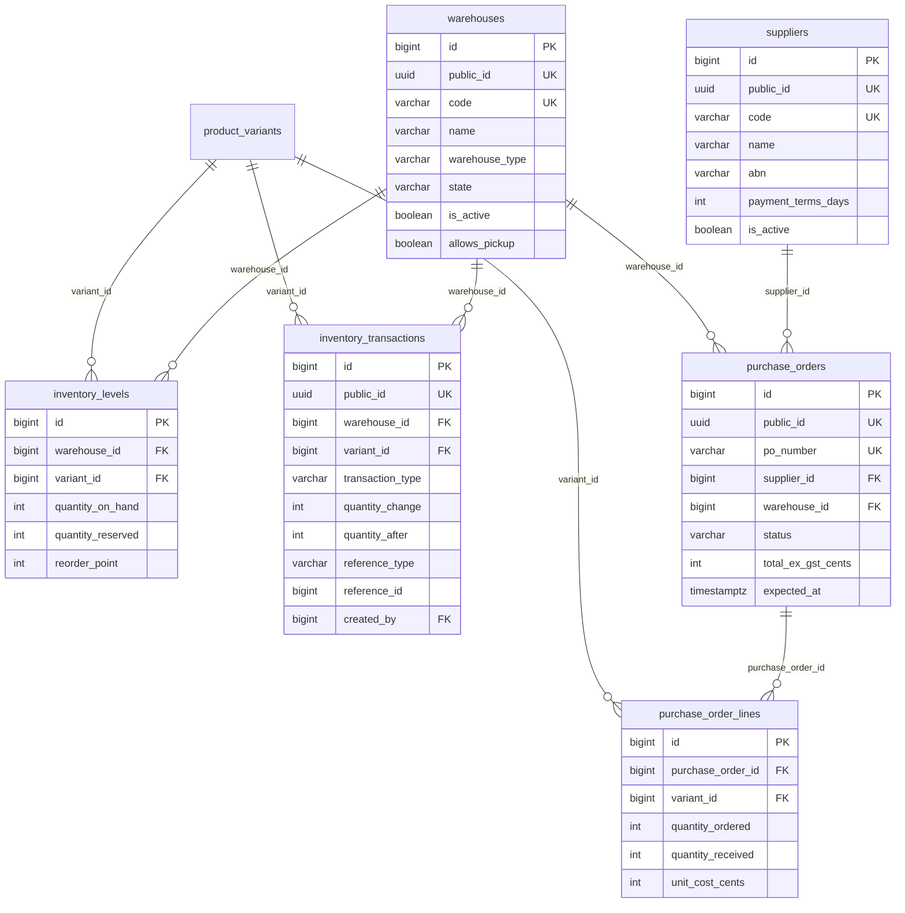
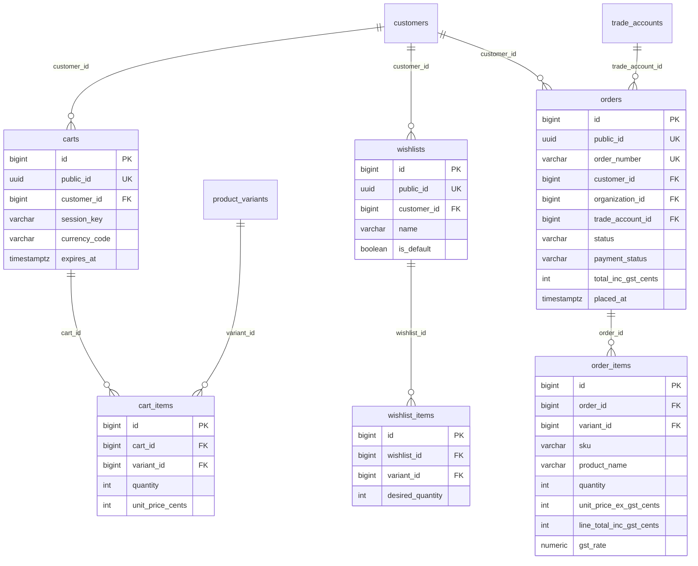
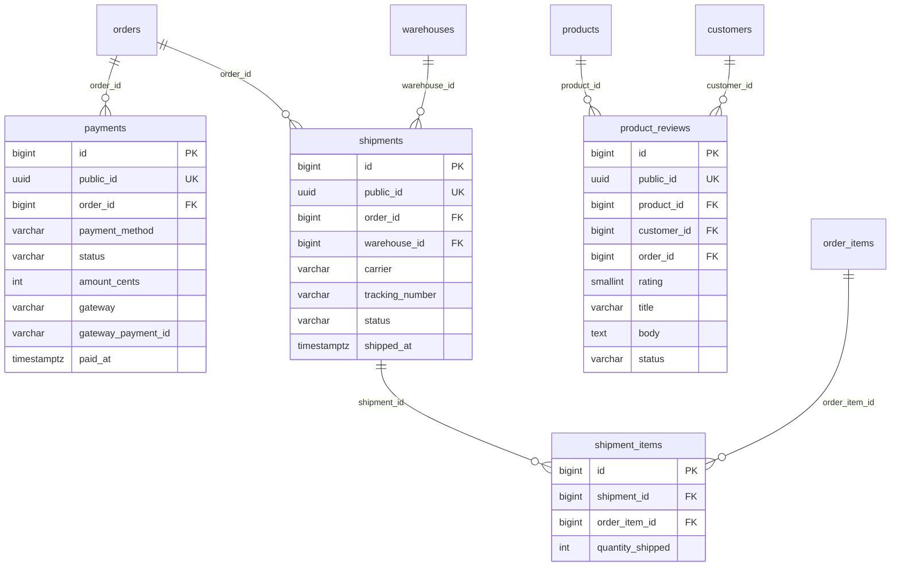
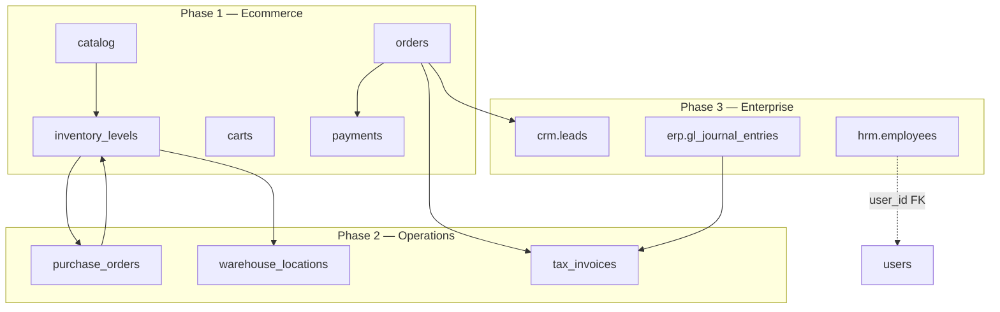

# A2Z Tools — PostgreSQL Database Architecture

**Australian Hardware & Networking Ecommerce · ERP-Ready**

| Attribute | Value |
|-----------|-------|
| **Database** | PostgreSQL 16+ |
| **ORM** | Django 5.x |
| **Deployment** | Docker (`postgres:16-alpine`) |
| **Frontend** | Next.js 15 (headless via DRF API) |
| **Currency** | AUD — integer cents (`BIGINT`) |
| **Tax** | GST 10% — snapshotted on transactions |
| **Timezone** | `Australia/Sydney` (store UTC `TIMESTAMPTZ`) |
| **Document Version** | 1.0 |

---

## Table of Contents

1. [Executive Summary](#1-executive-summary)
2. [Design Principles](#2-design-principles)
3. [Schema Organisation](#3-schema-organisation)
4. [Master ER Diagram](#4-master-er-diagram)
5. [Domain ER Diagrams](#5-domain-er-diagrams)
6. [Core Tables — PK & FK Reference](#6-core-tables--pk--fk-reference)
7. [Relationship Matrix](#7-relationship-matrix)
8. [Supporting Tables](#8-supporting-tables)
9. [Indexing & Performance](#9-indexing--performance)
10. [Future ERP Expansion](#10-future-erp-expansion)
11. [Django & Docker Integration](#11-django--docker-integration)

---

## 1. Executive Summary

A2Z Tools uses a **single PostgreSQL database** (`a2z_tools`) as the system of record. Phase 1 delivers ecommerce; the schema is structured so CRM, HRM, procurement, and WMS modules can attach without breaking existing tables.

**21 core business tables** (this document) map to **~45 physical tables** including junction tables, ledgers, and line-item children required for data integrity.

```
┌──────────────┐     ┌──────────────┐     ┌──────────────┐
│   Next.js    │────►│  Django DRF  │────►│ PostgreSQL   │
│  Storefront  │ JWT │  Modular     │     │  a2z_tools   │
└──────────────┘     │  Monolith    │     └──────────────┘
                     └──────────────┘
```

**Identifier strategy:**

| Layer | Type | Usage |
|-------|------|-------|
| Internal joins | `BIGSERIAL` | Primary keys, FK joins — never exposed in API |
| External API | `UUID v4` | `public_id` on all customer-facing entities |
| Business keys | `VARCHAR` UK | `order_number`, `sku`, `abn`, supplier `code` |

---

## 2. Design Principles

| Principle | Implementation |
|-----------|----------------|
| **Integer money** | All amounts in AUD cents — `BIGINT`, never `FLOAT` |
| **GST snapshots** | `gst_rate`, `gst_cents` frozen on order/payment lines |
| **Immutable sales** | `order_items` store SKU, name, price at purchase time |
| **Inventory ledger** | `inventory_transactions` append-only; levels derived |
| **Soft delete** | `deleted_at` on users, products, customers |
| **Audit trail** | `created_at`, `updated_at`; `created_by` on admin writes |
| **Normalised catalog** | Product → Variant (SKU) is the sellable unit |
| **ERP boundaries** | Logical PostgreSQL schemas in Phase 3+ (`erp`, `crm`, `hrm`) |

---

## 3. Schema Organisation

Phase 1: all tables in `public` schema, grouped by Django app.

```
a2z_tools (PostgreSQL 16)
│
├── IDENTITY          users, roles, user_roles, permissions
├── CUSTOMERS         customers, organizations, trade_accounts, addresses
├── CATALOG           categories, brands, products, product_variants, product_images
├── INVENTORY         warehouses, inventory_levels, inventory_transactions
├── SUPPLY            suppliers, supplier_products, purchase_orders, purchase_order_lines
├── COMMERCE          carts, cart_items, wishlists, wishlist_items
├── SALES             orders (sales orders), order_items
├── FULFILMENT        shipments, shipment_items
├── FINANCE           payments, payment_transactions, refunds
└── ENGAGEMENT        product_reviews
```

**Future (Phase 3+)** — additive schemas, FKs reference `public` where needed:

```
├── erp_finance       gl_accounts, journal_entries, tax_invoices
├── erp_procurement   goods_received_notes, supplier_invoices
├── erp_wms           warehouse_locations, pick_lists, cycle_counts
├── crm               leads, opportunities, activities
└── hrm               employees, leave_requests, payroll_runs
```

---

## 4. Master ER Diagram

All 21 core entities and primary relationships:



---

## 5. Domain ER Diagrams

### 5.1 Identity, Customers & Trade

```mermaid
erDiagram
    users {
        bigint id PK
        uuid public_id UK
        varchar email UK
        varchar password_hash
        boolean is_active
        boolean is_staff
        timestamptz email_verified_at
        timestamptz deleted_at
    }

    roles {
        bigint id PK
        varchar slug UK
        varchar name UK
        boolean is_system
    }

    user_roles {
        bigint user_id PK_FK
        bigint role_id PK_FK
        bigint organization_id FK
    }

    customers {
        bigint id PK
        uuid public_id UK
        bigint user_id FK_UK
        bigint organization_id FK
        varchar customer_type
        varchar trade_account_status
    }

    organizations {
        bigint id PK
        uuid public_id UK
        varchar legal_name
        varchar abn UK
        boolean abn_verified
    }

    trade_accounts {
        bigint id PK
        uuid public_id UK
        bigint organization_id FK_UK
        varchar account_number UK
        varchar tier
        varchar status
        int credit_limit_cents
        int credit_used_cents
        int payment_terms_days
    }

    addresses {
        bigint id PK
        uuid public_id UK
        bigint customer_id FK
        varchar line1
        varchar suburb
        varchar state
        varchar postcode
        varchar country
    }

    users ||--o| customers : user_id
    users }o--o{ roles : user_roles
    organizations ||--o| trade_accounts : organization_id
    customers }o--o| organizations : organization_id
    customers ||--o{ addresses : customer_id
```

### 5.2 Catalog



### 5.3 Inventory, Warehouses & Supply Chain



### 5.4 Commerce — Cart, Wishlist, Sales Orders



### 5.5 Fulfilment, Payments & Reviews



---

## 6. Core Tables — PK & FK Reference

For each of the **21 core tables**, physical table name, primary key, and all foreign keys.

### 6.1 Users

**Table:** `users`

| Key | Column(s) | References |
|-----|-----------|------------|
| **PK** | `id` BIGSERIAL | — |
| **UK** | `public_id` UUID | API identifier |
| **UK** | `email` VARCHAR(254) | Login |

**Outgoing FKs:** None (root identity entity)

**Incoming FKs:** `customers.user_id`, `user_roles.user_id`, `inventory_transactions.created_by`, `order_status_history.changed_by`

---

### 6.2 Roles

**Table:** `roles` (+ junction `user_roles`, `role_permissions`)

| Key | Column(s) | References |
|-----|-----------|------------|
| **PK** | `roles.id` BIGSERIAL | — |
| **UK** | `roles.slug` VARCHAR(100) | e.g. `trade_buyer`, `staff_catalog` |

**`user_roles` composite PK:**

| Key | Column(s) | References |
|-----|-----------|------------|
| **PK** | `(user_id, role_id)` | — |
| **FK** | `user_id` | → `users.id` ON DELETE CASCADE |
| **FK** | `role_id` | → `roles.id` ON DELETE CASCADE |
| **FK** | `organization_id` (nullable) | → `organizations.id` ON DELETE CASCADE |

---

### 6.3 Customers

**Table:** `customers`

| Key | Column(s) | References |
|-----|-----------|------------|
| **PK** | `id` BIGSERIAL | — |
| **UK** | `public_id` UUID | API identifier |
| **UK** | `user_id` BIGINT (nullable) | → `users.id` ON DELETE CASCADE |
| **FK** | `organization_id` (nullable) | → `organizations.id` ON DELETE SET NULL |

**Incoming FKs:** `addresses`, `carts`, `wishlists`, `orders`, `product_reviews`, `coupon_redemptions`

---

### 6.4 Trade Accounts

**Table:** `trade_accounts`

| Key | Column(s) | References |
|-----|-----------|------------|
| **PK** | `id` BIGSERIAL | — |
| **UK** | `public_id` UUID | API identifier |
| **UK** | `organization_id` BIGINT | → `organizations.id` ON DELETE RESTRICT |
| **UK** | `account_number` VARCHAR(20) | e.g. `TA-00042` |

| Column | Type | Notes |
|--------|------|-------|
| `tier` | VARCHAR(20) | `bronze`, `silver`, `gold`, `platinum` |
| `status` | VARCHAR(20) | `pending`, `approved`, `suspended`, `rejected` |
| `credit_limit_cents` | BIGINT | AUD cents |
| `credit_used_cents` | BIGINT | Running balance |
| `payment_terms_days` | INTEGER | Net 7/14/30/60 |

**Incoming FKs:** `orders.trade_account_id`, future `quotes.trade_account_id`

---

### 6.5 Categories

**Table:** `categories`

| Key | Column(s) | References |
|-----|-----------|------------|
| **PK** | `id` BIGSERIAL | — |
| **UK** | `public_id` UUID | |
| **UK** | `slug` VARCHAR(150) | URL segment |
| **FK** | `parent_id` (nullable) | → `categories.id` ON DELETE SET NULL |

**M2M:** `product_categories(product_id, category_id)` → products, categories

---

### 6.6 Brands

**Table:** `brands`

| Key | Column(s) | References |
|-----|-----------|------------|
| **PK** | `id` BIGSERIAL | — |
| **UK** | `public_id` UUID | |
| **UK** | `slug` VARCHAR(150) | |
| **UK** | `name` VARCHAR(150) | |

**Incoming FKs:** `products.brand_id`

---

### 6.7 Products

**Table:** `products`

| Key | Column(s) | References |
|-----|-----------|------------|
| **PK** | `id` BIGSERIAL | — |
| **UK** | `public_id` UUID | |
| **UK** | `slug` VARCHAR(255) | PDP URL |
| **FK** | `brand_id` (nullable) | → `brands.id` ON DELETE SET NULL |

**Incoming FKs:** `product_variants`, `product_images`, `product_categories`, `product_reviews`

---

### 6.8 Product Variants

**Table:** `product_variants` — **sellable SKU unit**

| Key | Column(s) | References |
|-----|-----------|------------|
| **PK** | `id` BIGSERIAL | — |
| **UK** | `public_id` UUID | |
| **UK** | `sku` VARCHAR(50) | Global SKU |
| **FK** | `product_id` | → `products.id` ON DELETE CASCADE |

**Incoming FKs:** `cart_items`, `wishlist_items`, `order_items`, `inventory_levels`, `purchase_order_lines`, `supplier_products`, `price_list_items`

**Delete rule:** RESTRICT if referenced by `order_items` (historical orders)

---

### 6.9 Product Images

**Table:** `product_images`

| Key | Column(s) | References |
|-----|-----------|------------|
| **PK** | `id` BIGSERIAL | — |
| **FK** | `product_id` | → `products.id` ON DELETE CASCADE |

| Column | Notes |
|--------|-------|
| `url` | S3/R2 path or CDN URL |
| `sort_order` | Gallery ordering |
| `is_primary` | PLP thumbnail |

---

### 6.10 Inventory

**Table:** `inventory_levels` (current position) + `inventory_transactions` (ledger)

#### `inventory_levels`

| Key | Column(s) | References |
|-----|-----------|------------|
| **PK** | `id` BIGSERIAL | — |
| **UK** | `(warehouse_id, variant_id)` | Composite unique |
| **FK** | `warehouse_id` | → `warehouses.id` ON DELETE CASCADE |
| **FK** | `variant_id` | → `product_variants.id` ON DELETE CASCADE |

| Column | Rule |
|--------|------|
| `quantity_on_hand` | Physical count |
| `quantity_reserved` | Carts + unfulfilled orders |
| `quantity_available` | `on_hand − reserved` (generated or maintained) |

#### `inventory_transactions` (append-only ledger)

| Key | Column(s) | References |
|-----|-----------|------------|
| **PK** | `id` BIGSERIAL | — |
| **UK** | `public_id` UUID | |
| **FK** | `warehouse_id` | → `warehouses.id` |
| **FK** | `variant_id` | → `product_variants.id` |
| **FK** | `created_by` (nullable) | → `users.id` |
| **Poly** | `(reference_type, reference_id)` | → orders, purchase_orders, adjustments |

**Transaction types:** `receipt`, `sale`, `return`, `adjustment`, `transfer_in`, `transfer_out`, `reservation`, `release`

---

### 6.11 Warehouses

**Table:** `warehouses`

| Key | Column(s) | References |
|-----|-----------|------------|
| **PK** | `id` BIGSERIAL | — |
| **UK** | `public_id` UUID | |
| **UK** | `code` VARCHAR(10) | e.g. `SYD`, `MEL` |

**Incoming FKs:** `inventory_levels`, `inventory_transactions`, `purchase_orders`, `shipments`, `stock_reservations`

**Future WMS:** `warehouse_locations.warehouse_id`, `pick_lists.warehouse_id`

---

### 6.12 Suppliers

**Table:** `suppliers`

| Key | Column(s) | References |
|-----|-----------|------------|
| **PK** | `id` BIGSERIAL | — |
| **UK** | `public_id` UUID | |
| **UK** | `code` VARCHAR(20) | Internal vendor code |

| Column | Notes |
|--------|-------|
| `abn` | Australian supplier ABN |
| `payment_terms_days` | AP terms |

**Incoming FKs:** `purchase_orders.supplier_id`, `supplier_products.supplier_id`

---

### 6.13 Purchase Orders

**Tables:** `purchase_orders` + `purchase_order_lines`

#### `purchase_orders`

| Key | Column(s) | References |
|-----|-----------|------------|
| **PK** | `id` BIGSERIAL | — |
| **UK** | `public_id` UUID | |
| **UK** | `po_number` VARCHAR(20) | e.g. `PO-20250617-001` |
| **FK** | `supplier_id` | → `suppliers.id` ON DELETE RESTRICT |
| **FK** | `warehouse_id` | → `warehouses.id` ON DELETE RESTRICT |
| **FK** | `created_by` (nullable) | → `users.id` |

**Status:** `draft`, `submitted`, `confirmed`, `partial_received`, `received`, `cancelled`

#### `purchase_order_lines`

| Key | Column(s) | References |
|-----|-----------|------------|
| **PK** | `id` BIGSERIAL | — |
| **FK** | `purchase_order_id` | → `purchase_orders.id` ON DELETE CASCADE |
| **FK** | `variant_id` | → `product_variants.id` ON DELETE RESTRICT |

**ERP path:** PO receipt → `inventory_transactions` type `receipt` → updates `inventory_levels`

---

### 6.14 Sales Orders

**Table:** `orders` (sales orders)

| Key | Column(s) | References |
|-----|-----------|------------|
| **PK** | `id` BIGSERIAL | — |
| **UK** | `public_id` UUID | |
| **UK** | `order_number` VARCHAR(20) | `A2Z-YYYYMMDD-XXXX` |
| **FK** | `customer_id` | → `customers.id` ON DELETE RESTRICT |
| **FK** | `organization_id` (nullable) | → `organizations.id` ON DELETE SET NULL |
| **FK** | `trade_account_id` (nullable) | → `trade_accounts.id` ON DELETE SET NULL |
| **FK** | `coupon_id` (nullable) | → `coupons.id` ON DELETE SET NULL |

| Totals (AUD cents) | Column |
|--------------------|--------|
| Subtotal ex GST | `subtotal_ex_gst_cents` |
| GST total | `gst_total_cents` |
| Shipping | `shipping_ex_gst_cents`, `shipping_gst_cents` |
| Grand total | `total_inc_gst_cents` |

**Status:** `draft`, `pending_payment`, `confirmed`, `processing`, `on_hold`, `completed`, `cancelled`

---

### 6.15 Order Items

**Table:** `order_items`

| Key | Column(s) | References |
|-----|-----------|------------|
| **PK** | `id` BIGSERIAL | — |
| **FK** | `order_id` | → `orders.id` ON DELETE CASCADE |
| **FK** | `variant_id` | → `product_variants.id` ON DELETE RESTRICT |

**Snapshot columns (immutable after placement):** `sku`, `product_name`, `variant_name`, `unit_price_ex_gst_cents`, `unit_gst_cents`, `gst_rate`, `line_total_inc_gst_cents`

**Incoming FKs:** `shipment_items.order_item_id`

---

### 6.16 Carts

**Tables:** `carts` + `cart_items`

#### `carts`

| Key | Column(s) | References |
|-----|-----------|------------|
| **PK** | `id` BIGSERIAL | — |
| **UK** | `public_id` UUID | |
| **FK** | `customer_id` (nullable) | → `customers.id` ON DELETE CASCADE |

| Constraint | Rule |
|------------|------|
| `CHECK` | `customer_id IS NOT NULL OR session_key IS NOT NULL` |
| `session_key` | Guest cart UUID (maps to `X-Session-Key` header) |

#### `cart_items`

| Key | Column(s) | References |
|-----|-----------|------------|
| **PK** | `id` BIGSERIAL | — |
| **UK** | `(cart_id, variant_id)` | One row per SKU per cart |
| **FK** | `cart_id` | → `carts.id` ON DELETE CASCADE |
| **FK** | `variant_id` | → `product_variants.id` ON DELETE RESTRICT |

---

### 6.17 Wishlist

**Tables:** `wishlists` + `wishlist_items`

#### `wishlists`

| Key | Column(s) | References |
|-----|-----------|------------|
| **PK** | `id` BIGSERIAL | — |
| **UK** | `public_id` UUID | |
| **FK** | `customer_id` | → `customers.id` ON DELETE CASCADE |

#### `wishlist_items`

| Key | Column(s) | References |
|-----|-----------|------------|
| **PK** | `id` BIGSERIAL | — |
| **UK** | `(wishlist_id, variant_id)` | |
| **FK** | `wishlist_id` | → `wishlists.id` ON DELETE CASCADE |
| **FK** | `variant_id` | → `product_variants.id` ON DELETE CASCADE |

---

### 6.18 Addresses

**Table:** `addresses`

| Key | Column(s) | References |
|-----|-----------|------------|
| **PK** | `id` BIGSERIAL | — |
| **UK** | `public_id` UUID | |
| **FK** | `customer_id` | → `customers.id` ON DELETE CASCADE |

| Column | Constraint |
|--------|------------|
| `state` | NSW, VIC, QLD, SA, WA, TAS, NT, ACT |
| `postcode` | `CHAR(4)` — Australian 4-digit |
| `country` | Default `'AU'` |

**Order snapshots:** `order_addresses` stores JSONB copies at checkout — not live FK to `addresses`

---

### 6.19 Reviews

**Table:** `product_reviews`

| Key | Column(s) | References |
|-----|-----------|------------|
| **PK** | `id` BIGSERIAL | — |
| **UK** | `public_id` UUID | |
| **FK** | `product_id` | → `products.id` ON DELETE CASCADE |
| **FK** | `customer_id` | → `customers.id` ON DELETE CASCADE |
| **FK** | `order_id` (nullable) | → `orders.id` ON DELETE SET NULL |

| Column | Notes |
|--------|-------|
| `rating` | 1–5 |
| `status` | `pending`, `approved`, `rejected` |
| `is_verified_purchase` | `order_id IS NOT NULL` |

**UK (optional):** `(customer_id, product_id, order_id)` — one review per purchase

---

### 6.20 Payments

**Table:** `payments` (+ `payment_transactions`, `refunds`)

#### `payments`

| Key | Column(s) | References |
|-----|-----------|------------|
| **PK** | `id` BIGSERIAL | — |
| **UK** | `public_id` UUID | |
| **UK** | `idempotency_key` VARCHAR(64) | Prevent duplicate charges |
| **FK** | `order_id` | → `orders.id` ON DELETE RESTRICT |

| Column | Values |
|--------|--------|
| `payment_method` | `card`, `paypal`, `bank_transfer`, `trade_credit` |
| `gateway` | `stripe`, `manual`, `trade_account` |
| `status` | `pending`, `processing`, `succeeded`, `failed`, `cancelled` |
| `amount_cents` | BIGINT — AUD cents |

---

### 6.21 Shipments

**Tables:** `shipments` + `shipment_items`

#### `shipments`

| Key | Column(s) | References |
|-----|-----------|------------|
| **PK** | `id` BIGSERIAL | — |
| **UK** | `public_id` UUID | |
| **FK** | `order_id` | → `orders.id` ON DELETE CASCADE |
| **FK** | `warehouse_id` (nullable) | → `warehouses.id` ON DELETE SET NULL |

| Column | Notes |
|--------|-------|
| `carrier` | AusPost, StarTrack, TNT, Click & Collect |
| `tracking_number` | Carrier tracking |
| `status` | `pending`, `picked`, `packed`, `shipped`, `delivered`, `failed` |

#### `shipment_items`

| Key | Column(s) | References |
|-----|-----------|------------|
| **PK** | `id` BIGSERIAL | — |
| **FK** | `shipment_id` | → `shipments.id` ON DELETE CASCADE |
| **FK** | `order_item_id` | → `order_items.id` ON DELETE RESTRICT |

---

## 7. Relationship Matrix

Complete parent → child FK map for the 21 core domains:

| # | Parent Table | Child Table | FK Column | Cardinality | ON DELETE |
|---|--------------|-------------|-----------|-------------|-----------|
| 1 | `users` | `customers` | `user_id` | 1:0..1 | CASCADE |
| 2 | `users` | `user_roles` | `user_id` | 1:N | CASCADE |
| 3 | `roles` | `user_roles` | `role_id` | 1:N | CASCADE |
| 4 | `organizations` | `customers` | `organization_id` | 1:N | SET NULL |
| 5 | `organizations` | `trade_accounts` | `organization_id` | 1:1 | RESTRICT |
| 6 | `customers` | `addresses` | `customer_id` | 1:N | CASCADE |
| 7 | `customers` | `carts` | `customer_id` | 1:N | CASCADE |
| 8 | `customers` | `wishlists` | `customer_id` | 1:N | CASCADE |
| 9 | `customers` | `orders` | `customer_id` | 1:N | RESTRICT |
| 10 | `trade_accounts` | `orders` | `trade_account_id` | 1:N | SET NULL |
| 11 | `categories` | `categories` | `parent_id` | 1:N | SET NULL |
| 12 | `brands` | `products` | `brand_id` | 1:N | SET NULL |
| 13 | `products` | `product_variants` | `product_id` | 1:N | CASCADE |
| 14 | `products` | `product_images` | `product_id` | 1:N | CASCADE |
| 15 | `products` | `product_reviews` | `product_id` | 1:N | CASCADE |
| 16 | `categories` | `product_categories` | `category_id` | N:M | CASCADE |
| 17 | `products` | `product_categories` | `product_id` | N:M | CASCADE |
| 18 | `warehouses` | `inventory_levels` | `warehouse_id` | 1:N | CASCADE |
| 19 | `product_variants` | `inventory_levels` | `variant_id` | 1:N | CASCADE |
| 20 | `warehouses` | `inventory_transactions` | `warehouse_id` | 1:N | RESTRICT |
| 21 | `product_variants` | `inventory_transactions` | `variant_id` | 1:N | RESTRICT |
| 22 | `suppliers` | `purchase_orders` | `supplier_id` | 1:N | RESTRICT |
| 23 | `warehouses` | `purchase_orders` | `warehouse_id` | 1:N | RESTRICT |
| 24 | `purchase_orders` | `purchase_order_lines` | `purchase_order_id` | 1:N | CASCADE |
| 25 | `product_variants` | `purchase_order_lines` | `variant_id` | 1:N | RESTRICT |
| 26 | `carts` | `cart_items` | `cart_id` | 1:N | CASCADE |
| 27 | `product_variants` | `cart_items` | `variant_id` | 1:N | RESTRICT |
| 28 | `wishlists` | `wishlist_items` | `wishlist_id` | 1:N | CASCADE |
| 29 | `product_variants` | `wishlist_items` | `variant_id` | 1:N | CASCADE |
| 30 | `orders` | `order_items` | `order_id` | 1:N | CASCADE |
| 31 | `product_variants` | `order_items` | `variant_id` | 1:N | RESTRICT |
| 32 | `orders` | `payments` | `order_id` | 1:N | RESTRICT |
| 33 | `orders` | `shipments` | `order_id` | 1:N | CASCADE |
| 34 | `warehouses` | `shipments` | `warehouse_id` | 1:N | SET NULL |
| 35 | `shipments` | `shipment_items` | `shipment_id` | 1:N | CASCADE |
| 36 | `order_items` | `shipment_items` | `order_item_id` | 1:N | RESTRICT |
| 37 | `customers` | `product_reviews` | `customer_id` | 1:N | CASCADE |
| 38 | `orders` | `product_reviews` | `order_id` | 1:N | SET NULL |

---

## 8. Supporting Tables

Required for integrity but outside the 21-entity list:

| Table | Purpose |
|-------|---------|
| `organizations` | B2B company — parent of trade accounts |
| `organization_members` | Users within an org |
| `user_profiles` | 1:1 display name, phone, preferences |
| `permissions`, `role_permissions` | RBAC granularity |
| `product_categories` | M2M products ↔ categories |
| `supplier_products` | Vendor SKU + cost mapping |
| `inventory_transactions` | Stock ledger (paired with inventory_levels) |
| `stock_reservations` | Checkout stock holds |
| `cart_items`, `wishlist_items` | Line items |
| `purchase_order_lines` | PO lines |
| `shipment_items` | Partial fulfilment |
| `order_addresses` | Frozen billing/shipping JSONB |
| `order_status_history` | Order state audit |
| `payment_transactions`, `refunds` | Payment gateway events |
| `coupons`, `price_lists` | Promotions & B2B pricing |

Full column definitions: [`DATABASE_PLAN.md`](../DATABASE_PLAN.md)

---

## 9. Indexing & Performance

### Critical indexes (per core table)

| Table | Index | Columns | Purpose |
|-------|-------|---------|---------|
| `users` | UK | `email`, `public_id` | Login, API |
| `customers` | IDX | `user_id`, `organization_id` | Profile lookup |
| `trade_accounts` | UK | `organization_id`, `account_number` | B2B credit check |
| `categories` | IDX | `parent_id, sort_order` | Tree navigation |
| `products` | UK + GIN | `slug`, `search_vector` | PDP + search |
| `product_variants` | UK | `sku`, `public_id` | Cart/checkout |
| `inventory_levels` | UK | `warehouse_id, variant_id` | Stock lookup |
| `orders` | UK + IDX | `order_number`, `customer_id, placed_at DESC` | History |
| `carts` | IDX | `session_key`, `customer_id` | Guest + auth cart |
| `payments` | IDX | `order_id`, `gateway_payment_id` | Reconciliation |
| `shipments` | IDX | `order_id`, `tracking_number` | Tracking |
| `purchase_orders` | UK | `po_number` | Procurement |
| `product_reviews` | Partial | `product_id WHERE status='approved'` | PDP reviews |

### Partitioning (Phase 3+)

| Table | Strategy | Key |
|-------|----------|-----|
| `inventory_transactions` | RANGE quarterly | `created_at` |
| `analytics_events` | RANGE monthly | `occurred_at` |
| `order_status_history` | RANGE yearly | `created_at` |

---

## 10. Future ERP Expansion

### 10.1 Module Roadmap



### 10.2 Extension Points (no breaking changes)

| Current Table | ERP Module | Extension |
|---------------|------------|-----------|
| `customers` | CRM | Sync to `crm.accounts`; activity timeline |
| `orders` | Finance | `tax_invoices.order_id`, GL posting |
| `purchase_orders` | Procurement | GRN, three-way match, AP invoices |
| `inventory_levels` | WMS | Bin locations, pick/pack/ship waves |
| `warehouses` | WMS | `warehouse_locations`, zones, aisles |
| `suppliers` | Procurement | Vendor scorecards, contracts |
| `trade_accounts` | Finance | AR aging, credit holds |
| `users` | HRM | `hrm.employees.user_id` — payroll separate |

### 10.3 Event Outbox (integration bus)

```sql
CREATE TABLE outbox_events (
    id           BIGSERIAL PRIMARY KEY,
    event_type   VARCHAR(100) NOT NULL,  -- order.placed, stock.received
    aggregate_id UUID NOT NULL,
    payload      JSONB NOT NULL,
    created_at   TIMESTAMPTZ NOT NULL DEFAULT NOW(),
    published_at TIMESTAMPTZ NULL
);
```

Feeds CRM webhooks, Xero/MYOB sync, and WMS without dual-write bugs.

### 10.4 Schema Isolation Strategy

| Phase | Approach |
|-------|----------|
| Phase 1 | Single `public` schema — Django apps |
| Phase 2 | `CREATE SCHEMA erp_procurement` — new tables only |
| Phase 3 | Read replicas for catalog/search; primary for writes |
| Phase 4 | Optional service extraction — same DB or logical replication |

**Rule:** Never rename Phase 1 tables. Add columns or sibling tables in new schemas.

---

## 11. Django & Docker Integration

### 11.1 Django App Mapping

| Django App | Core Tables |
|------------|-------------|
| `accounts` | users, roles, user_roles, permissions |
| `customers` | customers, organizations, addresses |
| `trade_accounts` | trade_accounts |
| `catalog` | categories, brands, products, product_variants, product_images |
| `inventory` | warehouses, inventory_levels, inventory_transactions |
| `suppliers` | suppliers, purchase_orders, purchase_order_lines |
| `orders` | carts, cart_items, wishlists, wishlist_items, orders, order_items |
| `payments` | payments |
| `shipping` | shipments, shipment_items |
| `reviews` | product_reviews |

### 11.2 Docker Compose (PostgreSQL)

```yaml
db:
  image: postgres:16-alpine
  environment:
    POSTGRES_DB: a2z_tools
    POSTGRES_USER: a2z
    POSTGRES_PASSWORD: ${POSTGRES_PASSWORD}
  volumes:
    - postgres_data:/var/lib/postgresql/data
  healthcheck:
    test: ["CMD-SHELL", "pg_isready -U a2z -d a2z_tools"]
```

### 11.3 Recommended PostgreSQL Extensions

```sql
CREATE EXTENSION IF NOT EXISTS "uuid-ossp";
CREATE EXTENSION IF NOT EXISTS "pg_trgm";    -- fuzzy search
CREATE EXTENSION IF NOT EXISTS "btree_gin";  -- composite GIN
```

### 11.4 Migration Order

```
1. users, roles, permissions
2. organizations, customers, trade_accounts, addresses
3. categories, brands, products, product_variants, product_images
4. warehouses, suppliers, inventory_levels
5. carts, wishlists
6. orders, order_items, payments, shipments
7. purchase_orders (Phase 2)
8. product_reviews
```

---

## Appendix — Core Table Quick Reference

| # | Business Entity | Physical Table(s) | PK | Primary FKs |
|---|-----------------|-------------------|-----|-------------|
| 1 | Users | `users` | `id` | — |
| 2 | Roles | `roles`, `user_roles` | `id` / composite | `users`, `roles` |
| 3 | Customers | `customers` | `id` | `users`, `organizations` |
| 4 | Trade Accounts | `trade_accounts` | `id` | `organizations` |
| 5 | Categories | `categories` | `id` | `categories` (parent) |
| 6 | Brands | `brands` | `id` | — |
| 7 | Products | `products` | `id` | `brands` |
| 8 | Product Variants | `product_variants` | `id` | `products` |
| 9 | Product Images | `product_images` | `id` | `products` |
| 10 | Inventory | `inventory_levels` | `id` | `warehouses`, `product_variants` |
| 11 | Warehouses | `warehouses` | `id` | — |
| 12 | Suppliers | `suppliers` | `id` | — |
| 13 | Purchase Orders | `purchase_orders`, `purchase_order_lines` | `id` | `suppliers`, `warehouses`, `product_variants` |
| 14 | Sales Orders | `orders` | `id` | `customers`, `trade_accounts` |
| 15 | Order Items | `order_items` | `id` | `orders`, `product_variants` |
| 16 | Carts | `carts`, `cart_items` | `id` | `customers`, `product_variants` |
| 17 | Wishlist | `wishlists`, `wishlist_items` | `id` | `customers`, `product_variants` |
| 18 | Addresses | `addresses` | `id` | `customers` |
| 19 | Reviews | `product_reviews` | `id` | `products`, `customers`, `orders` |
| 20 | Payments | `payments` | `id` | `orders` |
| 21 | Shipments | `shipments`, `shipment_items` | `id` | `orders`, `warehouses`, `order_items` |

---

## Related Documents

| Document | Description |
|----------|-------------|
| [DATABASE_PLAN.md](../DATABASE_PLAN.md) | Full column-level definitions (~50 tables) |
| [BACKEND_ARCHITECTURE.md](BACKEND_ARCHITECTURE.md) | Django apps, API, Docker, auth |
| [API_SPECIFICATION.md](../API_SPECIFICATION.md) | REST contracts for Next.js |

---

*A2Z Tools PostgreSQL Database Architecture v1.0 — ERP-ready ecommerce foundation for the Australian market.*
