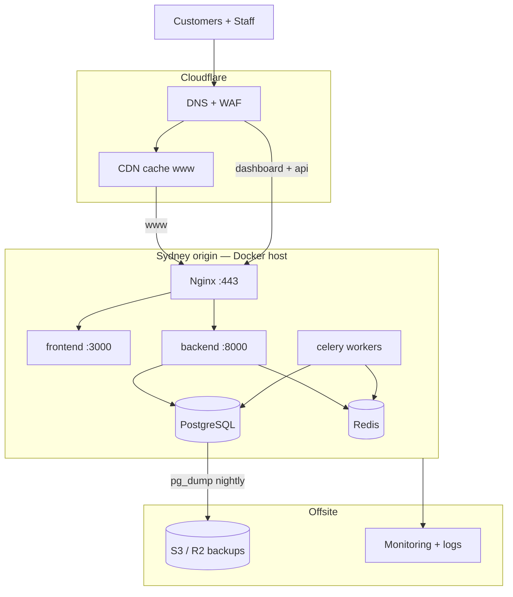
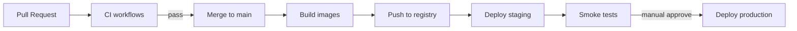
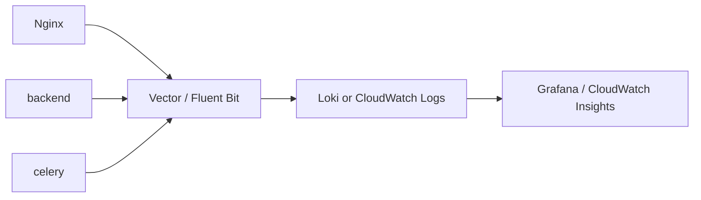

# Production Deployment Plan — A2Z Tools

**Target go-live:** Production stack on Sydney-region infrastructure  
**Domains:** `www.a2ztools.com` · `dashboard.a2ztools.com` · `api.a2ztools.com`  
**Stack:** Docker · Nginx · Cloudflare · PostgreSQL 16 · Redis 7 · Next.js 15 · Django REST

| Document | Role |
|----------|------|
| [PRODUCTION_READINESS.md](./PRODUCTION_READINESS.md) | **Readiness score, risks, architecture summary** |
| [GO_LIVE_CHECKLIST.md](./GO_LIVE_CHECKLIST.md) | **Go-live and rollback checklist** |
| This plan | **Execution checklist** — what to do, in order |
| [DEPLOYMENT_ARCHITECTURE.md](./DEPLOYMENT_ARCHITECTURE.md) | Deep architecture, scaling, module evolution |
| [deployment.md](./deployment.md) | Day-2 runbook (deploy, rollback, smoke tests) |
| [RBAC.md](./RBAC.md) | Staff/customer access for dashboard + API |

---

## Executive summary

Phase 1 deploys a **single production host** (or small VM pair) running Docker Compose with Nginx as the only public entry point. **Cloudflare** sits in front for DNS, WAF, DDoS, and CDN caching on the storefront. **PostgreSQL backups** run nightly to S3-compatible storage with weekly restore drills. **GitHub Actions** gates merges with CI and promotes `main` to production via SSH or a container registry.



---

## Timeline (recommended)

| Week | Milestone | Deliverables |
|------|-----------|--------------|
| **W1** | Foundation | Cloudflare zone, DNS, origin server, SSH hardening, secret manager |
| **W2** | Staging | `staging.a2ztools.com` + `api.staging.a2ztools.com`, full Compose stack, CI green |
| **W3** | Production build | Prod `.env`, Nginx + origin certs, backup cron, monitoring agents |
| **W4** | Go-live | DNS cutover, smoke tests, DR drill #1, status page |

---

## 1. Domain & DNS (Cloudflare)

### 1.1 Zone setup

1. Add `a2ztools.com` to Cloudflare (Full setup — nameservers at registrar).
2. Enable **DNSSEC** after validation.
3. Set **SSL/TLS → Overview → Full (strict)** (origin must present valid cert).
4. Enable **Always Use HTTPS** and **Automatic HTTPS Rewrites**.

### 1.2 DNS records

| Name | Type | Content | Proxy | Notes |
|------|------|---------|-------|-------|
| `@` | CNAME | `www.a2ztools.com` | Proxied | Apex → www |
| `www` | A / AAAA | `<ORIGIN_IP>` | **Proxied** | Storefront; CDN caches static assets |
| `dashboard` | A / AAAA | `<ORIGIN_IP>` | **Proxied** | Admin ERP; stricter WAF rules |
| `api` | A / AAAA | `<ORIGIN_IP>` | **DNS only** (grey cloud) | API bypasses CDN; lower latency, no cache |
| `staging` | A / AAAA | `<STAGING_IP>` | Proxied | Pre-prod storefront |
| `api.staging` | A / AAAA | `<STAGING_IP>` | DNS only | Pre-prod API |

> **Why API is DNS-only:** JWT auth, WebSockets, and dynamic responses must not be cached. Cloudflare still provides DDoS protection at L3/L4 for grey-cloud records.

### 1.3 Cloudflare configuration

| Area | Setting | Value |
|------|---------|-------|
| **Caching** | Page Rules / Cache Rules | Cache `www.a2ztools.com/_next/static/*` — Edge TTL 1 year |
| **Caching** | Bypass cache | `api.a2ztools.com/*`, `dashboard.a2ztools.com/*` |
| **Security** | Security Level | Medium; High on checkout paths |
| **WAF** | Managed rules | OWASP Core Ruleset ON |
| **WAF** | Custom rule | Rate-limit `POST /api/v1/auth/login` — 20 req/min/IP |
| **WAF** | Custom rule | Block countries outside AU/NZ (optional B2B) |
| **Bot Fight** | Super Bot Fight Mode | ON for `www` checkout |
| **Headers** | Transform Rules | Add `X-Request-Id` if not present (optional) |
| **HSTS** | Enable after 48h stable HTTPS | `max-age=31536000; includeSubDomains; preload` |

### 1.4 Origin certificates

**Option A (recommended with Cloudflare):** Cloudflare **Origin Certificate** (15-year) installed in Nginx:

```bash
# On origin host
mkdir -p infrastructure/nginx/ssl/a2ztools.com
# Paste origin cert → fullchain.pem, private key → privkey.pem (chmod 600)
```

**Option B:** Let's Encrypt via Certbot on the host (works with Full strict if CF validates origin).

Use `infrastructure/nginx/production.conf.example` — mount as `conf.d/default.conf` in the `nginx` service.

---

## 2. Docker production stack

### 2.1 Host requirements (Phase 1)

| Spec | Minimum | Recommended |
|------|---------|-------------|
| vCPU | 4 | 8 |
| RAM | 8 GB | 16 GB |
| Disk | 100 GB SSD | 200 GB NVMe |
| OS | Ubuntu 22.04/24.04 LTS | Same |
| Region | `ap-southeast-2` (Sydney) | AU data residency |

### 2.2 Deploy command

```bash
# On production host — /opt/a2z-tools
git clone <repo> . && git checkout main
cp .env.production.example .env   # fill from secret manager — never commit

docker compose -f docker-compose.yml -f docker-compose.prod.yml \
  --profile proxy --profile workers up -d --build
```

### 2.3 Service matrix

| Container | Profile | Public | Health |
|-----------|---------|--------|--------|
| `nginx` | `proxy` | 80, 443 | `GET /health` |
| `frontend` | default | internal 3000 | `GET /` |
| `backend` | default | internal 8000 | `GET /api/v1/health/` |
| `postgres` | default | **none** | `pg_isready` |
| `redis` | default | **none** | `redis-cli ping` |
| `celery` + `celery-beat` | `workers` | none | worker heartbeat |
| `pgadmin` | `ops` | VPN only | — |

### 2.4 Production environment variables

```bash
# --- Django / API (api.a2ztools.com) ---
DJANGO_SETTINGS_MODULE=config.settings.prod
DJANGO_DEBUG=False
DJANGO_SECRET_KEY=<from-secret-manager>
DJANGO_ALLOWED_HOSTS=api.a2ztools.com
DJANGO_CORS_ALLOWED_ORIGINS=https://www.a2ztools.com,https://dashboard.a2ztools.com
CSRF_TRUSTED_ORIGINS=https://www.a2ztools.com,https://dashboard.a2ztools.com,https://api.a2ztools.com
DJANGO_SECURE_SSL_REDIRECT=True
FRONTEND_URL=https://www.a2ztools.com

# --- Database ---
POSTGRES_DB=a2z_tools
POSTGRES_USER=a2z
POSTGRES_PASSWORD=<from-secret-manager>
POSTGRES_HOST=postgres

# --- Redis / Celery ---
REDIS_URL=redis://redis:6379/0
CELERY_BROKER_URL=redis://redis:6379/1

# --- Frontend build args ---
NEXT_PUBLIC_API_URL=https://api.a2ztools.com/api/v1
NEXT_PUBLIC_SITE_URL=https://www.a2ztools.com
NEXT_PUBLIC_ADMIN_URL=https://dashboard.a2ztools.com
NEXT_PUBLIC_ADMIN_DEMO=false

# --- Backups ---
BACKUP_S3_BUCKET=a2z-tools-prod-backups
AWS_DEFAULT_REGION=ap-southeast-2
```

### 2.5 Nginx routing

| `server_name` | Upstream | Purpose |
|---------------|----------|---------|
| `www.a2ztools.com` | `frontend:3000` | Storefront |
| `dashboard.a2ztools.com` | `frontend:3000` | Admin (`/admin-dashboard/*`) |
| `api.a2ztools.com` | `backend:8000` | REST API + Django admin |

**Post-deploy fix:** Production Compose mounts `nginx.prod.conf`, `conf.d/production.conf`, and `proxy_params.conf` (see `docker-compose.prod.yml`). Generate dev TLS with `./infrastructure/scripts/generate-dev-ssl.sh` before first local prod run.

---

## 3. SSL/TLS

| Layer | Responsibility |
|-------|----------------|
| **Browser ↔ Cloudflare** | Cloudflare Universal SSL (auto) |
| **Cloudflare ↔ Origin** | Origin cert or Let's Encrypt on Nginx |
| **Protocols** | TLS 1.2+ only; prefer TLS 1.3 |
| **Ciphers** | Modern suite in `production.conf.example` |

**Validation before HSTS preload:**

```bash
curl -I https://www.a2ztools.com
curl -I https://dashboard.a2ztools.com
curl -I https://api.a2ztools.com/api/v1/health/
```

Test at [https://www.ssllabs.com/ssltest/](https://www.ssllabs.com/ssltest/) — target **A** rating.

---

## 4. PostgreSQL backups

### 4.1 Backup policy

| Type | Method | Schedule | Retention | Storage |
|------|--------|----------|-----------|---------|
| **Full dump** | `pg_dump -Fc` | Daily 02:00 AEST | 30 days | `s3://a2z-tools-prod-backups/postgres/daily/` |
| **WAL archive** | `archive_mode=on` | Continuous | 7 days PITR | `s3://.../postgres/wal/` |
| **Pre-deploy** | Manual `pg_dump` | Before each prod deploy | 7 days | `s3://.../postgres/pre-deploy/` |
| **Config** | Git tag + `.env` snapshot | Every release | Indefinite | Secret manager versions |

### 4.2 Cron on origin host

```cron
# /etc/cron.d/a2z-backups
0 2 * * * root cd /opt/a2z-tools && \
  POSTGRES_USER=a2z POSTGRES_DB=a2z_tools \
  BACKUP_S3_BUCKET=a2z-tools-prod-backups \
  ./infrastructure/scripts/backup-postgres.sh >> /var/log/a2z-backup.log 2>&1
```

Script: `infrastructure/scripts/backup-postgres.sh` (already in repo).

### 4.3 WAL archiving (enable for PITR)

Add to Postgres custom config (volume or `command`):

```ini
archive_mode = on
archive_command = 'aws s3 cp %p s3://a2z-tools-prod-backups/postgres/wal/%f'
wal_level = replica
```

### 4.4 Restore drill (weekly on staging)

```bash
# Download latest dump
aws s3 cp s3://a2z-tools-prod-backups/postgres/daily/<latest>.dump /tmp/

# Restore to staging Postgres
docker exec -i a2z-postgres pg_restore -U a2z -d a2z_tools_staging --clean --if-exists < /tmp/<latest>.dump

# Smoke test
curl -fsS https://api.staging.a2ztools.com/api/v1/ready/
```

### 4.5 Australian compliance

- Encrypt backups at rest (S3 SSE-S3 or SSE-KMS).
- GST/order data: retain **5 years** (ATO).
- Restrict S3 bucket policy to ops IAM role; enable access logging.

---

## 5. CI/CD pipeline

### 5.1 Pipeline overview



### 5.2 Existing CI (enable — already in repo)

| Workflow | Trigger | Gates |
|----------|---------|-------|
| `ci-backend.yml` | PR/push `backend/**` | Ruff, Django check, pytest |
| `ci-frontend.yml` | PR/push `frontend/**` | ESLint, typecheck, `next build` |

**Branch protection on `main`:** require both CI jobs + 1 review.

### 5.3 Production deploy workflow (to implement)

Replace placeholder in `.github/workflows/deploy.yml`:

```yaml
name: Deploy Production

on:
  workflow_dispatch:
    inputs:
      environment:
        description: Target environment
        required: true
        default: staging
        type: choice
        options: [staging, production]

jobs:
  build:
    runs-on: ubuntu-latest
    steps:
      - uses: actions/checkout@v4
      - name: Build backend image
        run: docker build -t ghcr.io/${{ github.repository }}/backend:${{ github.sha }} ./backend --target production
      - name: Build frontend image
        run: |
          docker build -t ghcr.io/${{ github.repository }}/frontend:${{ github.sha }} ./frontend \
            --target production \
            --build-arg NEXT_PUBLIC_API_URL=${{ vars.NEXT_PUBLIC_API_URL }} \
            --build-arg NEXT_PUBLIC_SITE_URL=${{ vars.NEXT_PUBLIC_SITE_URL }}
      - name: Push images
        run: docker push ghcr.io/${{ github.repository }}/backend:${{ github.sha }}

  deploy:
    needs: build
    runs-on: ubuntu-latest
    environment: ${{ inputs.environment }}
    steps:
      - name: SSH deploy
        uses: appleboy/ssh-action@v1
        with:
          host: ${{ secrets.DEPLOY_HOST }}
          username: deploy
          key: ${{ secrets.DEPLOY_SSH_KEY }}
          script: |
            cd /opt/a2z-tools
            export IMAGE_TAG=${{ github.sha }}
            git fetch && git checkout ${{ github.sha }}
            docker compose -f docker-compose.yml -f docker-compose.prod.yml pull
            docker compose -f docker-compose.yml -f docker-compose.prod.yml \
              --profile proxy --profile workers up -d
            curl -fsS https://api.a2ztools.com/api/v1/health/
```

**Secrets (GitHub Environments):**

| Secret | Purpose |
|--------|---------|
| `DEPLOY_HOST` | Origin server IP/hostname |
| `DEPLOY_SSH_KEY` | Deploy user private key |
| `DJANGO_SECRET_KEY` | Injected to `.env` on host |
| `POSTGRES_PASSWORD` | Database |
| `AWS_ACCESS_KEY_ID` / `AWS_SECRET_ACCESS_KEY` | Backup uploads (prefer IAM role on host) |

### 5.4 Release strategy

| Environment | Branch | Approval | URL |
|-------------|--------|----------|-----|
| Staging | `develop` | Auto on merge | `staging.a2ztools.com` |
| Production | `main` | Manual workflow_dispatch | `www.a2ztools.com` |

**Database migrations:** run automatically via `RUN_MIGRATIONS=true` on backend startup. Destructive migrations require maintenance window + pre-deploy backup.

---

## 6. Monitoring

### 6.1 Health endpoints

| Check | URL | Interval | Alert if |
|-------|-----|----------|----------|
| API liveness | `GET https://api.a2ztools.com/api/v1/health/` | 60s | non-200 |
| API readiness | `GET https://api.a2ztools.com/api/v1/ready/` | 60s | DB down |
| Storefront | `GET https://www.a2ztools.com/` | 60s | non-200 |
| Dashboard | `GET https://dashboard.a2ztools.com/admin-dashboard` | 120s | non-200 |

**Tools:** Cloudflare Health Checks, UptimeRobot, or Better Stack — all probe from outside Sydney.

### 6.2 Application monitoring

| Tool | Scope | Integration |
|------|-------|-------------|
| **Sentry** | Frontend + Django exceptions | `SENTRY_DSN` env vars |
| **Cloudflare Analytics** | Traffic, WAF blocks, bot score | Dashboard |
| **Prometheus + Grafana** (optional) | Container CPU/RAM, Postgres connections | `cadvisor` + `node_exporter` on host |

### 6.3 Alerts (minimum viable)

| Alert | Channel | Severity |
|-------|---------|----------|
| API health fail 3× | Slack / PagerDuty | SEV1 |
| Disk > 85% on origin | Email | SEV2 |
| Backup cron failed | Email + Slack | SEV2 |
| 5xx rate > 1% (5 min) | Slack | SEV1 |
| Postgres connections > 80% | Slack | SEV2 |
| Certificate expiry < 14 days | Email | SEV2 |

### 6.4 Dashboards

1. **Ops dashboard (Grafana):** request rate, p95 latency, error rate, Celery queue depth.
2. **Business dashboard (admin):** orders/hour, low-stock count — already in app roadmap.

---

## 7. Logging

### 7.1 Log sources

| Source | Format | Retention |
|--------|--------|-----------|
| Nginx access/error | JSON (log_format) | 90 days |
| Django / Gunicorn | Structured JSON to stdout | 30 days |
| Celery workers | stdout | 30 days |
| PostgreSQL | `log_min_duration_statement=500ms` | 14 days |
| Cloudflare | HTTP requests, WAF | 30 days (plan dependent) |

### 7.2 Collection architecture



**Phase 1 (simple):** Docker `json-file` driver + nightly logrotate on host + Cloudflare Logpush to S3.

**Phase 2:** Vector agent ships JSON logs to Grafana Cloud Loki or AWS CloudWatch.

### 7.3 Structured log fields

Ensure every API log line includes:

- `request_id` (from `X-Request-Id` header)
- `user_id` / `customer_id` (when authenticated)
- `path`, `method`, `status`, `duration_ms`

### 7.4 Audit logs

| Event | Store |
|-------|-------|
| Staff login / failed login | Django logs + Sentry |
| RBAC permission denials | Django WARNING |
| Inventory movements | `inventory_transactions` table (already append-only) |
| Order status changes | `orders` table timestamps |
| Admin actions | Django admin log + future `audit_logs` app |

---

## 8. Disaster recovery

### 8.1 Objectives

| Tier | Systems | RTO | RPO |
|------|---------|-----|-----|
| **Tier 1** | Storefront, checkout, API auth | **1 hour** | **15 min** (with WAL) |
| **Tier 2** | Dashboard, inventory, PO receive | **4 hours** | **1 hour** |
| **Tier 3** | Analytics, reports | **24 hours** | **24 hours** |

### 8.2 Failure playbooks

| Scenario | Detection | Response |
|----------|-----------|----------|
| Container crash | Docker healthcheck restart | Auto-restart (`restart: always`) |
| Origin host loss | Uptime monitor | Provision new VM; restore Compose + latest dump |
| Postgres corruption | `/ready/` fails | Stop writes; restore from dump + WAL |
| Region outage | Multi-region monitor | Activate Melbourne cold standby (Phase 2) |
| DDoS | CF traffic spike | Under Attack mode; tighten WAF |
| Credential leak | Alert / audit | Rotate secrets; JWT blacklist refresh tokens |

### 8.3 DR runbook (condensed)

1. **Assess (0–15 min):** Confirm via health checks; classify SEV1–3; notify on-call.
2. **Contain (15–30 min):** Enable maintenance mode if data integrity at risk; preserve logs.
3. **Recover (30 min – RTO):**
   - Provision host in `ap-southeast-2` (or DR region).
   - Pull images at last known-good SHA.
   - Restore Postgres: `pg_restore -d a2z_tools latest.dump`.
   - Restore `.env` from secret manager.
   - `docker compose ... --profile proxy --profile workers up -d`.
4. **Verify:** Health, login, place test order, admin dashboard, inventory read.
5. **Communicate:** Status page update; customer email if checkout/PII affected.
6. **Post-mortem:** Within 5 business days.

### 8.4 Cross-region backup replication

```bash
# S3 lifecycle — replicate backups to Melbourne
aws s3 sync s3://a2z-tools-prod-backups s3://a2z-tools-dr-backups --source-region ap-southeast-2
```

Enable **S3 Cross-Region Replication** on the backups bucket → `ap-southeast-4`.

---

## 9. Security hardening

### 9.1 Pre-go-live checklist

**Cloudflare**

- [ ] WAF OWASP ruleset enabled
- [ ] API (`api`) grey-cloud (no cache)
- [ ] Rate limits on `/api/v1/auth/*`
- [ ] Bot protection on checkout
- [ ] DNSSEC enabled

**Origin server**

- [ ] SSH key-only auth; `PermitRootLogin no`
- [ ] UFW: allow 22 (bastion IP only), 80, 443
- [ ] Fail2ban on SSH
- [ ] Unattended security upgrades enabled
- [ ] Deploy user is non-root; Docker group only

**Docker**

- [ ] Postgres and Redis **not** published to host ports (prod override ✓)
- [ ] All app containers run as non-root
- [ ] Pin image digests in production
- [ ] Trivy scan in CI before deploy

**Application**

- [ ] `DJANGO_DEBUG=False`
- [ ] Strong `DJANGO_SECRET_KEY` (50+ chars, from secret manager)
- [ ] `NEXT_PUBLIC_ADMIN_DEMO=false`
- [ ] DRF default `IsAuthenticated`; public endpoints explicit
- [ ] RBAC seeded: `RoleService.ensure_system_roles()`
- [ ] JWT access 15 min; refresh rotation + blacklist enabled
- [ ] CORS limited to www + dashboard origins
- [ ] Stripe keys in secret manager; no card data on servers

**Dashboard**

- [ ] Optional Cloudflare IP allowlist for `dashboard.a2ztools.com`
- [ ] Staff JWT required; no demo mode in prod
- [ ] MFA for super-admin (Phase 2 — Google Workspace / Auth0)

**Backups**

- [ ] S3 bucket encryption + block public access
- [ ] Weekly restore drill logged
- [ ] Backup failure alerts configured

### 9.2 Defence-in-depth diagram

```
Internet → Cloudflare WAF/DDoS → TLS → Nginx rate limits → JWT + RBAC → Django services → PostgreSQL (encrypted volume)
```

---

## 10. Go-live checklist

### T-7 days

- [ ] Staging environment mirrors production topology
- [ ] All CI checks green on `main`
- [ ] Load test: 50 concurrent checkout sessions
- [ ] Security scan (Trivy + OWASP ZAP on staging)
- [ ] Backup + restore drill successful

### T-1 day

- [ ] Pre-deploy `pg_dump` to S3
- [ ] Freeze schema migrations unless critical
- [ ] Notify team of deploy window (low-traffic period)
- [ ] Status page ready (e.g. `status.a2ztools.com`)

### Deploy day

- [ ] Run deploy workflow (staging first, then production)
- [ ] Verify health endpoints (see [deployment.md](./deployment.md))
- [ ] Smoke test: register → verify email → login → add to cart → checkout
- [ ] Smoke test: staff login → dashboard → inventory view
- [ ] Monitor error rates for 2 hours
- [ ] Enable Cloudflare HSTS preload (if SSL stable)

### T+1 day

- [ ] Review Nginx and application logs for anomalies
- [ ] Confirm backup cron ran successfully
- [ ] Update runbook with any deploy lessons

---

## 11. Post-launch operations

| Task | Frequency | Owner |
|------|-----------|-------|
| Backup verification | Weekly | Ops |
| Dependency updates (security patches) | Monthly | Engineering |
| SSL cert / origin cert expiry check | Monthly | Ops |
| DR drill (full restore) | Quarterly | Ops + Backend |
| Secret rotation (`POSTGRES_PASSWORD`, API keys) | Quarterly | Ops |
| Capacity review (CPU, disk, DB size) | Monthly | Engineering |
| GST data retention audit | Annually | Finance |

---

## 12. Quick reference

```bash
# Deploy
docker compose -f docker-compose.yml -f docker-compose.prod.yml \
  --profile proxy --profile workers up -d --build

# Logs
docker compose logs -f backend nginx

# Backup
./infrastructure/scripts/backup-postgres.sh

# RBAC seed
docker compose exec backend python manage.py shell -c \
  "from apps.accounts.services import RoleService; RoleService.ensure_system_roles()"

# Rollback
git checkout <previous-sha> && docker compose ... up -d --build
```

---

## Related files in repo

| Path | Purpose |
|------|---------|
| `docker-compose.yml` | Base services |
| `docker-compose.prod.yml` | Production overrides |
| `infrastructure/nginx/nginx.prod.conf` | Production main config (upstreams, rate limits) |
| `infrastructure/nginx/conf.d/production.conf` | Multi-domain vhosts |
| `infrastructure/nginx/proxy_params.conf` | Shared proxy headers |
| `infrastructure/scripts/generate-dev-ssl.sh` | Self-signed certs for local prod testing |
| `infrastructure/scripts/backup-postgres.sh` | Daily backup script |
| `.github/workflows/ci-*.yml` | CI gates |
| `.github/workflows/deploy.yml` | Build, scan, push GHCR, SSH deploy |
| `.env.production.example` | Production environment template |
| `infrastructure/scripts/deploy.sh` | Origin host deploy script |
| `infrastructure/scripts/restore-postgres.sh` | DR database restore |
| `infrastructure/cloudflare/` | Cache rules + DNS reference |
| `infrastructure/monitoring/healthchecks.example.yaml` | External probe config |
| `infrastructure/logging/logrotate-a2z.conf` | Host log rotation |

---

*Last updated: aligns with current RBAC, inventory WMS, and Docker Compose layout in this repository.*
