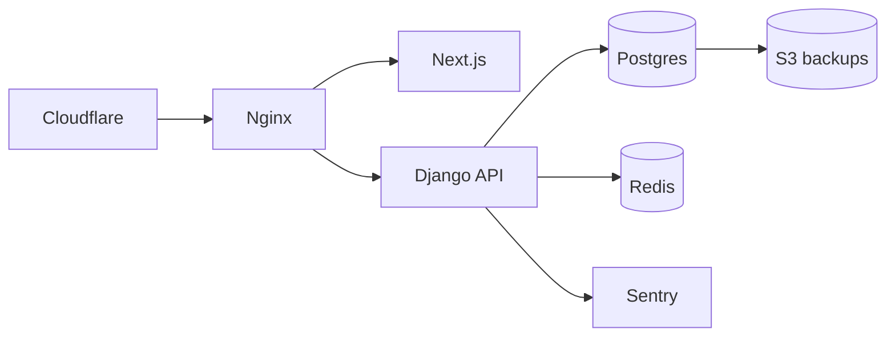

# Production Readiness — A2Z Tools ERP

See also: [GO_LIVE_CHECKLIST.md](./GO_LIVE_CHECKLIST.md) · [PRODUCTION_DEPLOYMENT_PLAN.md](./PRODUCTION_DEPLOYMENT_PLAN.md)

**Overall score: 78 / 100** — Ready for controlled go-live after staging soak.

## Infrastructure Architecture

Docker Compose on Sydney origin + Cloudflare edge. Nginx is the only public entry; Postgres and Redis are internal.

| Component | Path |
|-----------|------|
| Compose prod | `docker-compose.prod.yml` |
| Env template | `.env.production.example` |
| Env validation | `infrastructure/scripts/validate-production-env.sh` |
| Deploy | `infrastructure/scripts/deploy.sh` |
| Health | `/api/v1/health/`, `/api/v1/ready/`, `/api/health` |

## Readiness Score

| Area | Score |
|------|-------|
| Containerization | 92 |
| Environment | 85 |
| Health checks | 88 |
| CI/CD | 80 |
| Observability | 70 |
| Backups | 80 |
| Security | 78 |
| Load testing | 65 |
| Documentation | 90 |

## Risk Assessment

| ID | Risk | Mitigation |
|----|------|------------|
| R1 | Database loss | Daily pg_dump + weekly verify |
| R2 | Secret leak | Gitleaks + external secrets |
| R3 | Bad deploy | Branch protection + pre-deploy backup |

## Monitoring

- **Sentry** — `config/sentry.py`, set `SENTRY_DSN`
- **JSON logs** — stdout via `prod.py`
- **Uptime** — `infrastructure/monitoring/healthchecks.example.yaml`
- **Audit** — `OperationalAuditLog` table

## Backups

| Asset | Script | Schedule |
|-------|--------|----------|
| Postgres | `backup-postgres.sh` | Daily |
| Redis | `backup-redis.sh` | Daily |
| Media | `backup-media.sh` | Weekly |
| Verify | `verify-backup-restore.sh` | Weekly |

Cron: `infrastructure/cron/a2z-backups`

## Load Testing

`infrastructure/load-tests/k6/` — ecommerce, dashboard, API throughput scripts.

## Rollback

Redeploy previous GHCR `IMAGE_TAG`; restore S3 dump if migration failed.
