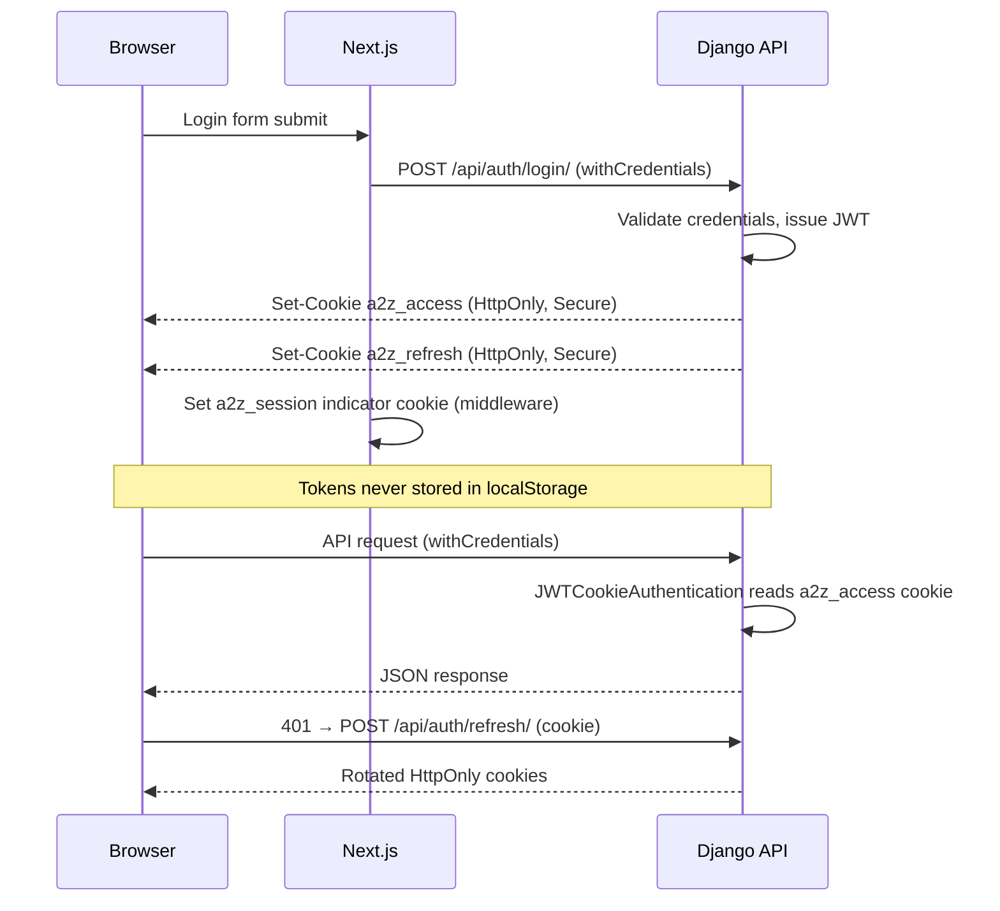

# Production Security Hardening

Security controls implemented for A2Z Tools production deployment.

## Updated Authentication Architecture



### Cookie configuration

| Setting | Dev | Production |
|---------|-----|------------|
| `JWT_AUTH_COOKIE` | `a2z_access` | `a2z_access` |
| `JWT_AUTH_COOKIE_SECURE` | `false` | `true` |
| `JWT_AUTH_COOKIE_SAMESITE` | `Lax` | `None` (cross-subdomain) |
| `JWT_COOKIE_DOMAIN` | unset | `.a2ztools.com` |
| `JWT_AUTH_COOKIE_ONLY` | `true` | `true` (no tokens in JSON body) |

Authorization header (`Bearer`) remains supported for tests and API clients.

## Security Implementation Summary

| # | Requirement | Implementation |
|---|-------------|----------------|
| 1 | Disable admin demo in production | `isAdminDemoEnabled()` returns `false` when `NODE_ENV=production` |
| 2 | HttpOnly cookie auth | `JWTCookieAuthentication`, `auth_cookies.py`, `withCredentials` on Axios |
| 3 | Protect API docs/schema | `StaffSpectacularAPIView` — staff-only when `DEBUG=False` |
| 4 | SECRET_KEY enforcement | `ImproperlyConfigured` if missing/insecure when `DEBUG=False` |
| 5 | Trade credit restrictions | `TradeCreditService` — approved account, limit check, audit log |
| 6 | Cart ownership validation | Session key + customer ID verified at checkout |
| 7 | JWT / CSRF / CORS / rate limits | See review section below |

### Key files

**Backend**
- `apps/accounts/authentication.py` — cookie JWT auth
- `apps/accounts/auth_cookies.py` — HttpOnly cookie helpers
- `apps/accounts/cookie_refresh.py` — cookie-aware refresh
- `apps/core/schema_views.py` — staff-protected OpenAPI
- `apps/core/permissions.py` — `IsStaffUser`
- `apps/trade_accounts/trade_credit.py` — credit authorization + audit
- `apps/orders/views.py` — cart ownership checks
- `config/settings/base.py` — SECRET_KEY, CORS credentials, CSRF origins, JWT cookies
- `config/settings/prod.py` — secure cookie flags

**Frontend**
- `lib/api/client.ts` — `withCredentials: true`, cookie refresh
- `lib/api/auth/token-storage.ts` — no localStorage JWTs
- `lib/security/admin-demo.ts` — production demo guard
- `middleware.ts` — checks `a2z_access` or `a2z_session`

## Security Controls Review

### JWT
- Access token: 15 minutes (configurable)
- Refresh token: 7 days with rotation + blacklist
- Stored in HttpOnly cookies (not localStorage)
- Short-lived access limits XSS blast radius

### CSRF
- `CsrfViewMiddleware` enabled
- JWT cookie auth uses `SameSite=None; Secure` in production (cross-origin API)
- Stripe webhook remains CSRF-exempt with signature verification
- `CSRF_TRUSTED_ORIGINS` configured for frontend domains

### CORS
- `CORS_ALLOW_CREDENTIALS = True` (required for cookies)
- `CORS_ALLOWED_ORIGINS` whitelist only (no wildcard with credentials)
- Explicit origins in `.env.production.example`

### Rate limiting
- Global: anon 120/hr, user 1000/hr
- Auth endpoints: 20/min anon, 60/min user
- Scoped throttles on analytics and coupon endpoints

### Session security (production)
- `SESSION_COOKIE_SECURE = True`
- `SESSION_COOKIE_HTTPONLY = True`
- `SESSION_COOKIE_SAMESITE = None`
- HSTS enabled (1 year, includeSubDomains, preload)

## Production Security Checklist

### Before deploy
- [ ] Set `DJANGO_SECRET_KEY` to cryptographically random 50+ char value
- [ ] Set `DJANGO_DEBUG=False`
- [ ] Set `NEXT_PUBLIC_ADMIN_DEMO=false` (ignored in prod builds anyway)
- [ ] Configure `JWT_COOKIE_DOMAIN=.yourdomain.com`
- [ ] Set `DJANGO_CORS_ALLOWED_ORIGINS` to exact frontend URLs
- [ ] Set `CSRF_TRUSTED_ORIGINS` to frontend + API URLs
- [ ] Verify `DEMO_AUTO_COMPLETE_PAYMENTS=False`
- [ ] Run `python manage.py migrate trade_accounts` (audit log table)
- [ ] Confirm Stripe webhook secret is set

### After deploy
- [ ] Verify `/api/docs/` returns 401/403 without staff login
- [ ] Verify login sets HttpOnly cookies (no `tokens` in response body)
- [ ] Verify localStorage has no `a2z_access_token` / `a2z_refresh_token`
- [ ] Test trade credit rejected without approved account
- [ ] Test guest cart cannot be checked out with wrong session key
- [ ] Confirm HSTS header present on API responses

## Security Test Plan

```bash
cd backend
python manage.py test apps.core.tests.test_security --settings=config.settings.test
```

| Test | Verifies |
|------|----------|
| `test_test_settings_use_non_default_secret` | Test env uses non-default SECRET_KEY |
| `test_schema_requires_staff_when_not_debug` | OpenAPI schema blocked for anonymous users |
| `test_cannot_checkout_foreign_guest_cart` | Cart session binding |
| `test_can_checkout_own_guest_cart_with_matching_session` | Valid guest cart merge at checkout |
| `test_login_sets_httponly_cookies` | Cookie auth, no tokens in body |
| `test_trade_credit_requires_sufficient_limit` | Credit limit enforcement |
| `test_trade_credit_charges_account_and_audits` | Charge + audit trail |
| `test_trade_credit_rejected_without_approved_account` | Approved account required |

```bash
cd frontend && npm run typecheck
```

Manual checks:
1. Login → DevTools → Application → Cookies: `a2z_access` is HttpOnly
2. DevTools → Local Storage: no JWT keys
3. Set `NEXT_PUBLIC_ADMIN_DEMO=true` in dev only — confirm blocked in production build
4. Attempt checkout with another user's cart ID → 409 Conflict

## Remaining Risks

| Risk | Severity | Mitigation path |
|------|----------|-----------------|
| `a2z_session` indicator cookie is not HttpOnly | Low | Used only for Next.js route gating; real auth is HttpOnly on API |
| Cross-subdomain cookie requires `SameSite=None` | Medium | Requires HTTPS everywhere; monitor for CSRF on state-changing browser forms |
| Bearer header fallback still enabled | Low | Needed for tests/API clients; restrict in future via env flag |
| Guest session key in localStorage | Medium | Session fixation risk low; consider httpOnly session cookie for cart |
| No centralized security audit log | Medium | Trade credit has audit; extend pattern to admin actions |
| JWT in response body when `JWT_AUTH_COOKIE_ONLY=false` | Low | Keep `true` in production |
| Redis/cache not used for rate limit distribution | Low | Single-node throttling; use Redis backend at scale |
| Admin demo env var in dev builds | Low | Hard-disabled in `NODE_ENV=production` |

## Migration Notes

1. **Deploy backend first** with cookie auth endpoints
2. **Deploy frontend** with `withCredentials` — users must re-login (localStorage tokens cleared on login)
3. **Set env vars** from `.env.production.example` JWT section
4. **Run migration**: `python manage.py migrate trade_accounts`
5. **Clear stale tokens**: existing users' localStorage tokens are ignored; prompt re-login

## Related

- [STRIPE_PAYMENTS.md](STRIPE_PAYMENTS.md)
- [RBAC.md](RBAC.md)
- [PRODUCTION_DEPLOYMENT_PLAN.md](PRODUCTION_DEPLOYMENT_PLAN.md)
