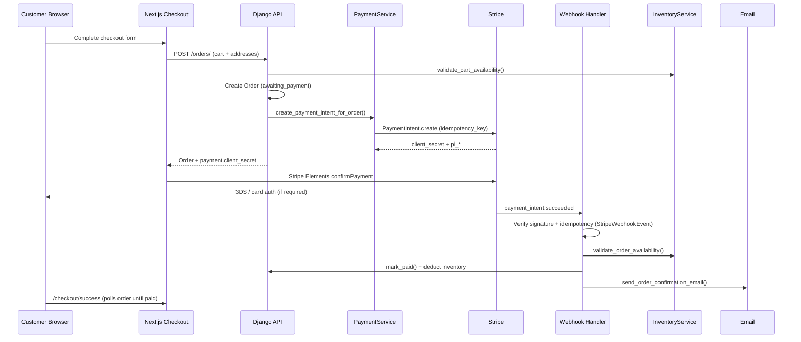

# Stripe Production Payments

Production card payment processing for A2Z Tools using Stripe Payment Intents, webhook confirmation, and inventory-safe order fulfilment.

## Architecture Diagram



## Order Status Flow

| Status | Meaning |
|--------|---------|
| `pending` | Order placed; non-card or awaiting manual payment |
| `awaiting_payment` | Card order created; Stripe PaymentIntent issued |
| `paid` | Webhook confirmed payment; inventory deducted |
| `packed` | Warehouse packed |
| `shipped` | Carrier dispatched |
| `delivered` | Customer received |
| `cancelled` | Order cancelled |
| `refunded` | Payment refunded |

**Security rule:** Only the Stripe webhook (`payment_intent.succeeded`) calls `OrderService.mark_paid()`. The frontend never marks orders paid.

## Implementation Summary

### Backend (`apps/payments/`)

| Component | Path | Responsibility |
|-----------|------|----------------|
| PaymentService | `apps/payments/services.py` | PaymentIntent creation, webhook handling, idempotency |
| StripeWebhookEvent | `apps/payments/models.py` | Duplicate event prevention |
| StripeWebhookView | `apps/payments/views.py` | Signature verification, CSRF-exempt endpoint |
| PaymentConfigView | `apps/payments/views.py` | Publishable key for Elements |

### Orders integration (`apps/orders/`)

- `create_from_cart()` validates stock, sets `awaiting_payment` for card orders, creates PaymentIntent when Stripe is configured.
- `mark_paid()` is idempotent; validates stock again before inventory deduction.
- `mark_payment_failed()` handles `payment_intent.payment_failed` webhooks.
- `send_order_confirmation_email()` sent only after webhook-confirmed payment.

### Inventory (`apps/inventory/`)

- `validate_cart_availability()` — before order creation.
- `validate_order_availability()` — before webhook marks paid.
- `_deduct_inventory_for_order()` — raises on insufficient stock (no silent failures).

### Frontend

| Component | Path |
|-----------|------|
| Stripe Payment Element | `components/checkout/stripe-payment-form.tsx` |
| Checkout integration | `components/checkout/checkout-page-view.tsx` |
| Success page | `app/(shop)/checkout/success/` |
| Failure page | `app/(shop)/checkout/failure/` |
| Payment config hook | `lib/api/hooks/use-payments.ts` |

### API Endpoints

| Method | Path | Auth |
|--------|------|------|
| GET | `/api/v1/payments/config/` | Public |
| POST | `/api/v1/payments/webhook/` | Stripe signature |
| POST | `/api/v1/orders/` | Authenticated |

## Test Plan

### Automated (backend)

Run from `backend/`:

```bash
pip install -r requirements/base.txt
python manage.py test apps.payments.tests.test_stripe_payments apps.orders.tests.test_orders_api.OrderModuleTestCase.test_create_order_with_gst_totals
```

| Test | File | Verifies |
|------|------|----------|
| `test_successful_payment_webhook_marks_paid_and_deducts_inventory` | `test_stripe_payments.py` | Webhook → paid + email + stock deduction |
| `test_failed_payment_webhook` | `test_stripe_payments.py` | Failed PI → payment_status failed, no inventory change |
| `test_duplicate_webhook_is_idempotent` | `test_stripe_payments.py` | Same event ID processed once |
| `test_inventory_deduction_only_after_webhook` | `test_stripe_payments.py` | No stock movement at order create |
| `test_insufficient_stock_blocks_order_creation` | `test_stripe_payments.py` | Overselling prevented at checkout |

### Manual (Stripe test mode)

1. Set env vars: `STRIPE_SECRET_KEY`, `STRIPE_PUBLIC_KEY`, `STRIPE_WEBHOOK_SECRET`.
2. Run `stripe listen --forward-to localhost:8000/api/v1/payments/webhook/`.
3. Checkout with test card `4242 4242 4242 4242`.
4. Confirm order moves `awaiting_payment` → `paid` after webhook.
5. Confirm confirmation email and inventory decrement in admin.

### Frontend

```bash
cd frontend && npm run typecheck
```

## Migration Notes

### 1. Environment variables

Add to production `.env`:

```env
STRIPE_SECRET_KEY=sk_live_...
STRIPE_PUBLIC_KEY=pk_live_...
STRIPE_WEBHOOK_SECRET=whsec_...
NEXT_PUBLIC_STRIPE_PUBLISHABLE_KEY=pk_live_...  # optional; API config endpoint is primary
```

Set `DEMO_AUTO_COMPLETE_PAYMENTS=False` in production (default in `base.py`).

### 2. Database migration

```bash
python manage.py migrate payments
```

Creates `stripe_webhook_events` table for webhook idempotency.

### 3. Stripe Dashboard

1. Create webhook endpoint: `https://api.yourdomain.com/api/v1/payments/webhook/`
2. Subscribe to events:
   - `payment_intent.succeeded`
   - `payment_intent.payment_failed`
3. Copy signing secret to `STRIPE_WEBHOOK_SECRET`.

### 4. Deploy sequence

1. Deploy backend with Stripe env vars and run migrations.
2. Configure Stripe webhook URL (use test mode first).
3. Deploy frontend with API URL pointing to production.
4. Verify webhook delivery in Stripe Dashboard → Developers → Webhooks.
5. Disable `DEMO_AUTO_COMPLETE_PAYMENTS` in dev before go-live testing.

### 5. Rollback

- Remove webhook URL in Stripe Dashboard to stop new confirmations.
- Existing paid orders are unaffected.
- Card checkouts without webhook remain `awaiting_payment` — cancel manually or replay events from Stripe Dashboard.

### 6. Dev / demo mode

When `STRIPE_SECRET_KEY` is unset and `DEMO_AUTO_COMPLETE_PAYMENTS=True` (dev settings), card orders auto-complete without Stripe — useful for local UX demos only.

## Related Files

- `backend/apps/payments/`
- `backend/apps/orders/services.py`
- `backend/apps/inventory/services.py`
- `frontend/src/components/checkout/`
